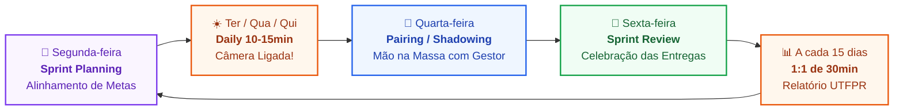

<p align="center">
  <a href="https://studio4you.com.br" target="_blank" rel="noopener noreferrer">
    <picture>
      <source media="(prefers-color-scheme: dark)" srcset="assets/logo-white.svg">
      <source media="(prefers-color-scheme: light)" srcset="assets/logo-black.svg">
      
    </picture>
  </a>
</p>

<h1 align="center">🚀 Manual do Calouro :: Studio4You</h1>

<p align="center">
  <strong>O guia definitivo, interativo e de alto padrão para você sobreviver, codar com excelência e brilhar no estágio.</strong>
</p>

<p align="center">
  <a href="https://studio4you.com.br"></a>
  
  
  
  
</p>

---

## ⚡ Central de Comando Rápido (Quick Links)

| 💬 Discord Oficial | 📋 Quadro do Trello | 🌐 Site Studio4You | 🛠️ Gerador de Relatório |
| :---: | :---: | :---: | :---: |
| **QG & Dailies**<br>[👉 Ir para Canais](#) | **Gestão de Sprints**<br>[👉 Ver Meus Cards](#) | **Software House**<br>[👉 studio4you.com.br](https://studio4you.com.br) | **Automação UTFPR**<br>`./scripts/novo-relatorio.sh` |

---

## 🧭 Bem-vindo(a) à Nave Studio4You!

Parabéns por conquistar sua vaga de estágio! 🎉  
Se você chegou até aqui, significa que vimos potencial em você para construir coisas incríveis e aprender engenharia de software de verdade.

Este repositório é o seu **Manual de Bordo Oficial**. Ele foi desenhado para preparar você para a rotina real de desenvolvimento, alinhar expectativas, eliminar o medo de errar e guiar sua evolução rumo à senioridade e autonomia.

> [!TIP]
> **Como ler este manual:** Ele é [atualizado constantemente](#-este-manual-é-vivo-acompanhe-e-contribua), então volte sempre. Reserve seu 1º dia para ler as **Trilhas 1 e 2**. Em seguida, siga passo a passo a [Trilha de Decolagem dos Primeiros 7 Dias](docs/11-onboarding-primeiros-7-dias.md) para subir seu ambiente sem atrito!

---

## ⚡ As 7 Leis Sagradas do Estágio na Studio4You

Antes de abrir qualquer terminal, grave estas regras no seu coração (ou cole num post-it no seu monitor):

| # | Lei Sagrada | O Princípio que Você Deve Seguir |
| :-: | :--- | :--- |
| **1** | 📹 **Câmera Ligada nas Reuniões** | Nada de foto estática ou tela preta de podcast fantasma. Nas dailies e rituais, olho no olho. A presença humana gera confiança e aproxima o time remoto. |
| **2** | 🎯 **1 Card por Vez no Trello** | A regra inegociável do `Em Andamento`. Termine uma coisa antes de começar outra. Foco e consistência sempre vencem multitarefa desordenada. |
| **3** | 🪜 **A Escadinha do Desbloqueio** | Travou em um erro? Siga a escadinha: **1º Pesquisa Ativa (15 min)** ➡️ **2º Ajuda com o Colega de Estágio** ➡️ **3º Ricardo (Gestor)** trazendo o contexto do que já foi testado. |
| **4** | 💥 **Quebrou? Não Esconda!** | Cometeu um erro de Git ou quebrou a build? Avise imediatamente! Lembra da analogia da luz da injeção do carro: fita isolante preta por cima da lâmpada não impede o motor de fundir na estrada. |
| **5** | 💻 **Ambiente Livre & Seguro** | Preferimos Linux, mas Windows com WSL 2 e macOS são bem-vindos. O que importa é um ambiente reprodutível e uma máquina blindada contra malwares, ativadores piratas e links suspeitos. |
| **6** | 📝 **Relatório Quinzenal em Dia** | O estágio é uma parceria com a **UTFPR (TSI)**. Relatório feito e assinado a cada 15 dias poupa noites de desespero e correria no final do semestre. |
| **7** | 👔 **Postura Adulta & Sem Melindres** | Foco, maturidade e conversas profissionais. Code review não é ataque pessoal; é controle de qualidade de software. Descontração tem hora e lugar: no `#geral-bate-papo` e no Happy Hour mensal! |

---

## 🗺️ Mapa de Navegação das 4 Trilhas do Conhecimento

Nossos 16 módulos estão organizados em **4 Trilhas Estratégicas** para guiar você desde o primeiro comando até a sua efetivação:

### 🏛️ Trilha 1: Boas-Vindas, Cultura & Rituais
| Módulo | ⏱️ Leitura | O que você vai dominar | Documento |
| :--- | :---: | :--- | :--- |
| **01. Boas-Vindas & Cultura** | `6 min` | Mindset de crescimento, postura profissional e escadinha de dúvidas. | [01-boas-vindas-e-cultura.md](docs/01-boas-vindas-e-cultura.md) |
| **02. Comunicação, Contas & Discord** | `8 min` | Conta corporativa do estágio, bloco legal sobre cópia de dados, canais do Discord (`#avisos`, `#duvidas`) e etiqueta. | [02-comunicacao-contas-e-discord.md](docs/02-comunicacao-contas-e-discord.md) |
| **03. O Tao do Trello & Sprints** | `4 min` | Fluxo das 5 colunas Kanban, limite de WIP e anatomia do card perfeito. | [03-fluxo-trello-e-sprints.md](docs/03-fluxo-trello-e-sprints.md) |
| **04. Rituais & Reuniões** | `4 min` | Dailies (10-15m), Segundas (Plan), Sextas (Review), Pairing e folga em provas UTFPR. | [04-rituais-e-reunioes.md](docs/04-rituais-e-reunioes.md) |

### ⚙️ Trilha 2: Engenharia, Setup & Gestão
| Módulo | ⏱️ Leitura | O que você vai dominar | Documento |
| :--- | :---: | :--- | :--- |
| **05. Setup de Ambiente & Segurança** | `15 min` | Linux, Windows com WSL 2, macOS, Docker e o Bloco de Segurança: 2FA, as 6 ameaças, LGPD e o que fazer em um incidente. | [05-setup-ambiente-linux.md](docs/05-setup-ambiente-linux.md) |
| **06. Git & GitHub Workflow** | `5 min` | Fluxo de branches, commits, Pull Requests para a `develop` e resolução de conflitos. | [06-git-github-workflow.md](docs/06-git-github-workflow.md) |
| **07. Gestão Interna (Manual do Gestor)** | `5 min` | Documento do gestor para conduzir rituais, 1:1, reembolsos e retenção. | [07-guia-de-gestao-interna.md](docs/07-guia-de-gestao-interna.md) |
| **16. Padrões de Commit, Branch & PR** | `7 min` | Referência oficial: `TIPO/ descrição`, branch com card, PR com revisor, autorrevisão e uso de IA. | [16-padroes-de-commit-branch-e-pr.md](docs/16-padroes-de-commit-branch-e-pr.md) |

### 🎁 Trilha 3: Benefícios, Rotina & DNA da Empresa
| Módulo | ⏱️ Leitura | O que você vai dominar | Documento |
| :--- | :---: | :--- | :--- |
| **08. Benefícios & Ferramentas Top** | `5 min` | Claude Code, Udemy, Inova Guarapuava, Happy Hour e Indique e Ganhe (5% PIX). | [08-beneficios-e-ferramentas-premium.md](docs/08-beneficios-e-ferramentas-premium.md) |
| **09. Rotina & Home Office de Elite** | `4 min` | Da cama ao terminal: mesa limpa, café, alongamento e ritual matinal com Git e Docker. | [09-rotina-e-boas-praticas-remotas.md](docs/09-rotina-e-boas-praticas-remotas.md) |
| **10. Conhecendo a Studio4You** | `5 min` | Nosso DNA de código nativo, Core Web Vitals 90+, GEO para IAs e os 4 pilares de serviços. | [10-sobre-a-studio4you.md](docs/10-sobre-a-studio4you.md) |

### 🚀 Trilha 4: Decolagem, Primeiros Socorros & Carreira
| Módulo | ⏱️ Leitura | O que você vai dominar | Documento |
| :--- | :---: | :--- | :--- |
| **11. Trilha de Decolagem (7 Dias)** | `5 min` | Checklist prático do Day 1 ao Day 5: acessos, Docker local e o primeiro PR! | [11-onboarding-primeiros-7-dias.md](docs/11-onboarding-primeiros-7-dias.md) |
| **12. Primeiros Socorros / Troubleshooting** | `6 min` | Guia de sobrevivência: portas do Docker em uso, socket daemon, commit na main e merge. | [12-troubleshooting-primeiros-socorros.md](docs/12-troubleshooting-primeiros-socorros.md) |
| **13. Sigilo, NDA & Redes Sociais** | `6 min` | Ética profissional, LGPD, conduta pública, o que NUNCA postar e o que postar com orgulho. | [13-sigilo-etica-e-confidencialidade.md](docs/13-sigilo-etica-e-confidencialidade.md) |
| **14. Dicionário do Calouro** | `5 min` | Glossário do dev moderno: Deploy, Staging, Migration, Seed, Payload, CORS e SLA. | [14-glossario-do-dev-moderno.md](docs/14-glossario-do-dev-moderno.md) |
| **15. Critérios de Sucesso & Carreira** | `4 min` | Os 5 pilares de avaliação, feedbacks 1:1, projetos freela remunerados e efetivação. | [15-criterios-de-sucesso-e-carreira.md](docs/15-criterios-de-sucesso-e-carreira.md) |

---

### 📑 Modelos Oficiais & Templates Prontos
| Recurso | Descrição | Arquivo |
| :--- | :--- | :--- |
| **📢 Divulgação da Vaga** | Modelos prontos para LinkedIn, WhatsApp e Murais da UTFPR. | [divulgacao-da-vaga.md](docs/divulgacao-da-vaga.md) |
| **📝 Template: Relatório Quinzenal** | Modelo oficial UTFPR pronto para preenchimento a cada 15 dias. | [relatorio-quinzenal-utfpr.md](docs/templates/relatorio-quinzenal-utfpr.md) |
| **💡 Exemplo de Relatório Preenchido** | Modelo real preenchido com humor e clareza como referência. | [exemplo-preenchido-relatorio.md](docs/templates/exemplo-preenchido-relatorio.md) |

---

## 📝 Este Manual é Vivo: Acompanhe e Contribua

> [!IMPORTANT]
> **Este manual é atualizado o tempo todo.** Regras, padrões e processos mudam conforme a empresa evolui, e a versão que vale é sempre a que está na branch `main` deste repositório, não a que você leu no primeiro dia. *"Eu não sabia que tinha mudado"* não é justificativa: ficar atento às atualizações faz parte do seu trabalho.

### 👀 Como ficar esperto com as mudanças

- **Atualize a sua cópia toda segunda-feira**, antes da Sprint Planning, e veja o que mudou:
  ```bash
  git pull origin main
  git log --oneline -10
  ```
- **Leia o histórico de commits** no GitHub (aba **Commits**) para ver exatamente o que foi alterado em cada módulo.
- **Fique de olho no `#avisos`** do Discord: mudanças importantes de regra são comunicadas por lá.
- **Releia o módulo quando for usá-lo.** Vai abrir um PR? Confira o [Módulo 16](docs/16-padroes-de-commit-branch-e-pr.md) de novo, ele pode ter mudado.

### 🤝 Achou algo para melhorar? Abra um PR!

Este manual também é seu. Você, que acabou de passar pelo onboarding, é quem melhor enxerga o que está confuso, desatualizado ou faltando. **Qualquer estagiário pode e deve abrir Pull Requests de melhoria**, por exemplo:

- Erro de digitação, link quebrado ou texto confuso;
- Comando que não funcionou no seu ambiente, com a correção que funcionou;
- Um passo que faltava e que você descobriu na prática;
- Um problema novo e a solução para o [Módulo 12 (Primeiros Socorros)](docs/12-troubleshooting-primeiros-socorros.md);
- Um termo que você não conhecia para o [Módulo 14 (Dicionário)](docs/14-glossario-do-dev-moderno.md).

**Como contribuir:**

1. Crie uma branch no padrão do [Módulo 16](docs/16-padroes-de-commit-branch-e-pr.md), por exemplo `docs/corrige-comando-docker-wsl`;
2. Faça a alteração e o commit, por exemplo `DOCS/ corrige comando do docker no WSL`;
3. Abra o PR com a descrição preenchida e marque o gestor como revisor. Este repositório tem apenas a branch `main`, então aqui o PR aponta para ela;
4. Aguarde a revisão. Nada entra sem aprovação.

> [!NOTE]
> **Correção e melhoria de texto: é só abrir o PR. Mudança de regra: converse antes.** Se a sua sugestão altera um processo ou uma política da empresa, leve a ideia ao gestor na Daily ou no 1:1; a decisão é dele. E, como em qualquer repositório, nada de dado de cliente, credencial ou print de projeto real nos exemplos.

---

## 🔄 O Ciclo Semanal de Alta Performance



---

## 🛠️ Automação: Gerador de Relatório Quinzenal

Criamos um script facilitador para você não perder tempo copiando e renomeando arquivos na mão:

```bash
# Na raiz do repositório manual-do-calouro:
./scripts/novo-relatorio.sh "01"
```
Isso criará automaticamente uma cópia limpa do template oficial em `docs/relatorios-entregues/relatorio-quinzena-01.md`.

---

<p align="center">
  <em>"Não tenha medo de quebrar coisas no ambiente local. Tenha medo apenas de não avisar quando travou.<br><strong>Boa sorte, foco no código e bem-vindo à Studio4You!</strong>" 🚀</em>
</p>
