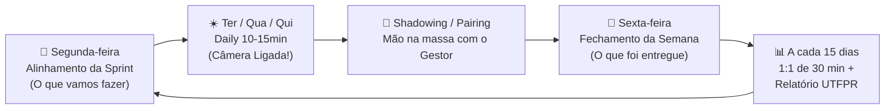

# 🚀 Manual do Calouro :: studio4you
> *O guia definitivo, interativo e bem-humorado para você sobreviver, codar muito e brilhar como estagiário na studio4you.*

---

## 🧭 Bem-vindo(a) à Nave studio4you!

Parabéns por conquistar sua vaga de estágio! 🎉  
Se você chegou até aqui, significa que vimos potencial em você para construir coisas incríveis com a gente. 

Este repositório é o seu **Manual de Bordo**. Ele foi desenhado especificamente para preparar você para a rotina real de desenvolvimento, alinhar expectativas, tirar o medo de errar e transformar você em um desenvolvedor autônomo, confiante e produtivo.

Aqui não tem pegadinha: tudo o que você precisa saber sobre ferramentas, reuniões, entregas, relatórios da UTFPR, benefícios exclusivos e convivência com o time está organizado e mastigado nos subdocumentos abaixo.

---

## ⚡ As 7 Leis Sagradas do Estágio na studio4you

Antes de abrir qualquer terminal, grave estas regras no seu coração (ou cole num post-it no monitor):

1. **📹 Câmera Ligada nas Reuniões:** Nada de foto estática ou tela preta de podcast fantasma! Nas dailies e reuniões, olho no olho. A presença humana aproxima o time.
2. **🎯 1 Card por Vez no Trello:** A regra de ouro do `Em Andamento`. Termine uma coisa antes de começar outra. Foco vence multitarefa caótica.
3. **💬 A Escadinha do Desbloqueio (Pesquise ➡️ Colega ➡️ Gestor):** Travou em um erro de código ou bug? Primeiro pesquise na documentação e IA (~15 min). Ainda travou? Converse com seu colega de estágio. Se continuarem sem solução, aí sim venham falar com o Ricardo trazendo o que já foi tentado!
4. **💥 Quebrou? Não Esconda!** Errou um comando ou quebrou o build? Avise imediatamente! Lembra da analogia da luz da injeção do motor: fita isolante preta por cima da lâmpada não impede o motor de fundir na estrada. Honestidade técnica sempre!
5. **🐧 Alma Linux:** Seu ambiente de desenvolvimento é Linux (Ubuntu recomendado). Domine o terminal, ame a linha de comando e documente tudo no `README.md`.
6. **📝 Relatório Quinzenal em Dia:** O estágio é uma parceria com a **UTFPR (TSI)**. Relatório feito a cada 15 dias poupa desespero no fim do semestre.
7. **👔 Postura Adulta & Sem Melindres:** No trabalho, foco, maturidade e conversas profissionais. Code review não é ataque pessoal; é engenharia de software pura. Descontração tem hora e lugar: no `#geral-bate-papo` e no Happy Hour mensal!

---

## 🗺️ Mapa de Navegação dos Subdocumentos

Clique nos links abaixo para mergulhar nos guias práticos do seu dia a dia:

| 📑 Módulo | 🎯 O que você vai aprender | Arquivo |
| :--- | :--- | :--- |
| **01. Boas-Vindas & Cultura** | Postura, curiosidade, como tirar dúvidas e mindset de crescimento. | [01-boas-vindas-e-cultura.md](docs/01-boas-vindas-e-cultura.md) |
| **02. Comunicação no Discord** | Canais de texto (`#avisos`, `#duvidas`, `#links-uteis`), salas de voz e etiqueta. | [02-comunicacao-discord.md](docs/02-comunicacao-discord.md) |
| **03. O Tao do Trello & Sprints** | O fluxo de colunas, limite de 1 card em andamento e entrega por Sprints. | [03-fluxo-trello-e-sprints.md](docs/03-fluxo-trello-e-sprints.md) |
| **04. Rituais & Reuniões** | Dailies (10-15m), Segundas (Plan), Sextas (Review), Pairing e 1:1 quinzenal. | [04-rituais-e-reunioes.md](docs/04-rituais-e-reunioes.md) |
| **05. Setup do Ambiente Linux** | Preparando Ubuntu, Git, ferramentas, dependências e o README do seu repo. | [05-setup-ambiente-linux.md](docs/05-setup-ambiente-linux.md) |
| **06. Git & GitHub Workflow** | Branches, commits atômicos, Pull Requests caprichados e e-mail vinculado. | [06-git-github-workflow.md](docs/06-git-github-workflow.md) |
| **07. Gestão Interna (Manual do Gestor)** | Diretrizes internas de acompanhamento, shadowing, code review e feedbacks. | [07-guia-de-gestao-interna.md](docs/07-guia-de-gestao-interna.md) |
| **08. Benefícios & Ferramentas Top** | JetBrains, Claude Code, Udemy, Coworking Inova Guarapuava & Happy Hour mensal! | [08-beneficios-e-ferramentas-premium.md](docs/08-beneficios-e-ferramentas-premium.md) |
| **09. Rotina & Home Office de Elite** | Da cama ao terminal: mesa limpa, café, alongamento, ritual matinal do Git e Docker. | [09-rotina-e-boas-praticas-remotas.md](docs/09-rotina-e-boas-praticas-remotas.md) |
| **Divulgação da Vaga** | Modelos prontos para LinkedIn, WhatsApp e Murais da UTFPR. | [divulgacao-da-vaga.md](docs/divulgacao-da-vaga.md) |
| **Template: Relatório Quinzenal** | Modelo oficial UTFPR pronto para preencher e assinar a cada 15 dias. | [relatorio-quinzenal-utfpr.md](docs/templates/relatorio-quinzenal-utfpr.md) |
| **Exemplo de Relatório Preenchido** | Um exemplo real preenchido com humor e clareza para você se guiar. | [exemplo-preenchido-relatorio.md](docs/templates/exemplo-preenchido-relatorio.md) |

---

## 🔄 Resumo do Ciclo Semanal



---

## 🛠️ Automação Útil: Gerador de Relatório

Criamos um script facilitador para você não perder tempo copiando e renomeando arquivos na mão:

```bash
# Na raiz do projeto manual-do-calouro:
./scripts/novo-relatorio.sh "01"
```
Isso gerará uma cópia limpa do template diretamente em `docs/relatorios-entregues/relatorio-quinzena-01.md`.

---

> *"Não tenha medo de quebrar coisas no ambiente local. Tenha medo apenas de não avisar quando travou. Boa sorte e bom código!"* 🚀
