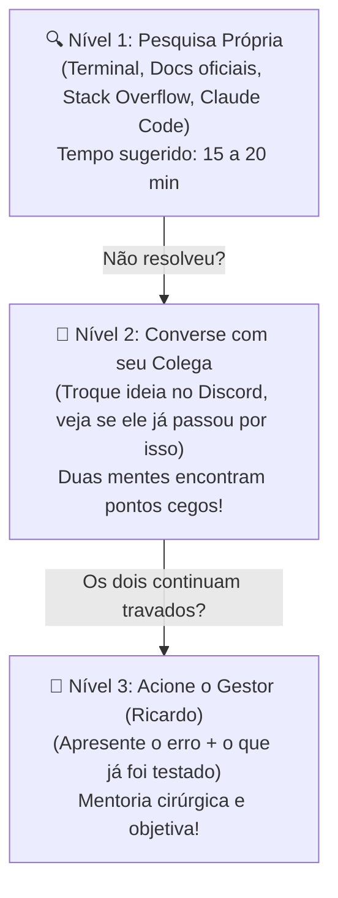

> 📍 **Manual do Calouro** » **Trilha 1: Cultura & Rituais** » [🏠 Hub Central (README)](../README.md) &nbsp;|&nbsp; ⏱️ *Tempo de leitura: 6 min*

---

# 🌟 01. Boas-Vindas & Cultura da Studio4You

> *"Você não foi contratado porque já sabe tudo; você foi contratado porque tem capacidade de aprender qualquer coisa."*

---

## 🐣 O que significa ser Calouro na Studio4You?

Chegar em uma empresa de tecnologia dá aquele friozinho na barriga:
- *"E se eu fizer um commit errado e derrubar o servidor?"* (Spoilers: você não tem acesso de deploy em produção ainda, respire fundo).
- *"E se eu fizer uma pergunta óbvia e acharem que não sei nada?"* (A única pergunta boba é aquela que você guarda para si e te faz perder dois dias).
- *"Será que preciso fingir que domino tudo?"* (Definitivamente não. Seja sincero sobre o que sabe e o que ainda não viu).

O estágio na Studio4You é uma ponte entre o mundo acadêmico (aulas, provas, teoria da UTFPR) e o mercado de software real (clientes, prazos, código sustentável, trabalho colaborativo). Nosso objetivo é que você saia desse período infinitamente melhor do que quando entrou.

---

## 🎯 Nossos Pilares de Convivência e Trabalho

### 1. Transparência Radical & "Quebrou? Não Esconda!" 💥

> [!CAUTION]
> **A REGRA DE OURO DOS ERROS: Se você quebrou algo, NUNCA esconda.**  
> O problema nunca é o erro. O verdadeiro desastre é o silêncio.

Para entender por que levamos isso tão a sério, pense em duas analogias da vida real:

#### 🚗 A Analogia da Luz da Injeção no Painel
Imagine que você está dirigindo e, de repente, acende a luz vermelha da **injeção eletrônica** no painel. Em vez de parar o carro ou avisar o mecânico, você pega um pedaço de **fita isolante preta e cola por cima da lâmpada** porque *"se eu não estou vendo a luz acesa, o problema não existe"*.  
O que acontece? Três quilômetros depois, o motor ferve, funde o cabeçote no meio da estrada e um conserto simples de sensor vira um prejuízo catastrófico com guincho.

#### ☕ A Analogia da Xícara Quebrada no Chão
Se você esbarra numa xícara, ela quebra e você avisa na hora: *"Pessoal, derrubei a xícara aqui perto da bancada!"*, o gestor ou colega pega a vassoura, passa um pano e em 30 segundos tudo está limpo e seguro.  
Mas se você varre os cacos afiados **para debaixo do tapete**, alguém vai pisar descalço amanhã de manhã, cortar o pé e o estrago será dez vezes pior.

#### 💻 Como isso funciona no Software?
* Rodou um comando perigoso no terminal?
* Deletou sem querer um arquivo ou branch de trabalho?
* Fez um commit errado ou quebrou a migration do banco?
* A API parou de responder e você não sabe o que alterou?

**Respire fundo e avise na hora no `#duvidas` do Discord ou na Daily.**  
Você está aqui para aprender. Erros técnicos fazem parte da evolução de todo desenvolvedor (inclusive dos seniores!).  
* Um erro comunicado em 5 minutos é resolvido em 1 ou 2 comandos com seu mentor (um simples `git reflog`, rollback de container ou `docker compose down -v`).  
* Um erro escondido vira uma bola de neve que explode na mão do cliente na sexta-feira no final do expediente. Seja transparente sempre!

### 2. O Funil de Resolução em 3 Níveis (A Escadinha do Desbloqueio) 🧗‍♂️

> *"Antes de terceirizar a dúvida para o gestor, exercite a musculatura da investigação e a força do trabalho em equipe."*

Quando você encontrar um bug, comportamento inesperado ou erro de compilação, **siga obrigatoriamente estes 3 passos sequenciais**:

#### 🔍 Nível 1: Pesquisa Própria & Autonomia
* **Leia o erro de verdade:** 90% das respostas estão na última linha do terminal ou no console do navegador.
* **Consulte a documentação:** Acesse os docs oficiais da linguagem, biblioteca ou framework.
* **Use as ferramentas certas:** Busque no Google, Stack Overflow, issues do GitHub e consulte o **Claude Code** para entender a causa raiz.
* *Atenção:* O gestor não é um mecanismo de busca! Criar o hábito de pesquisar é o que vai transformar você em um desenvolvedor sênior no futuro.

#### 👥 Nível 2: Converse com o seu Colega de Estágio
* Pesquisou, testou e ainda está na dúvida? **Não venha direto no gestor ainda!**
* Chame seu colega de estágio no Discord (canal `#duvidas` ou puxem uma salinha de voz).
* Muitas vezes o seu colega acabou de passar por esse mesmo problema ontem ao configurar o ambiente dele, ou consegue enxergar uma vírgula ou dependência que você não viu por estar cansado.
* **Ajudar o colega consolida o aprendizado dos dois**, desde que seja ajuda de verdade: explicar e apontar o caminho, não fazer a tarefa por ele (veja o item 4 logo abaixo).

#### 🚨 Nível 3: Aí sim, venha falar com o Gestor (Ricardo)!
* Se você pesquisou com calma (Nível 1) e você e seu colega tentaram juntos e continuam travados (Nível 2): **agora é a hora perfeita de me chamar!**
* **Como me apresentar a dúvida:**
  * ❌ *Forma errada:* "Ricardo, não tá dando certo aqui, olha pra mim?"
  * ✅ *Forma profissional da Studio4You:*
    > *"Ricardo, estou travado no card X com o erro Y. Já pesquisei na documentação, tentei a solução Z, conversei com o [Nome do Colega] e testamos a abordagem W, mas o erro persiste no Linux. Pode nos ajudar a destravar?"*
* Dessa forma, a mentoria é rápida, direta ao ponto e resolve exatamente o nó que nenhum de vocês conseguiu desatar.

### 3. Autonomia com Responsabilidade
Você terá liberdade para testar abordagens, sugerir melhorias e organizar seu código. Mas autonomia anda de mãos dadas com responsabilidade:
- Teste antes de pedir revisão.
- Deixe o código limpo e indentado.
- Documente comandos especiais que seu colega ou gestor precise rodar.

### 4. Camaradagem e Espírito de Time
Trabalho em equipe significa que a vitória de um é a vitória de todos. Ajudar um colega a destravar uma dependência ou compartilhar um link útil no Discord enriquece toda a equipe.

#### 🤝 Ajudar é ensinar o caminho, não fazer pelo outro

> *"Quem recebe a resposta pronta resolve o problema de hoje. Quem entende a resposta resolve os problemas de amanhã."*

Existe uma diferença enorme entre **pedir ajuda** e **pedir para fazer**. A primeira faz os dois crescerem. A segunda cria o colega "sanguessuga": aquele que sempre pede socorro, recebe a solução, não aprende nada e volta no dia seguinte com a mesma dúvida. Ele não evolui e ainda atrasa quem está ajudando, que deixa o próprio card de lado para fazer o trabalho de dois.

| | ✅ Ajudar | ❌ Fazer pelo outro |
| :--- | :--- | :--- |
| **Quem digita** | Quem pediu a ajuda. | Quem está ajudando. |
| **O que se entrega** | Uma pista, uma pergunta, o link da documentação, a explicação do conceito. | O código pronto para copiar e colar. |
| **Como termina** | Quem pediu consegue explicar a solução com as próprias palavras. | O card anda, mas quem pediu não sabe por quê. |
| **Na próxima vez** | Resolve sozinho. | Pede de novo. |

**Se você está pedindo ajuda:**
- **Chegue com a lição de casa feita.** Passe pelo Nível 1 da escadinha antes: mostre o erro, o que você pesquisou e o que já tentou.
- **Peça para entender, não para resolver.** *"Me explica por que isso acontece?"* em vez de *"arruma pra mim?"*.
- **O teclado é seu.** Compartilhe a tela e digite você mesmo, mesmo que demore mais.
- **Anote o que aprendeu.** Perguntar a mesma coisa duas vezes é sinal de que você recebeu a resposta, mas não aprendeu.
- **Retribua.** Quando souber algo que o colega não sabe, é a sua vez de ensinar.

**Se você está ajudando:**
- **Não assuma o teclado nem mande o código pronto.** Faça perguntas, aponte onde olhar e deixe o colega chegar à solução.
- **O seu card continua sendo a sua prioridade.** Ajudar é parte do trabalho; fazer o trabalho do outro não é.
- **Você pode dizer não.** Um *"agora estou no meio do meu card, te chamo em 30 minutos"* ou *"o que você já tentou?"* é uma resposta profissional, não falta de coleguismo.
- **Virou rotina? Fale com o gestor.** Se o mesmo colega pede a mesma coisa toda semana, ou os pedidos estão atrapalhando as suas entregas, traga isso no 1:1. Não é dedurar: é sinal de que alguém precisa de um apoio diferente, e isso é papel do gestor.

> [!WARNING]
> **Entregar o que você não sabe explicar não conta como entrega.** No code review e no 1:1 você vai ser perguntado sobre o seu próprio código. Autonomia e evolução são critérios de avaliação do estágio ([Módulo 15](./15-criterios-de-sucesso-e-carreira.md)), e isso vale tanto para o código feito pelo colega quanto para o código feito pela IA ([Módulo 16](./16-padroes-de-commit-branch-e-pr.md)).

### 5. Maturidade Profissional: Menos Melindre, Mais Engenharia (Zero "Mimimi") 🎯

> *"Feedback técnico em código não é ataque pessoal; é controle de qualidade e respeito ao cliente que paga a conta."*

Na **Studio4You**, tratamos você como um futuro engenheiro de software, não como uma criança. Por isso, adotamos uma postura adulta e realista:

1. **Conversas Profissionais no Expediente:**
   - Nas Dailies, reuniões com o gestor, Pull Requests e canais de projeto, o diálogo é **direto, educado, objetivo e focado em resolver problemas**.
   - O tempo de todos é precioso. Evite rodeios, desculpas vazias ou postura vitimista quando algo der errado.
2. **Code Review não é julgamento moral:**
   - Se o gestor apontar que sua função está confusa, que seu commit está desorganizado ou que a lógica quebrou o padrão do projeto, **não leve para o lado pessoal**.
   - Feedback técnico rigoroso é o maior acelerador de carreira que existe. Quem quer crescer agradece o apontamento, ajusta o código e aprende a lição.
3. **Cada coisa no seu lugar (Trabalho vs Descontração):**
   - **Na hora de trabalhar:** Postura, comprometimento, respeito aos prazos e foco total no terminal.
   - **Na hora de descontrair:** Somos um time acolhedor e parceiro! Para memes, risadas e conversas aleatórias, use o canal `#geral-bate-papo`. E para quem está em Guarapuava, o **Happy Hour mensal presencial (100% pago pela empresa: 1 lanche de até R$ 60 + R$ 20 em bebidas não alcoólicas)** é o palco sagrado para relaxar, trocar ideias e celebrar as conquistas da Sprint.

---

## 💡 Como ter uma trajetória de sucesso aqui

| O que esperamos de você ✨ | O que você deve evitar 🚫 |
| :--- | :--- |
| Curiosidade ativa e vontade de aprender | Fingir que entendeu uma instrução sem ter entendido |
| Anotar instruções importantes e criar documentação | Repetir a mesma dúvida básica 5 vezes por não anotar |
| Manter câmera ligada nas reuniões com postura engajada | Virar "fantasma" no Discord sem responder mensagens |
| Receber correções e code reviews com maturidade | Fazer drama, melindre ou levar feedback técnico para o lado pessoal |
| Conversas profissionais e objetivas no expediente | Transformar reuniões de trabalho em conversa fiada sem foco |
| Entregar tarefas pequenas e consistentes no Trello | Tentar abraçar o mundo e travar tudo no final da Sprint |
| Usar as ferramentas (Claude Code/IDEs) com foco nos projetos da empresa | Usar IA e acessos corporativos para demandas pessoais sem pedir autorização |
| Atualizar seu relatório quinzenal com frequência | Lembrar do relatório 10 minutos antes de entregar ao professor |

---

## 🗺️ Mapa de Navegação das 4 Trilhas do Conhecimento

Nossos 16 módulos estão organizados em **4 Trilhas Estratégicas** para guiar você desde o primeiro comando até a sua efetivação:

### 🏛️ Trilha 1: Boas-Vindas, Cultura & Rituais
| Módulo | ⏱️ Leitura | O que você vai dominar | Documento |
| :--- | :---: | :--- | :--- |
| **01. Boas-Vindas & Cultura** | `6 min` | *(Você está aqui)* Mindset de crescimento, postura profissional e escadinha de dúvidas. | [01-boas-vindas-e-cultura.md](./01-boas-vindas-e-cultura.md) |
| **02. Comunicação no Discord** | `5 min` | Conta corporativa do estágio, regras dos canais de texto (`#avisos`, `#duvidas`), salas de voz e etiqueta. | [02-comunicacao-discord.md](./02-comunicacao-discord.md) |
| **03. O Tao do Trello & Sprints** | `4 min` | Fluxo das 5 colunas Kanban, limite de WIP e anatomia do card perfeito. | [03-fluxo-trello-e-sprints.md](./03-fluxo-trello-e-sprints.md) |
| **04. Rituais & Reuniões** | `4 min` | Dailies (10-15m), Segundas (Plan), Sextas (Review), Pairing e folga em provas UTFPR. | [04-rituais-e-reunioes.md](./04-rituais-e-reunioes.md) |

### ⚙️ Trilha 2: Engenharia, Setup & Gestão
| Módulo | ⏱️ Leitura | O que você vai dominar | Documento |
| :--- | :---: | :--- | :--- |
| **05. Setup de Ambiente & Segurança** | `15 min` | Linux, Windows com WSL 2, macOS, Docker e o Bloco de Segurança: 2FA, as 6 ameaças, LGPD e o que fazer em um incidente. | [05-setup-ambiente-linux.md](./05-setup-ambiente-linux.md) |
| **06. Git & GitHub Workflow** | `5 min` | Fluxo de branches, commits, Pull Requests para a `develop` e resolução de conflitos. | [06-git-github-workflow.md](./06-git-github-workflow.md) |
| **07. Gestão Interna (Manual do Gestor)** | `5 min` | Documento do gestor para conduzir rituais, 1:1, reembolsos e retenção. | [07-guia-de-gestao-interna.md](./07-guia-de-gestao-interna.md) |
| **16. Padrões de Commit, Branch & PR** | `7 min` | Referência oficial: `TIPO/ descrição`, branch com card, PR com revisor, autorrevisão e uso de IA. | [16-padroes-de-commit-branch-e-pr.md](./16-padroes-de-commit-branch-e-pr.md) |

### 🎁 Trilha 3: Benefícios, Rotina & DNA da Empresa
| Módulo | ⏱️ Leitura | O que você vai dominar | Documento |
| :--- | :---: | :--- | :--- |
| **08. Benefícios & Ferramentas Top** | `5 min` | Claude Code, Udemy, Inova Guarapuava, Happy Hour e Indique e Ganhe (5% PIX). | [08-beneficios-e-ferramentas-premium.md](./08-beneficios-e-ferramentas-premium.md) |
| **09. Rotina & Home Office de Elite** | `4 min` | Da cama ao terminal: mesa limpa, café, alongamento e ritual matinal com Git e Docker. | [09-rotina-e-boas-praticas-remotas.md](./09-rotina-e-boas-praticas-remotas.md) |
| **10. Conhecendo a Studio4You** | `5 min` | Nosso DNA de código nativo, Core Web Vitals 90+, GEO para IAs e os 4 pilares de serviços. | [10-sobre-a-studio4you.md](./10-sobre-a-studio4you.md) |

### 🚀 Trilha 4: Decolagem, Primeiros Socorros & Carreira
| Módulo | ⏱️ Leitura | O que você vai dominar | Documento |
| :--- | :---: | :--- | :--- |
| **11. Trilha de Decolagem (7 Dias)** | `5 min` | Checklist prático do Day 1 ao Day 5: acessos, Docker local e o primeiro PR! | [11-onboarding-primeiros-7-dias.md](./11-onboarding-primeiros-7-dias.md) |
| **12. Primeiros Socorros / Troubleshooting** | `6 min` | Guia de sobrevivência: portas do Docker em uso, socket daemon, commit na main e merge. | [12-troubleshooting-primeiros-socorros.md](./12-troubleshooting-primeiros-socorros.md) |
| **13. Sigilo, NDA & Redes Sociais** | `6 min` | Ética profissional, LGPD, conduta pública, o que NUNCA postar e o que postar com orgulho. | [13-sigilo-etica-e-confidencialidade.md](./13-sigilo-etica-e-confidencialidade.md) |
| **14. Dicionário do Calouro** | `5 min` | Glossário do dev moderno: Deploy, Staging, Migration, Seed, Payload, CORS e SLA. | [14-glossario-do-dev-moderno.md](./14-glossario-do-dev-moderno.md) |
| **15. Critérios de Sucesso & Carreira** | `4 min` | Os 5 pilares de avaliação, feedbacks 1:1, projetos freela remunerados e efetivação. | [15-criterios-de-sucesso-e-carreira.md](./15-criterios-de-sucesso-e-carreira.md) |

---

### 📑 Modelos Oficiais & Templates Prontos
| Recurso | Descrição | Arquivo |
| :--- | :--- | :--- |
| **📢 Divulgação da Vaga** | Modelos prontos para LinkedIn, WhatsApp e Murais da UTFPR. | [divulgacao-da-vaga.md](./divulgacao-da-vaga.md) |
| **📝 Template: Relatório Quinzenal** | Modelo oficial UTFPR pronto para preenchimento a cada 15 dias. | [relatorio-quinzenal-utfpr.md](./templates/relatorio-quinzenal-utfpr.md) |
| **💡 Exemplo de Relatório Preenchido** | Modelo real preenchido com humor e clareza como referência. | [exemplo-preenchido-relatorio.md](./templates/exemplo-preenchido-relatorio.md) |

---

## 🧭 Navegação Rápida

[🏠 Início (README)](../README.md) &nbsp;|&nbsp; [Próximo: 02. Comunicação no Discord ➡️](./02-comunicacao-discord.md)
