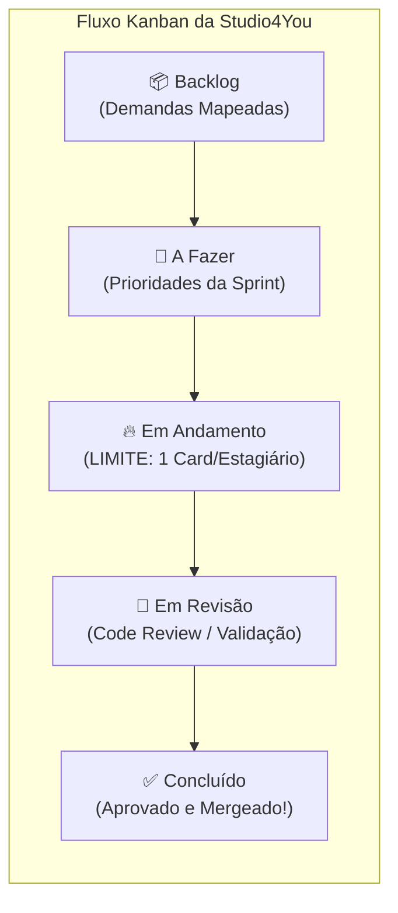

> 📍 **Manual do Calouro** » **Trilha 1: Cultura & Rituais** » [🏠 Hub Central (README)](../README.md) &nbsp;|&nbsp; ⏱️ *Tempo de leitura: 4 min*

---

# 📋 03. O Tao do Trello & O Ciclo de Sprints

> *"Pare de começar e comece a terminar." — Filosofia Kanban aplicada à vida.*

---

## 🏃 Como Funcionam as Nossas Sprints?

Na **Studio4You**, não trabalhamos no estilo "cada um faz o que dá na telha". Adotamos ciclos estruturados chamados **Sprints** (geralmente ciclos semanais ou quinzenais alinhados às sextas-feiras):

1. **Início da Sprint (Segunda-feira):** Pegamos o que é prioridade máxima do `Backlog` e colocamos na coluna `A Fazer`.
2. **Execução durante a semana:** Você puxa as tarefas, coda, testa e move os cards.
3. **Fim da Sprint (Sexta-feira):** Conferimos tudo o que foi parar em `Concluído` e comemoramos o progresso.

---

## 🏗️ As 5 Colunas Sagradas do Nosso Trello

O fluxo das colunas é rigorosamente respeitado para evitar gargalos e confusão.



### 1. `Backlog` (Demandas Mapeadas)
- Onde moram as ideias, funcionalidades futuras, melhorias e débitos técnicos.
- **Atenção:** Você não mexe aqui sozinho! O gestor prioriza e alimenta esta coluna.

### 2. `A Fazer` (Prioridades do Ciclo)
- As tarefas que foram selecionadas na reunião de **Segunda-feira** para serem feitas na Sprint atual.
- Se o seu card anterior foi concluído e você está livre, é daqui que você puxa o próximo.

### 3. `Em Andamento` ⚠️ (LIMITE ESTRITO: 1 CARD POR ESTAGIÁRIO)
- > [!IMPORTANT]
  > **LEI MARCIAL DO TRELLO:** Você só pode ter **EXATAMENTE 1 CARD** nesta coluna ao mesmo tempo.  
  > Se você puxar 3 cards, você não está sendo 3 vezes mais produtivo, está apenas deixando 3 coisas incompletas. Foco total em finalizar uma entrega antes de partir para a próxima!

### 4. `Em Revisão` (Aguardando Code Review / Validação)
- Você terminou o código?
- Abriu o Pull Request no GitHub?
- Testou localmente no seu Ubuntu e tudo funcionou?
- **Mova o card para cá!** Adicione o link do PR ou prints de validação visual e avise o gestor.

### 5. `Concluído` (Entregas Aprovadas)
- O Pull Request foi revisado, aprovado e mergeado na branch principal.
- Tarefa testada, homologada e finalizada com louvor.
- Aqui fica o troféu do seu trabalho na semana! 🏆

---

## 🃏 Anatomia de um Card Perfeito no Trello

Para que um card seja produtivo e não vire uma charada, ele deve conter:

1. **Título Claro:**  
   - ❌ *Ruim:* "Ajustar coisas na tela"  
   - ✅ *Bom:* `feat(auth): Criar componente de formulário de login responsivo`
2. **Descrição com Contexto:**  
   - Qual é o objetivo da tarefa?
   - Qual issue ou bug ela resolve?
3. **Critérios de Aceite (Checklist):**
   ```markdown
   - [ ] Criar arquivo LoginForm.tsx
   - [ ] Validar e-mail com regex
   - [ ] Exibir mensagem de erro amigável se a senha for curta
   - [ ] Testar layout em 320px, 768px e 1080px
   ```
4. **Membro Responsável:** Atribua o seu usuário ao card.
5. **Etiquetas (Labels):** `Frontend`, `Backend`, `Bug`, `Docs`, `Prioridade Alta`.
6. **Link do PR / Branch:** Anexado assim que a branch for criada.

---

## 🧭 Navegação Rápida

[⬅️ Anterior: 02. Comunicação, Contas & Discord](./02-comunicacao-contas-e-discord.md) &nbsp;|&nbsp; [🏠 Início (README)](../README.md) &nbsp;|&nbsp; [Próximo: 04. Rituais & Reuniões ➡️](./04-rituais-e-reunioes.md)
