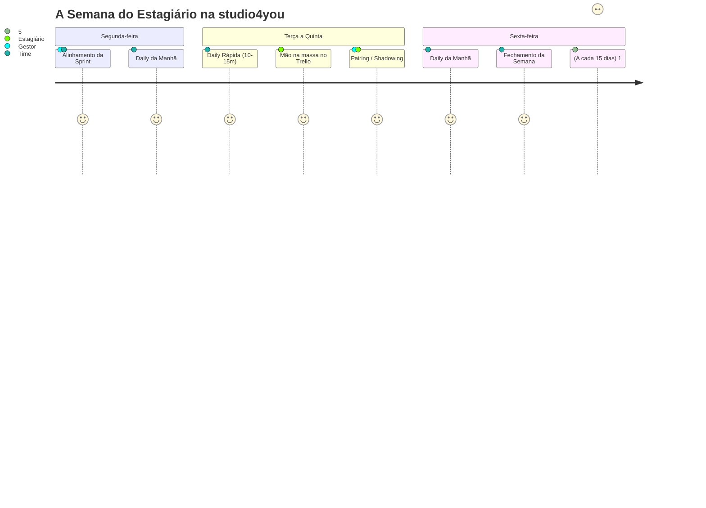

# ⏰ 04. Rituais & Reuniões de Equipe

> *"Reunião boa é reunião objetiva, transparente e com todo mundo presente de verdade."*

---

## 📹 A Regra Suprema: Câmera Ligada!

Vamos começar falando da regra mais comentada (e mais cobrada pelo gestor):

> [!IMPORTANT]
> **A CÂMERA DEVE ESTAR LIGADA EM TODAS AS REUNIÕES.**  
> Não aceitamos ícone estático, tela preta, teto do quarto ou transmissão de fantasma.  
> - Penteie o cabelo, coloque uma camiseta legal e ajeite a iluminação.  
> - Estágio remoto requer conexão humana, confiança visual e foco mútuo.  
> - Se você estiver com a câmera desligada sem um motivo de força maior pré-comunicado, a reunião nem começa!

---

## 🗓️ O Calendário Semanal de Rituais

---

## ☀️ 1. Daily Diária (10 a 15 minutos)

Acontece todo santo dia no canal de voz do Discord. É rápida, ágil e focada.

### A Fórmula dos 3 Passos:
Ao falar, você deve responder apenas a 3 perguntas essenciais:
1. **O que eu fiz ontem:** *(ex: "Terminei o card de validação do formulário e subi o PR #14.")*
2. **O que vou fazer hoje:** *(ex: "Vou pegar o card da API de autenticação na coluna 'A Fazer'.")*
3. **O que está me travando (Impedimentos):** *(ex: "Estou com dúvida sobre onde guardar o JWT no localStorage ou em cookies.")*

> [!TIP]
> **Regra de Ouro da Daily:** O objetivo não é prestar contas detalhadas de cada linha de código, mas **destravar impedimentos técnicos**.  
> Quebrou a branch? Rodou comando errado no banco? Não esconda com vergonha. A Daily é o local seguro para levantar a mão. Um erro dito em 1 minuto vira solução imediata com a equipe!

---

## 🚀 2. Alinhamento Semanal (Segunda-feira)

- **Objetivo:** Abrir a semana alinhando a bússola.
- **O que acontece:**
  - O gestor apresenta as prioridades do cliente ou do produto para a Sprint.
  - Selecionamos juntos as tarefas do `Backlog` que passarão para a coluna `A Fazer`.
  - Definimos responsáveis e esclarecemos regras de negócio antes de começar a codar.

---

## 🏁 3. Fechamento Semanal (Sexta-feira)

- **Objetivo:** Celebrar conquistas e inspecionar a qualidade das entregas.
- **O que acontece:**
  - Olhamos a coluna `Concluído` do Trello.
  - Demonstração rápida (*Show & Tell*) das funcionalidades entregues.
  - Análise do que não deu tempo de fazer e por quê (sem julgamentos, com foco em aprendizado).
  - Deixamos a casa arrumada para que a segunda-feira comece com tranquilidade.

---

## 👥 4. Pairing & Shadowing com o Gestor (Semanal)

Uma das maiores vantagens do estágio na studio4you é a mentoria prática direta:
- **Shadowing (Você assiste):** O gestor compartilha a tela e resolve um problema complexo de arquitetura, refatoração ou infraestrutura ao vivo, explicando o raciocínio linha a linha.
- **Pairing (Você coda, o gestor orienta):** Você compartilha a sua tela codando enquanto o gestor atua como copiloto, dando dicas de atalhos no Linux, boas práticas de código e depuração.
- **Como aproveitar:** Tenha um caderno ou bloco de notas aberto. Anote comandos e macetes!

---

## 🎯 5. Feedback Quinzenal (1:1 de 30 minutos)

A cada 15 dias, você terá uma conversa individual de 30 minutos com o seu gestor:
- **Revisão dos Cards & PRs:** Análise das tarefas entregues no Trello e comentários feitos nos seus Pull Requests.
- **Pontos Fortes:** Reconhecimento daquilo em que você se destacou na quinzena.
- **Pontos Técnicos a Ajustar:** Onde você precisa estudar mais (ex: melhorar commits, testes, lógica, boas práticas).
- **Validação do Relatório Quinzenal:** O gestor analisa seu [Relatório Quinzenal da UTFPR](./templates/relatorio-quinzenal-utfpr.md), assina e valida suas horas.

---

## 🎓 6. Dias de Prova na UTFPR: FOLGA TOTAL PARA ESTUDAR! (Trabalho Não Permitido)

> *"Em dia de prova na UTFPR, você NÃO trabalha no estágio. Sua obrigação exclusiva é estudar, tirar uma boa nota e garantir sua aprovação!"*

Seguindo as diretrizes da **Lei do Estágio (Lei nº 11.788/2008)** e a política interna de valorização acadêmica da **studio4you**:

> [!IMPORTANT]
> **REGRA OFICIAL: DIA DE PROVA = FOLGA TOTAL PARA ESTUDO.**  
> - Em dias de avaliação, provas teóricas, exames práticos ou bancas de TCC da UTFPR, **não é permitido trabalhar no estágio**.  
> - Você **NÃO** deve abrir cards do Trello, não precisa participar de Dailies e não deve mexer em código da empresa nesses dias.  
> - O tempo é 100% reservado para seus cadernos, livros, exercícios e descanso mental pré-prova.

### 📋 O que você precisa fazer:
1. **Avisar as Datas com Antecedência (Obrigatório):**
   - No início do semestre ou assim que o professor publicar o cronograma de provas (P1, P2 e Exames Finais), envie as datas no canal `#avisos` do Discord ou na reunião de alinhamento de **Segunda-feira** (com no mínimo 48h de antecedência).
2. **Organização da Sprint pelo Gestor:**
   - Sabendo que você terá prova na quarta ou quinta-feira, o Ricardo simplesmente **não atribuirá demandas** para aquele dia no Trello.
   - Sua semana é planejada já considerando os dias de folga de estudo.
3. **Zero Estresse e Zero Culpa:**
   - Faça sua prova com calma. Após o término da prova, você descansa e retorna às atividades no dia útil seguinte com a mente limpa. Transparência prévia garante que tudo funcione sem atritos!

---

## 🧭 Navegação Rápida

[⬅️ Anterior: 03. O Tao do Trello & Sprints](./03-fluxo-trello-e-sprints.md) &nbsp;|&nbsp; [🏠 Início (README)](../README.md) &nbsp;|&nbsp; [Próximo: 05. Setup do Ambiente Linux ➡️](./05-setup-ambiente-linux.md)
