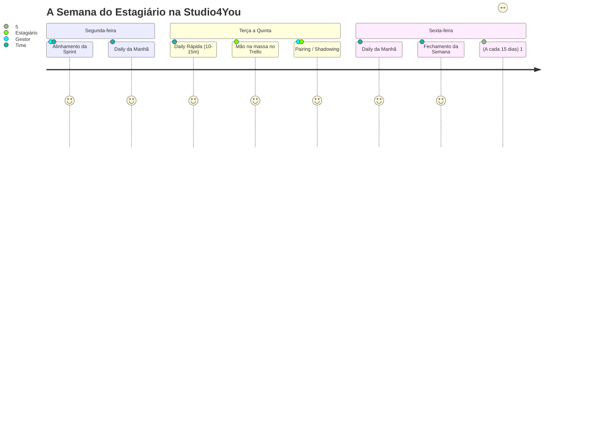

> 📍 **Manual do Calouro** » **Trilha 1: Cultura & Rituais** » [🏠 Hub Central (README)](../README.md) &nbsp;|&nbsp; ⏱️ *Tempo de leitura: 6 min*

---

# ⏰ 04. Rituais & Reuniões de Equipe

> *"Reunião boa é reunião objetiva, transparente e com todo mundo presente de verdade."*

---

## 📹 Reuniões com Câmera: Conexão Humana & Presença Real

Na **Studio4You**, nossos encontros e rituais acontecem com a **câmera ligada**:

> [!IMPORTANT]
> **A câmera aberta é sobre aproximação, foco mútuo e empatia.**  
> O estágio é remoto, mas a nossa equipe é feita de pessoas reais. Ver o rosto uns dos outros encurta distâncias, constrói confiança e torna a convivência muito mais acolhedora.  
> - Não precisa de superprodução nem terno: uma camiseta limpa, o rosto visível e uma iluminação básica são mais que suficientes.  
> - Teve um imprevisto (internet oscilando, webcam travou, ambiente barulhento)? Sem estresse: avise no canal antes de começar e participamos normalmente.

### 🤔 Por que a câmera ligada faz tanta diferença?

Não se trata de vigilância ou formalidade excessiva. Em um ambiente remoto, a câmera cumpre um papel fundamental para o time:

- **Conexão humana real:** Ver o rosto dos colegas transforma nomes no Discord em companheiros de equipe, criando senso de pertencimento e proximidade no dia a dia.
- **A expressão avisa antes da voz:** Quando alguém explica uma tarefa ou conceito, um olhar de dúvida ajuda o gestor ou mentor a perceber na hora que vale a pena pausar e explicar de outro jeito, evitando que a dúvida vire um travamento depois.
- **Sintonia e foco conjunto:** Como as reuniões são muito breves, estar presente visualmente ajuda todo mundo a manter a mesma frequência e alinhar as prioridades do dia sem ruídos.
- **Cultura de igualdade:** O gestor, os mentores e os estagiários ligam a câmera juntos. É um hábito compartilhado por toda a equipe, sem exceções.

#### 🤝 Em reuniões com clientes

Quando você participa de uma conversa com clientes, a câmera ligada transmite segurança e comprometimento:

- **Transparência e credibilidade:** O cliente vê profissionais reais, dedicados ao projeto dele e atentos às suas necessidades.
- **Desenvolvimento profissional:** É um ótimo laboratório para você praticar a postura e a comunicação interpessoal que o mercado de tecnologia valoriza.

#### 😌 Fique tranquilo: a câmera é para aproximar, não para vigiar

Ligar a câmera nos primeiros dias dá um friozinho na barriga em quase todo mundo, e isso é absolutamente natural. Para você participar com tranquilidade:

- **Ninguém está avaliando a sua casa ou sua aparência:** Não precisa de cenário decorado, iluminação profissional ou silêncio de estúdio. Se preferir mais privacidade, sinta-se à vontade para ativar o fundo desfocado (*blur*) ou um fundo virtual neutro.
- **As reuniões são curtas de verdade:** A Daily dura apenas de 10 a 15 minutos! Não é uma maratona na frente da tela, mas sim um momento rápido de alinhamento diário.
- **Imprevistos acontecem e ninguém vai se estressar:** A conexão caiu? A câmera não abriu? Tem barulho de obra no vizinho? Respire fundo, mande uma mensagem no canal avisando e acompanhe a chamada. Imprevistos técnicos acontecem com todo mundo.
- **É um hábito que fica natural em poucos dias:** O nervosismo do início passa logo. Em pouco tempo, a câmera aberta se torna algo leve, espontâneo e confortável.

> [!TIP]
> **Dica de ouro para diminuir a timidez e o cansaço:** no Discord ou Google Meet, ative a opção de **ocultar a sua própria imagem**. Você continua visível para o time, mas para de ficar se olhando e se policiando na tela. É exatamente como em uma conversa presencial: a gente olha para os colegas, e não para o espelho!

---

## ⏰ Horário de Funcionamento & Expediente da Empresa

A **Studio4You** opera de **segunda a sexta-feira** nos seguintes turnos oficiais:

| Turno | Horário | O que acontece |
| :--- | :---: | :--- |
| ☀️ **Manhã** | `09:00 às 12:00` | Início do expediente, Daily matinal, alinhamentos de sprint e foco em código. |
| 🍽️ **Almoço / Intervalo** | `12:00 às 14:00` | Pausa para almoço, descanso e recarregar as energias da equipe. |
| 🌆 **Tarde** | `14:00 às 18:00` | Continuidade do desenvolvimento, revisões de PRs, pareamentos e fechamento do dia. |

> [!NOTE]
> - **Carga horária do estágio:** Os estagiários cumprem sua jornada contratual (normalmente 6h diárias / 30h semanais) distribuída dentro dessa janela de operação, alinhada diretamente com o gestor para conciliar perfeitamente com as aulas e compromissos na UTFPR.
> - **Desconexão respeitada:** Fora desse expediente (antes das 09h, durante o almoço das 12h às 14h, após as 18h e nos fins de semana), você não tem obrigação de responder mensagens nem trabalhar. O descanso e os estudos são sagrados!

---

## 🗓️ O Calendário Semanal de Rituais

---

## ☀️ 1. Daily Diária (10 a 15 minutos)

Acontece todo santo dia no canal de voz do Discord. É rápida, ágil e focada.

### A Fórmula dos 3 Passos:
Ao falar, você deve responder apenas a 3 perguntas essenciais:
1. **O que eu fiz ontem:** *(ex: "Terminei o card de validação do formulário e subi o PR #14.")*
2. **O que vou fazer hoje:** *(ex: "Vou pegar o card da API de autenticação na coluna 'A Fazer'.")*
3. **O que está me travando (Impedimentos):** *(ex: "Estou com dúvida sobre onde guardar o JWT no localStorage ou em cookies.")*

> [!TIP]
> **Regra de Ouro da Daily:** O objetivo não é prestar contas detalhadas de cada linha de código, mas **destravar impedimentos técnicos**.  
> Quebrou a branch? Rodou comando errado no banco? Não esconda com vergonha. A Daily é o local seguro para levantar a mão. Um erro dito em 1 minuto vira solução imediata com a equipe!

---

## 🚀 2. Alinhamento Semanal (Segunda-feira)

- **Objetivo:** Abrir a semana alinhando a bússola.
- **O que acontece:**
  - O gestor apresenta as prioridades do cliente ou do produto para a Sprint.
  - Selecionamos juntos as tarefas do `Backlog` que passarão para a coluna `A Fazer`.
  - Definimos responsáveis e esclarecemos regras de negócio antes de começar a codar.

---

## 🏁 3. Fechamento Semanal (Sexta-feira)

- **Objetivo:** Celebrar conquistas e inspecionar a qualidade das entregas.
- **O que acontece:**
  - Olhamos a coluna `Concluído` do Trello.
  - Demonstração rápida (*Show & Tell*) das funcionalidades entregues.
  - Análise do que não deu tempo de fazer e por quê (sem julgamentos, com foco em aprendizado).
  - Deixamos a casa arrumada para que a segunda-feira comece com tranquilidade.

---

## 👥 4. Pairing & Shadowing com o Gestor (Semanal)

Uma das maiores vantagens do estágio na Studio4You é a mentoria prática direta:
- **Shadowing (Você assiste):** O gestor compartilha a tela e resolve um problema complexo de arquitetura, refatoração ou infraestrutura ao vivo, explicando o raciocínio linha a linha.
- **Pairing (Você coda, o gestor orienta):** Você compartilha a sua tela codando enquanto o gestor atua como copiloto, dando dicas de atalhos no Linux, boas práticas de código e depuração.
- **Como aproveitar:** Tenha um caderno ou bloco de notas aberto. Anote comandos e macetes!

---

## 🎯 5. Feedback Quinzenal (1:1 de 30 minutos)

A cada 15 dias, você terá uma conversa individual de 30 minutos com o seu gestor:
- **Revisão dos Cards & PRs:** Análise das tarefas entregues no Trello e comentários feitos nos seus Pull Requests.
- **Pontos Fortes:** Reconhecimento daquilo em que você se destacou na quinzena.
- **Pontos Técnicos a Ajustar:** Onde você precisa estudar mais (ex: melhorar commits, testes, lógica, boas práticas).
- **Validação do Relatório Quinzenal:** O gestor analisa seu [Relatório Quinzenal da UTFPR](./templates/relatorio-quinzenal-utfpr.md), assina e valida suas horas.

---

## 🎓 6. Dias de Prova na UTFPR: FOLGA TOTAL PARA ESTUDAR! (Trabalho Não Permitido)

> *"Em dia de prova na UTFPR, você NÃO trabalha no estágio. Sua obrigação exclusiva é estudar, tirar uma boa nota e garantir sua aprovação!"*

Seguindo as diretrizes da **Lei do Estágio (Lei nº 11.788/2008)** e a política interna de valorização acadêmica da **Studio4You**:

> [!IMPORTANT]
> **REGRA OFICIAL: DIA DE PROVA = FOLGA TOTAL PARA ESTUDO.**  
> - Em dias de avaliação, provas teóricas, exames práticos ou bancas de TCC da UTFPR, **não é permitido trabalhar no estágio**.  
> - Você **NÃO** deve abrir cards do Trello, não precisa participar de Dailies e não deve mexer em código da empresa nesses dias.  
> - O tempo é 100% reservado para seus cadernos, livros, exercícios e descanso mental pré-prova.

### 📋 O que você precisa fazer:
1. **Avisar as Datas com Antecedência (Obrigatório):**
   - No início do semestre ou assim que o professor publicar o cronograma de provas (P1, P2 e Exames Finais), envie as datas no canal `#avisos` do Discord ou na reunião de alinhamento de **Segunda-feira** (com no mínimo 48h de antecedência).
2. **Organização da Sprint pelo Gestor:**
   - Sabendo que você terá prova na quarta ou quinta-feira, o Ricardo simplesmente **não atribuirá demandas** para aquele dia no Trello.
   - Sua semana é planejada já considerando os dias de folga de estudo.
3. **Zero Estresse e Zero Culpa:**
   - Faça sua prova com calma. Após o término da prova, você descansa e retorna às atividades no dia útil seguinte com a mente limpa. Transparência prévia garante que tudo funcione sem atritos!

---

## 🧭 Navegação Rápida

[⬅️ Anterior: 03. O Tao do Trello & Sprints](./03-fluxo-trello-e-sprints.md) &nbsp;|&nbsp; [🏠 Início (README)](../README.md) &nbsp;|&nbsp; [Próximo: 05. Setup do Ambiente Linux ➡️](./05-setup-ambiente-linux.md)
