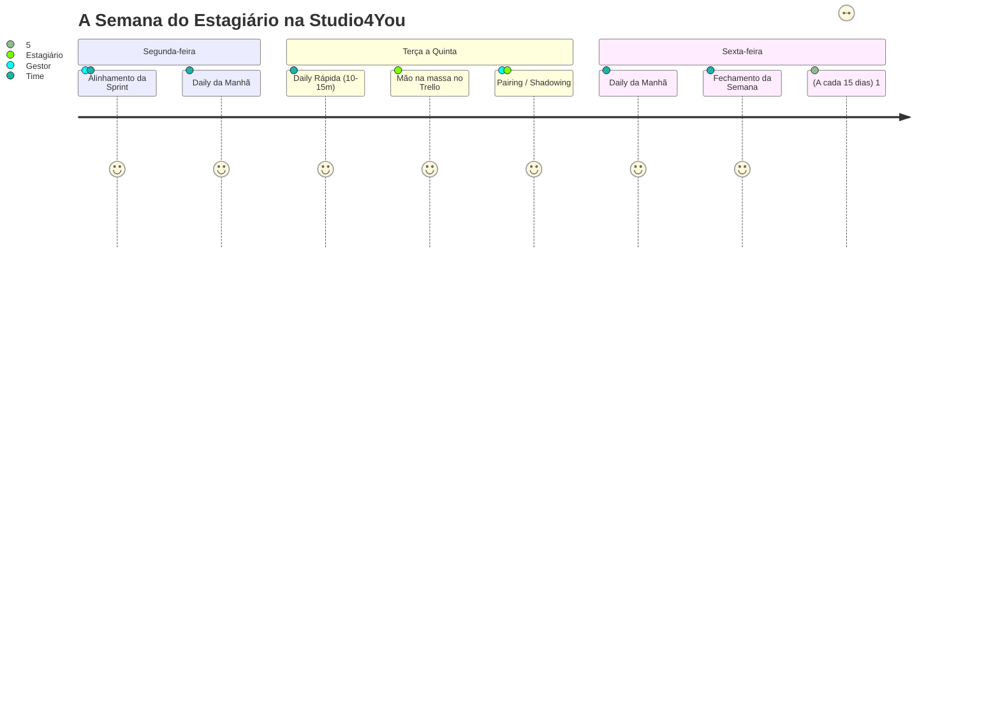

> 📍 **Manual do Calouro** » **Trilha 1: Cultura & Rituais** » [🏠 Hub Central (README)](../README.md) &nbsp;|&nbsp; ⏱️ *Tempo de leitura: 6 min*

---

# ⏰ 04. Rituais & Reuniões de Equipe

> *"Reunião boa é reunião objetiva, transparente e com todo mundo presente de verdade."*

---

## 📹 A Regra Suprema: Câmera Ligada!

Vamos começar falando da regra mais comentada (e mais cobrada pelo gestor):

> [!IMPORTANT]
> **A CÂMERA DEVE ESTAR LIGADA EM TODAS AS REUNIÕES.**  
> Não aceitamos ícone estático, tela preta, teto do quarto ou transmissão de fantasma.  
> - Penteie o cabelo, coloque uma camiseta legal e ajeite a iluminação.  
> - Estágio remoto requer conexão humana, confiança visual e foco mútuo.  
> - Se você estiver com a câmera desligada sem um motivo de força maior pré-comunicado, a reunião nem começa!

### 🤔 Por que a câmera ligada é obrigatória?

Não é implicância nem vigilância. A regra existe porque, em um time remoto, a câmera é o único canal que devolve o que uma sala de reunião presencial entrega de graça.

- **Quem conduz a reunião precisa ver se está sendo acompanhado.** Com a câmera ligada, dá para perceber quem está prestando atenção e quem está distraído: olhando o celular, conversando com outra pessoa na sala, mexendo em outra aba. Uma tela preta não informa nada, e quem está explicando fica falando sozinho sem saber.
- **A expressão do rosto avisa antes da voz.** Uma cara de dúvida mostra que a explicação não ficou clara e permite ao gestor parar e explicar de novo. Sem câmera, a dúvida só aparece dias depois, na forma de um card feito errado.
- **Câmera ligada segura o seu próprio foco.** Sabendo que está sendo visto, você não abre outra aba nem pega o celular. A regra protege a sua atenção, não só a de quem fala.
- **Presença gera confiança.** Em um time que quase nunca se encontra pessoalmente, ver o rosto um do outro é o que transforma nomes no Discord em colegas de equipe.
- **É uma questão de respeito.** Quem preparou a reunião reservou tempo para você. Aparecer de verdade é o mínimo de retorno.

#### 🤝 Em reunião com cliente, vale em dobro

Quando você participa de uma reunião com cliente, a câmera ligada deixa de ser só uma regra interna e passa a ser a imagem da empresa:

- **Câmera ligada dá presença.** O cliente vê um time real, atento e comprometido com o projeto dele, e não uma lista de nomes mudos na chamada.
- **Tela preta passa desinteresse.** O cliente não tem como saber se você está ouvindo, e a impressão que fica é a de alguém que não está nem aí.
- **Você representa a Studio4You.** Postura, ambiente e atenção valem tanto quanto o que é dito. Capriche no enquadramento e na iluminação ([Módulo 09](./09-rotina-e-boas-praticas-remotas.md)).

#### 📊 O que dizem as pesquisas

- **Câmera desligada é lida como desengajamento.** Em uma pesquisa da Wakefield Research para a Vyopta (2022), com 200 executivos de empresas americanas com 500 funcionários ou mais, **93%** disseram considerar que quem desliga a câmera está, em geral, menos engajado no trabalho, e **92%** afirmaram que profissionais que ficam com frequência no mudo ou sem câmera provavelmente não têm futuro de longo prazo na empresa. Além disso, 43% suspeitam que quem está sem câmera está navegando na internet ou nas redes sociais ([Axios](https://www.axios.com/2022/04/15/trouble-for-workers-who-turn-cameras-off-zoom)). É uma pesquisa de opinião: ela não prova que a câmera melhora o trabalho, mas mostra como o mercado enxerga a tela preta.
- **Câmera ligada também cansa, e nós sabemos disso.** Um experimento publicado no *Journal of Applied Psychology* (Shockley e colegas, 2021), com 103 participantes ao longo de quatro semanas, concluiu que manter a câmera ligada aumenta o cansaço em reuniões virtuais, com efeito maior em quem é novo no time ([Universidade da Geórgia](https://news.uga.edu/cameras-not-meetings-cause-zoom-fatigue/)).

Por isso a regra vem acompanhada de um compromisso nosso: **reuniões curtas e objetivas**. A Daily dura de 10 a 15 minutos justamente para que a câmera ligada seja um momento de presença, e não uma maratona.

> [!TIP]
> **Para cansar menos:** oculte a sua própria imagem na chamada (você não passa o dia se olhando no espelho em uma reunião presencial), posicione a câmera na altura dos olhos e, em reuniões longas, combine uma pausa. Teve um imprevisto de verdade, como problema na câmera, na internet ou no ambiente? Avise antes da reunião começar: motivo de força maior comunicado com antecedência é sempre aceito.

---

## 🗓️ O Calendário Semanal de Rituais

---

## ☀️ 1. Daily Diária (10 a 15 minutos)

Acontece todo santo dia no canal de voz do Discord. É rápida, ágil e focada.

### A Fórmula dos 3 Passos:
Ao falar, você deve responder apenas a 3 perguntas essenciais:
1. **O que eu fiz ontem:** *(ex: "Terminei o card de validação do formulário e subi o PR #14.")*
2. **O que vou fazer hoje:** *(ex: "Vou pegar o card da API de autenticação na coluna 'A Fazer'.")*
3. **O que está me travando (Impedimentos):** *(ex: "Estou com dúvida sobre onde guardar o JWT no localStorage ou em cookies.")*

> [!TIP]
> **Regra de Ouro da Daily:** O objetivo não é prestar contas detalhadas de cada linha de código, mas **destravar impedimentos técnicos**.  
> Quebrou a branch? Rodou comando errado no banco? Não esconda com vergonha. A Daily é o local seguro para levantar a mão. Um erro dito em 1 minuto vira solução imediata com a equipe!

---

## 🚀 2. Alinhamento Semanal (Segunda-feira)

- **Objetivo:** Abrir a semana alinhando a bússola.
- **O que acontece:**
  - O gestor apresenta as prioridades do cliente ou do produto para a Sprint.
  - Selecionamos juntos as tarefas do `Backlog` que passarão para a coluna `A Fazer`.
  - Definimos responsáveis e esclarecemos regras de negócio antes de começar a codar.

---

## 🏁 3. Fechamento Semanal (Sexta-feira)

- **Objetivo:** Celebrar conquistas e inspecionar a qualidade das entregas.
- **O que acontece:**
  - Olhamos a coluna `Concluído` do Trello.
  - Demonstração rápida (*Show & Tell*) das funcionalidades entregues.
  - Análise do que não deu tempo de fazer e por quê (sem julgamentos, com foco em aprendizado).
  - Deixamos a casa arrumada para que a segunda-feira comece com tranquilidade.

---

## 👥 4. Pairing & Shadowing com o Gestor (Semanal)

Uma das maiores vantagens do estágio na Studio4You é a mentoria prática direta:
- **Shadowing (Você assiste):** O gestor compartilha a tela e resolve um problema complexo de arquitetura, refatoração ou infraestrutura ao vivo, explicando o raciocínio linha a linha.
- **Pairing (Você coda, o gestor orienta):** Você compartilha a sua tela codando enquanto o gestor atua como copiloto, dando dicas de atalhos no Linux, boas práticas de código e depuração.
- **Como aproveitar:** Tenha um caderno ou bloco de notas aberto. Anote comandos e macetes!

---

## 🎯 5. Feedback Quinzenal (1:1 de 30 minutos)

A cada 15 dias, você terá uma conversa individual de 30 minutos com o seu gestor:
- **Revisão dos Cards & PRs:** Análise das tarefas entregues no Trello e comentários feitos nos seus Pull Requests.
- **Pontos Fortes:** Reconhecimento daquilo em que você se destacou na quinzena.
- **Pontos Técnicos a Ajustar:** Onde você precisa estudar mais (ex: melhorar commits, testes, lógica, boas práticas).
- **Validação do Relatório Quinzenal:** O gestor analisa seu [Relatório Quinzenal da UTFPR](./templates/relatorio-quinzenal-utfpr.md), assina e valida suas horas.

---

## 🎓 6. Dias de Prova na UTFPR: FOLGA TOTAL PARA ESTUDAR! (Trabalho Não Permitido)

> *"Em dia de prova na UTFPR, você NÃO trabalha no estágio. Sua obrigação exclusiva é estudar, tirar uma boa nota e garantir sua aprovação!"*

Seguindo as diretrizes da **Lei do Estágio (Lei nº 11.788/2008)** e a política interna de valorização acadêmica da **Studio4You**:

> [!IMPORTANT]
> **REGRA OFICIAL: DIA DE PROVA = FOLGA TOTAL PARA ESTUDO.**  
> - Em dias de avaliação, provas teóricas, exames práticos ou bancas de TCC da UTFPR, **não é permitido trabalhar no estágio**.  
> - Você **NÃO** deve abrir cards do Trello, não precisa participar de Dailies e não deve mexer em código da empresa nesses dias.  
> - O tempo é 100% reservado para seus cadernos, livros, exercícios e descanso mental pré-prova.

### 📋 O que você precisa fazer:
1. **Avisar as Datas com Antecedência (Obrigatório):**
   - No início do semestre ou assim que o professor publicar o cronograma de provas (P1, P2 e Exames Finais), envie as datas no canal `#avisos` do Discord ou na reunião de alinhamento de **Segunda-feira** (com no mínimo 48h de antecedência).
2. **Organização da Sprint pelo Gestor:**
   - Sabendo que você terá prova na quarta ou quinta-feira, o Ricardo simplesmente **não atribuirá demandas** para aquele dia no Trello.
   - Sua semana é planejada já considerando os dias de folga de estudo.
3. **Zero Estresse e Zero Culpa:**
   - Faça sua prova com calma. Após o término da prova, você descansa e retorna às atividades no dia útil seguinte com a mente limpa. Transparência prévia garante que tudo funcione sem atritos!

---

## 🧭 Navegação Rápida

[⬅️ Anterior: 03. O Tao do Trello & Sprints](./03-fluxo-trello-e-sprints.md) &nbsp;|&nbsp; [🏠 Início (README)](../README.md) &nbsp;|&nbsp; [Próximo: 05. Setup do Ambiente Linux ➡️](./05-setup-ambiente-linux.md)
