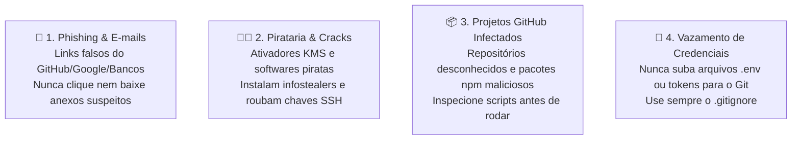

> 📍 **Manual do Calouro** » **Trilha 2: Engenharia, Setup & Gestão** » [🏠 Hub Central (README)](../README.md) &nbsp;|&nbsp; ⏱️ *Tempo de leitura: 6 min*

---

# 💻 05. Setup de Ambiente (Linux, Windows com WSL, macOS) & Segurança Virtual

> *"Desenvolver com qualidade é saber configurar seu ambiente com liberdade e protegê-lo como se fosse o cofre da sua casa."*

---

## 🧭 1. Flexibilidade de Sistema Operacional: Escolha o Seu

Na **Studio4You**, **você NÃO é obrigado a usar exclusivamente Linux nativo**.  
Reconhecemos que cada estudante possui sua própria máquina, e você tem total liberdade para trabalhar em:
* 🐧 **Linux Nativo (Ubuntu / Debian / Fedora / Arch)**;
* 🪟 **Windows (com WSL 2)**;
* 🍎 **macOS**.

O nosso requisito inegociável é que o seu ambiente consiga executar **Bash, Git, Node.js e Docker** com fidelidade aos nossos ambientes de produção e homologação.

---

## 🪟 Para quem usa Windows: A Opção do WSL 2 (Windows Subsystem for Linux)

Se você tem Windows na sua máquina, **não precisa formatar o PC nem arriscar dual-boot!**  
O Windows possui o **WSL 2**, uma tecnologia incrível da Microsoft que roda um kernel Linux Ubuntu genuíno diretamente dentro do Windows, com consumo mínimo de memória e integração total com o VS Code.

### Como instalar o WSL 2 no Windows:
1. Abra o **PowerShell** ou **Prompt de Comando** como **Administrador** (`Win + X` -> *Terminal como Administrador*).
2. Execute o comando:
   ```powershell
   wsl --install -d Ubuntu
   ```
3. Reinicie o computador quando solicitado.
4. Ao ligar, o Ubuntu abrirá uma janela de terminal pedindo para você criar seu usuário e senha Linux.
5. No seu VS Code no Windows, instale a extensão oficial **"WSL"** da Microsoft.
6. Pronto! Ao digitar `code .` dentro do terminal do Ubuntu, seu VS Code abrirá conectado diretamente ao Linux.

---

## 📦 Kit de Sobrevivência (Ubuntu Nativo ou WSL 2)

Dentro do seu terminal Linux (Ubuntu nativo ou WSL 2), prepare as ferramentas essenciais:

### 1. Atualizar os pacotes do sistema
```bash
sudo apt update && sudo apt upgrade -y
sudo apt install -y build-essential curl wget git htop tree jq
```

### 2. Configurar Git & Chaves SSH
Configure exatamente o mesmo nome e e-mail vinculado ao seu GitHub:
```bash
git config --global user.name "Seu Nome Completo"
git config --global user.email "seu-email@alunos.utfpr.edu.br"
```

Gere sua chave SSH:
```bash
ssh-keygen -t ed25519 -C "seu-email@alunos.utfpr.edu.br"
# Pressione Enter para salvar no caminho padrão ~/.ssh/id_ed25519

# Exiba e copie sua chave pública:
cat ~/.ssh/id_ed25519.pub
```
Cole essa chave no seu **GitHub (Settings -> SSH and GPG keys)**.

### 3. Node.js via NVM & Docker
```bash
# NVM (Node Version Manager)
curl -o- https://raw.githubusercontent.com/nvm-sh/nvm/v0.39.7/install.sh | bash
source ~/.bashrc
nvm install --lts

# No Linux Nativo: Instalar Docker
sudo apt install -y docker.io docker-compose-v2
sudo usermod -aG docker $USER

# No Windows com WSL 2: Instale o Docker Desktop no Windows e marque a opção:
# "Use the WSL 2 based engine" nas configurações do Docker Desktop.
```

---

## 🛡️ 2. BLOCO DE SEGURANÇA VIRTUAL & HIGIENE CIBERNÉTICA

> [!CAUTION]
> **A SEGURANÇA DA SUA MÁQUINA É PRIMORDIAL PARA A EMPRESA.**  
> Como desenvolvedor, seu computador guarda chaves SSH de servidores, tokens de API, credenciais de repositórios e código de clientes. Um único descuido pode comprometer toda a infraestrutura da Studio4You.

---

### 🪟 Alerta Especial para Windows: O Alvo Nº 1 de Ameaças
O Windows é o sistema operacional mais utilizado no mundo e, exatamente por isso, é o **alvo de 95% dos malwares, trojans, ransomwares e spywares** existentes.
* **Mantenha o Windows Defender SEMPRE ativo:** Nunca desative a proteção em tempo real.
* **Mantenha o Windows Update em dia:** Brechas de segurança conhecidas são corrigidas constantemente pela Microsoft.
* **Cuidado no Linux e Mac também:** Não caia no mito de que *"Linux não tem vírus"*. Scripts maliciosos e roubo de credenciais funcionam em qualquer sistema operacional!

---

### 🚨 As 4 Ameaças Reais do Mundo Dev (Fique Muito Atento!)



#### 🎣 1. Cuidado com Phishing e E-mails Falsos
* Desconfie de e-mails com tom alarmista (*"Sua conta do GitHub será suspensa em 24h"*, *"Atualização de segurança obrigatória"* ou faturas em anexo).
* **NUNCA** clique em links desconhecidos e nunca baixe anexos com extensões `.exe`, `.scr`, `.bat`, `.vbs` ou `.sh`.
* Sempre confira o domínio do remetente antes de tomar qualquer ação.

#### 🏴‍☠️ 2. Proibição Total de Cracks, Ativadores e Pirataria
* **NUNCA** instale ativadores piratas (como *KMS*, ativadores de Windows/Office), cracks de jogos ou programas baixados por torrent na sua máquina de trabalho.
* Esses ativadores quase sempre contêm **Infostealers** — malwares silenciosos projetados para raspar senhas salvas no navegador, cookies de sessão autenticados e as suas chaves privadas SSH (`id_rsa` / `id_ed25519`).
* Se sua máquina for infectada, o invasor terá acesso imediato aos repositórios do GitHub da empresa!

#### 📦 3. Cuidado com Repositórios do GitHub e Pacotes npm/PyPI
* **Até projetos no GitHub podem estar infectados!** Hackers criam repositórios fakes ou clonam ferramentas famosas inserindo código malicioso oculto.
* Cuidado ao rodar comandos que executam scripts cegamente da internet:
  ```bash
  # ❌ PERIGOSO: Rodar script sem ler o que tem dentro!
  curl -sSL https://site-estranho.com/install.sh | bash
  ```
* Antes de instalar dependências em um projeto pessoal, verifique o `package.json`, histórico de commits e a reputação dos pacotes.

#### 🔑 4. Gestão Segura de Chaves e `.env`
* **Nunca comite arquivos `.env`** contendo senhas de banco de dados, chaves secretas ou tokens da OpenAI/Claude.
* Sempre verifique se o `.env` está devidamente listado no arquivo `.gitignore` antes do seu primeiro `git commit`.

---

## 📜 Regra de Ouro: Documente o README.md do Projeto!

> [!IMPORTANT]
> Toda vez que você clonar um repositório da Studio4You para trabalhar:
> 1. Verifique se as instruções do `README.md` funcionam no seu ambiente (seja Linux, WSL ou Mac).
> 2. Se você precisou instalar uma biblioteca, extensão ou rodar uma migration que **NÃO** estava descrita no `README.md`: **atualize o README imediatamente e envie junto com o seu Pull Request!**
> 3. Um bom engenheiro deixa a trilha limpa e documentada para o próximo colega.

---

## 🧭 Navegação Rápida

[⬅️ Anterior: 04. Rituais & Reuniões](./04-rituais-e-reunioes.md) &nbsp;|&nbsp; [🏠 Início (README)](../README.md) &nbsp;|&nbsp; [Próximo: 06. Git & GitHub Workflow ➡️](./06-git-github-workflow.md)
