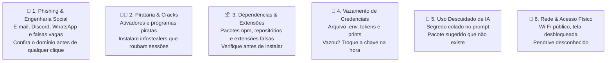

> 📍 **Manual do Calouro** » **Trilha 2: Engenharia, Setup & Gestão** » [🏠 Hub Central (README)](../README.md) &nbsp;|&nbsp; ⏱️ *Tempo de leitura: 15 min*

---

# 💻 05. Setup de Ambiente (Linux, Windows com WSL, macOS) & Segurança Virtual

> *"Desenvolver com qualidade é saber configurar seu ambiente com liberdade e protegê-lo como se fosse o cofre da sua casa."*

---

## 🧭 1. Flexibilidade de Sistema Operacional: Escolha o Seu

Na **Studio4You**, **a nossa preferência é o Linux**. É o sistema que roda nos nossos servidores de produção e homologação, o Docker funciona nele de forma nativa e os comandos deste manual foram escritos pensando nele. Quem desenvolve em Linux trabalha no mesmo ambiente em que o código vai rodar.

Mas preferência não é obrigação. **Se a sua máquina é Windows, não tem problema nenhum**: você não precisa formatar o computador nem comprar outro. Com o WSL 2 (explicado logo abaixo), você tem um Linux de verdade rodando dentro do Windows.

Reconhecemos que cada estudante possui sua própria máquina, e você pode trabalhar em:
* 🐧 **Linux Nativo (Ubuntu / Debian / Fedora / Arch)**: a opção preferida;
* 🪟 **Windows (com WSL 2)**: totalmente aceito;
* 🍎 **macOS**: totalmente aceito.

O nosso requisito inegociável é que o seu ambiente consiga executar **Bash, Git, Node.js e Docker** com fidelidade aos nossos ambientes de produção e homologação.

---

## 🪟 Para quem usa Windows: A Opção do WSL 2 (Windows Subsystem for Linux)

Se você tem Windows na sua máquina, **não precisa formatar o PC nem arriscar dual-boot!**  
O Windows possui o **WSL 2**, uma tecnologia incrível da Microsoft que roda um kernel Linux Ubuntu genuíno diretamente dentro do Windows, com consumo mínimo de memória e integração total com o VS Code.

### Como instalar o WSL 2 no Windows:
1. Abra o **PowerShell** ou **Prompt de Comando** como **Administrador** (`Win + X` -> *Terminal como Administrador*).
2. Execute o comando:
   ```powershell
   wsl --install -d Ubuntu
   ```
3. Reinicie o computador quando solicitado.
4. Ao ligar, o Ubuntu abrirá uma janela de terminal pedindo para você criar seu usuário e senha Linux.
5. No seu VS Code no Windows, instale a extensão oficial **"WSL"** da Microsoft.
6. Pronto! Ao digitar `code .` dentro do terminal do Ubuntu, seu VS Code abrirá conectado diretamente ao Linux.

---

## 📦 Kit de Sobrevivência (Ubuntu Nativo ou WSL 2)

Dentro do seu terminal Linux (Ubuntu nativo ou WSL 2), prepare as ferramentas essenciais:

### 1. Atualizar os pacotes do sistema
```bash
sudo apt update && sudo apt upgrade -y
sudo apt install -y build-essential curl wget git htop tree jq
```

### 2. Configurar Git & Chaves SSH
Configure exatamente o mesmo nome e e-mail vinculado ao seu GitHub:
```bash
git config --global user.name "Seu Nome Completo"
git config --global user.email "seu-email@alunos.utfpr.edu.br"
```

Gere sua chave SSH:
```bash
ssh-keygen -t ed25519 -C "seu-email@alunos.utfpr.edu.br"
# Pressione Enter para salvar no caminho padrão ~/.ssh/id_ed25519
# Quando pedir a passphrase, defina uma: ela protege a chave se o arquivo for copiado

# Exiba e copie sua chave pública:
cat ~/.ssh/id_ed25519.pub
```
Cole essa chave no seu **GitHub (Settings -> SSH and GPG keys)**.

### 3. Node.js via NVM & Docker
```bash
# NVM (Node Version Manager)
curl -o- https://raw.githubusercontent.com/nvm-sh/nvm/v0.39.7/install.sh | bash
source ~/.bashrc
nvm install --lts

# No Linux Nativo: Instalar Docker
sudo apt install -y docker.io docker-compose-v2
sudo usermod -aG docker $USER

# No Windows com WSL 2: Instale o Docker Desktop no Windows e marque a opção:
# "Use the WSL 2 based engine" nas configurações do Docker Desktop.
```

---

## 🛡️ 2. Bloco de Segurança Virtual & Higiene Cibernética

> [!CAUTION]
> **A segurança da sua máquina é a segurança da empresa.**  
> O seu computador guarda chaves SSH, tokens de API, sessões logadas do GitHub e código de clientes. Quem invade a sua máquina não invade "só você": entra nos repositórios, nos servidores e nos dados dos clientes da Studio4You com o seu nome.

Desenvolvedor é alvo preferencial justamente por isso. Um atacante não precisa quebrar o servidor se conseguir a chave de quem tem acesso a ele. A boa notícia é que quase todos os ataques dependem de **um descuido seu**: um clique, uma instalação, um arquivo commitado. Este bloco mostra onde estão esses descuidos.

---

### 🧱 2.1 A base: a máquina blindada

Vale para qualquer sistema operacional. Configure no primeiro dia.

| Proteção | O que fazer | Por quê |
| :--- | :--- | :--- |
| **Atualizações** | Sistema, navegador e editor sempre na última versão. Não adie a reinicialização por semanas. | A maioria das invasões explora falhas que já tinham correção publicada. |
| **Bloqueio de tela** | Senha ou biometria, com bloqueio automático em poucos minutos. Levantou da mesa, bloqueou (`Win + L` no Windows, `Super + L` no Linux, `Ctrl + Cmd + Q` no macOS). | Um notebook aberto em um café ou na faculdade é acesso livre a tudo. |
| **Disco criptografado** | BitLocker ou Criptografia do Dispositivo (Windows), FileVault (macOS), LUKS (Linux, escolhido na instalação). | Se o notebook for roubado, quem levou não consegue ler o disco. |
| **Antivírus e firewall** | No Windows, mantenha o Microsoft Defender e a proteção em tempo real ligados. Não instale um segundo antivírus "gratuito" por cima. | É a última barreira quando todas as outras falham. |
| **Usuário comum no dia a dia** | Só use administrador ou `sudo` quando o comando realmente precisar, e leia o que está autorizando. | Um malware rodando como administrador faz o que quiser com a máquina. |
| **Backup** | Código vive no Git, com push frequente. Arquivos pessoais, em um backup à parte. | Ransomware e HD queimado deixam de ser tragédia. |

> [!NOTE]
> **"Linux e Mac não pegam vírus" é mito.** O Windows concentra a maior parte dos malwares porque é o sistema mais usado em desktops, mas roubo de credenciais, pacote malicioso e phishing funcionam igual em qualquer sistema. Se você usa Windows com WSL 2, lembre que são dois ambientes para manter atualizados: o Windows e o Ubuntu.

---

### 🔐 2.2 Contas e senhas

A sua conta do GitHub vale mais para um atacante do que a sua máquina.

* **Autenticação em dois fatores (2FA) em tudo:** GitHub, Google, Discord e Trello. Use um aplicativo autenticador (Google Authenticator, Aegis, Authy) ou passkey. Evite SMS, que pode ser desviado por clonagem de chip.
* **Guarde os códigos de recuperação** fora do computador. Sem eles, perder o celular significa perder a conta.
* **Gerenciador de senhas:** Bitwarden, 1Password ou similar. Uma senha longa e diferente para cada serviço, gerada pelo gerenciador.
* **Nunca reutilize senha.** Quando um site qualquer vaza, os atacantes testam o mesmo e-mail e senha no GitHub e no Google automaticamente.
* **Senha não se manda por chat.** Nem no Discord, nem no WhatsApp, nem "só dessa vez". Credencial de projeto é entregue pelo gestor, pelo canal combinado.
* **Separe o pessoal do trabalho:** use um perfil de navegador só para a Studio4You. Menos extensões, menos sessões misturadas, menos risco.

---

### 🚨 2.3 As 6 Ameaças Reais do Mundo Dev



#### 🎣 1. Phishing e engenharia social
O ataque mais comum não é técnico: é uma mensagem convincente.

* **Desconfie de urgência.** *"Sua conta do GitHub será suspensa em 24h"*, *"atualização de segurança obrigatória"*, fatura em anexo. A pressa é a ferramenta do golpe.
* **Confira o domínio letra por letra** antes de digitar qualquer senha: `github.com` não é `github-login.com` nem `githuub.com`. Na dúvida, não clique no link: abra o site digitando o endereço.
* **Não baixe anexos executáveis** (`.exe`, `.scr`, `.bat`, `.vbs`, `.sh`, `.msi`) nem documentos que pedem para "habilitar macros".
* **Não é só e-mail.** Chega por Discord, WhatsApp, LinkedIn e SMS. Conta de colega invadida mandando *"testa meu jogo"* ou *"vota no meu projeto"* é golpe clássico.
* **Cuidado com a falsa vaga.** Um "recrutador" manda um repositório para você clonar e rodar como teste técnico. O projeto roda um script que rouba suas credenciais. Nunca rode projeto de desconhecido na máquina de trabalho.
* **Ninguém da Studio4You vai pedir sua senha ou seu código de 2FA.** Se alguém pedir, mesmo parecendo ser o gestor, confirme por voz no Discord antes de fazer qualquer coisa.

#### 🏴‍☠️ 2. Proibição total de cracks, ativadores e pirataria
* **Não instale** ativadores de Windows ou Office (KMS e similares), cracks de jogos, "mods" de procedência duvidosa ou programas baixados por torrent na máquina em que você trabalha.
* Esses arquivos são o principal veículo de **infostealers**: malwares silenciosos que copiam as senhas salvas no navegador, os **cookies de sessão** e as suas chaves SSH (`id_rsa` / `id_ed25519`).
* Com o cookie de sessão roubado, o invasor entra na sua conta **já logado, sem precisar de senha nem de 2FA**. Por isso essa regra não tem exceção.
* Precisa de um software pago? Fale com o gestor. Quase sempre existe licença de estudante, alternativa gratuita ou a empresa fornece.

#### 📦 3. Dependências, repositórios e extensões
Você roda código de terceiros o dia inteiro. É a chamada cadeia de suprimentos, e ela é atacada.

* **Confira o nome do pacote antes de instalar.** Atacantes publicam pacotes com nome quase igual ao original (`expres`, `reactt`, `lodahs`) esperando um erro de digitação.
* **Olhe a reputação:** downloads semanais, data da última versão, repositório vinculado e quem mantém. Pacote novo, sem histórico e com nome de biblioteca famosa é sinal vermelho.
* **Não adicione dependência nova em projeto da empresa sem combinar com o gestor.** Cada pacote é código de terceiros rodando com as suas permissões.
* **Respeite o lockfile.** Não apague `package-lock.json` para "resolver" erro, e prefira `npm ci` para instalar exatamente as versões travadas.
* **Extensões também são código.** Extensão de VS Code e de navegador lê tudo o que você digita. Instale só as de publicadores verificados e conhecidos, e remova as que não usa.
* **Leia antes de executar.** Nunca rode script da internet às cegas:
  ```bash
  # ❌ Perigoso: executa sem você ver o que tem dentro
  curl -sSL https://site-estranho.com/install.sh | bash

  # ✅ Baixe, leia e só então execute
  curl -sSL https://site-conhecido.com/install.sh -o install.sh
  less install.sh
  bash install.sh
  ```
* **Não cole no terminal comando que você não entende**, venha ele de fórum, de vídeo ou de IA. Atenção redobrada com `sudo`, `rm -rf`, `chmod 777` e qualquer coisa que baixe e execute.

#### 🔑 4. Gestão segura de chaves, tokens e `.env`
* **Nunca commite `.env`**, senha de banco, chave secreta ou token. O que vai para o repositório é o `.env.example`, só com os nomes das variáveis e valores fictícios.
* **Confira antes do primeiro commit** se o `.env` está mesmo sendo ignorado:
  ```bash
  # Mostra a regra do .gitignore que está ignorando o arquivo (sem saída = não está ignorado!)
  git check-ignore -v .env

  # Revise o que vai entrar no commit
  git status
  git diff --staged
  ```
* **Commitou um segredo? Apagar não resolve.** Ele continua no histórico do Git e, se houve push, considere a chave comprometida. O caminho é avisar o gestor na hora e **trocar a chave** (rotacionar). Remover do histórico vem depois.
* **Proteja a sua chave SSH com passphrase.** Se o arquivo for copiado, ele sozinho não serve para nada:
  ```bash
  # Adiciona ou troca a passphrase de uma chave que já existe
  ssh-keygen -p -f ~/.ssh/id_ed25519
  ```
* **Uma chave por máquina.** A chave privada nunca sai do computador onde foi gerada: não vai para pendrive, e-mail, Drive nem Discord. Trocou de máquina ou formatou? Gere outra e remova a antiga no GitHub.
* **Token com o mínimo de permissão e com validade.** Se o token só precisa ler um repositório, ele não deve poder apagar a organização.
* **Cuidado com print e compartilhamento de tela.** Antes de mandar um print no Discord ou abrir a tela na Daily, feche o `.env` e o terminal com credenciais (veja o [Módulo 13](./13-sigilo-etica-e-confidencialidade.md)).

#### 🤖 5. Inteligência Artificial com responsabilidade
* **Não cole segredo no prompt.** Senha, token, `.env` e dados pessoais de clientes não entram em conversa com IA.
* **Use só as ferramentas autorizadas pela empresa** ([Módulo 08](./08-beneficios-e-ferramentas-premium.md)). Código de cliente não vai para ferramenta gratuita aleatória nem para conta pessoal.
* **Confira o pacote que a IA sugeriu.** Modelos às vezes inventam nomes de bibliotecas, e atacantes registram esses nomes inventados com código malicioso. Se o pacote não tem histórico, não instale.
* **Leia o comando antes de aprovar.** Assistentes que executam comandos no terminal agem com as suas permissões. Aprovar sem ler é o mesmo que rodar script às cegas.
* O restante das regras de uso de IA no código está no [Módulo 16](./16-padroes-de-commit-branch-e-pr.md).

#### 📶 6. Rede e acesso físico
* **Wi-Fi público** (café, aeroporto, rede aberta) não é lugar de acessar servidor nem painel de cliente. Na dúvida, roteie a internet pelo celular.
* **Roteador de casa:** troque a senha padrão de administração e use WPA2 ou WPA3 com uma senha forte.
* **Pendrive desconhecido não se conecta**, nem "só para ver o que tem".
* **Máquina de trabalho não é máquina da família.** Se o computador é compartilhado, crie um usuário separado para você, com senha.
* **Em lugar público**, cuidado com quem está vendo a sua tela, e nunca deixe o notebook sozinho.

---

### ⚖️ 2.4 LGPD: a lei por trás dos dados que você manipula

A **Lei Geral de Proteção de Dados Pessoais (Lei nº 13.709/2018)** define como empresas podem coletar, usar, guardar e compartilhar dados de pessoas. Ela vale para todo sistema que a Studio4You desenvolve e é fiscalizada pela **ANPD** (Autoridade Nacional de Proteção de Dados).

Para você, na prática: no momento em que tem acesso a um banco com dados reais, você passa a fazer parte do tratamento desses dados e responde pelo cuidado com eles.

#### Os conceitos que todo dev precisa conhecer

| Conceito | O que é | Exemplo |
| :--- | :--- | :--- |
| **Dado pessoal** | Qualquer informação que identifica ou pode identificar uma pessoa. | Nome, CPF, e-mail, telefone, endereço, IP, placa do carro. |
| **Dado pessoal sensível** | Categoria com proteção reforçada, pelo potencial de discriminação. | Saúde, biometria, dado genético, origem racial ou étnica, religião, opinião política, filiação sindical, vida sexual. |
| **Titular** | A pessoa a quem os dados se referem. É a dona do dado. | O usuário final cadastrado no sistema do cliente. |
| **Controlador** | Quem decide por que e como os dados são tratados. | Em geral, o nosso cliente. |
| **Operador** | Quem trata os dados em nome do controlador. | Em geral, a Studio4You, e você como parte dela. |
| **Tratamento** | Qualquer operação com o dado. | Coletar, consultar, armazenar, exportar, copiar, compartilhar, apagar. |
| **Anonimização** | Processo que impede o dado de ser ligado a uma pessoa. | Base de testes com nomes e CPFs fictícios. |

> [!NOTE]
> Repare que **consultar** e **copiar** já são tratamento. Abrir uma tabela de clientes por curiosidade ou baixar um dump "para testar em casa" são operações reguladas pela lei.

#### Os princípios que viram decisão de código

A lei lista dez princípios (art. 6º). Quatro deles aparecem no seu dia a dia:

* **Finalidade:** o dado só é usado para o propósito informado ao titular. E-mail coletado para login não vira lista de marketing.
* **Necessidade:** colete e exiba o mínimo. Se a tela funciona sem o CPF, o CPF não vai para a tela nem para a resposta da API.
* **Segurança:** quem trata dados deve adotar medidas técnicas para protegê-los (art. 46). Senha com hash, HTTPS e controle de acesso são obrigação legal.
* **Prevenção:** evitar o dano antes que ele aconteça. É exatamente o que este bloco de segurança ensina.

#### O que isso muda na sua rotina

* **Dado real de produção não vai para a sua máquina.** Nada de dump de produção no ambiente local. Desenvolva com seeds e dados fictícios.
* **Não exponha dado pessoal em log, mensagem de erro ou `console.log`.** Log com CPF, senha ou token é vazamento esperando acontecer.
* **Não exporte nem copie base de clientes** para planilha, pendrive, Drive pessoal, WhatsApp ou e-mail.
* **Não cole dado pessoal em ferramenta de IA**, nem para "só formatar um JSON".
* **Print com dado real não se compartilha**, nem no Discord interno. Use dados fictícios ou borre antes (veja o [Módulo 13](./13-sigilo-etica-e-confidencialidade.md)).
* **Acesse só o que a tarefa exige.** Ter permissão para ver uma tabela não é motivo para olhar.
* **A API devolve só o necessário.** Não retorne o registro inteiro do usuário quando a tela usa apenas o nome.
* **Recebeu um pedido de titular** (alguém querendo saber, corrigir ou apagar os próprios dados)? Não responda nem execute por conta própria: encaminhe ao gestor.

#### Quando dá errado

* **Incidente com dados pessoais tem prazo legal.** Quando há risco relevante aos titulares, o controlador precisa comunicar a ANPD e as pessoas afetadas (art. 48), em prazo curto, contado em dias úteis. Cada hora que você demora para avisar o gestor sai desse prazo.
* **As sanções são pesadas:** advertência, multa de até 2% do faturamento, limitada a R$ 50 milhões por infração, publicização da infração e até bloqueio ou eliminação dos dados (art. 52). Além disso, há o dano à reputação do cliente e da Studio4You.

> [!IMPORTANT]
> Este é um resumo para o dia a dia do desenvolvimento, não uma orientação jurídica. Na dúvida sobre o que pode ser feito com um dado, **pare e pergunte ao gestor antes de fazer**. Vale a leitura do [texto oficial da lei](https://www.planalto.gov.br/ccivil_03/_ato2015-2018/2018/lei/l13709.htm).

---

### 🩺 2.5 Sinais de que algo está errado

Nenhum deles é prova, mas todos merecem um aviso ao gestor:

* E-mail de login ou de 2FA que você não pediu;
* Sessão, chave SSH ou token no GitHub que você não reconhece (confira em **Settings → Sessions** e **SSH and GPG keys**);
* Commits, mensagens ou posts em seu nome que você não fez;
* Antivírus desativado sozinho, ou máquina lenta com ventoinha no máximo sem motivo;
* Extensões ou programas instalados que você não lembra de ter instalado.

---

### 🚒 2.6 Suspeitou de invasão? Os primeiros 15 minutos

> [!WARNING]
> **Avise primeiro, investigue depois.** É a [Lei 4](../README.md) do manual: *Quebrou? Não Esconda!* Ninguém é punido por avisar cedo. O prejuízo de verdade vem do incidente escondido por vergonha, que dá ao invasor dias de vantagem.

1. **Desconecte a máquina da internet** (Wi-Fi e cabo). Não desligue nem formate: isso apaga pistas importantes.
2. **Avise o gestor imediatamente**, por ligação ou pelo celular. Conte o que aconteceu, o que você clicou ou instalou e a que horas.
3. **De outro dispositivo confiável**, troque as senhas, começando pelo e-mail e pelo GitHub.
4. **Encerre as sessões e revogue os acessos:** no GitHub, saia de todas as sessões e remova chaves SSH e tokens. Faça o mesmo no Google e no Discord.
5. **Liste as credenciais de projeto** que estavam na máquina (`.env`, tokens, acessos a servidor) para que o gestor possa trocá-las.
6. **Informe se havia dados pessoais de clientes** na máquina ou ao alcance dos acessos comprometidos. Isso aciona as obrigações da LGPD (seção 2.4).
7. **Só volte a usar a máquina** depois de combinar com o gestor a limpeza ou a reinstalação do sistema.

---

### ✅ 2.7 Checklist de Segurança do Calouro

- [ ] Sistema operacional, navegador e editor atualizados.
- [ ] Bloqueio de tela automático e disco criptografado.
- [ ] Microsoft Defender ativo (Windows) e nenhum crack ou ativador instalado.
- [ ] 2FA por aplicativo autenticador no GitHub, Google, Discord e Trello.
- [ ] Códigos de recuperação guardados fora do computador.
- [ ] Gerenciador de senhas configurado, sem senha repetida.
- [ ] Chave SSH com passphrase, gerada nesta máquina.
- [ ] `.env` no `.gitignore` de todos os projetos clonados.
- [ ] Perfil de navegador separado para o trabalho, só com extensões confiáveis.
- [ ] Nenhum dado real de cliente na minha máquina: só seeds e dados fictícios.
- [ ] Claude e ferramentas da empresa só na conta corporativa do estágio; nada da empresa em conta pessoal.
- [ ] Sei exatamente quem avisar, e como, se algo der errado.

---

## 📜 Regra de Ouro: Documente o README.md do Projeto!

> [!IMPORTANT]
> Toda vez que você clonar um repositório da Studio4You para trabalhar:
> 1. Verifique se as instruções do `README.md` funcionam no seu ambiente (seja Linux, WSL ou Mac).
> 2. Se você precisou instalar uma biblioteca, extensão ou rodar uma migration que **NÃO** estava descrita no `README.md`: **atualize o README imediatamente e envie junto com o seu Pull Request!**
> 3. Um bom engenheiro deixa a trilha limpa e documentada para o próximo colega.

---

## 🧭 Navegação Rápida

[⬅️ Anterior: 04. Rituais & Reuniões](./04-rituais-e-reunioes.md) &nbsp;|&nbsp; [🏠 Início (README)](../README.md) &nbsp;|&nbsp; [Próximo: 06. Git & GitHub Workflow ➡️](./06-git-github-workflow.md)
