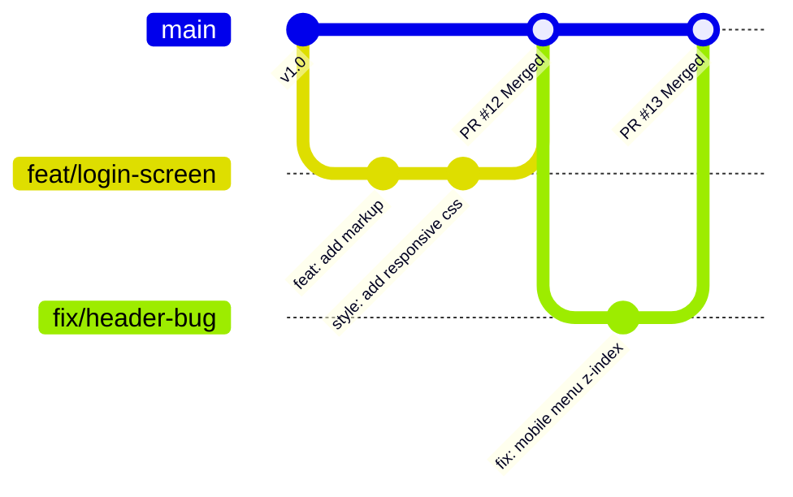

# 🐙 06. Git & GitHub Workflow

> *"Commit pequeno, commit frequente. Salve o seu trabalho antes que a energia acabe."*

---

## 🧭 O Ciclo de Vida de uma Tarefa no Git

Aqui na **Studio4You**, nunca comitamos diretamente na branch `main` ou `develop`.  
Toda e qualquer linha de código passa pelo fluxo de branches e Pull Request (PR) com revisão.



---

## 🌿 1. Nomenclatura das Branches

Crie branches com nomes semânticos que facilitem identificar a qual card do Trello ela pertence:

- **Novas funcionalidades:** `feat/nome-da-funcionalidade`  
  *(ex: `feat/cards-produtos`, `feat/formulario-contato`)*
- **Correção de bugs:** `fix/o-que-foi-corrigido`  
  *(ex: `fix/quebra-layout-mobile`, `fix/erro-ao-salvar-usuario`)*
- **Melhorias de documentação:** `docs/atualiza-readme`
- **Refatorações:** `refactor/otimiza-query-sql`

```bash
# Sempre parta da branch principal atualizada:
git checkout main
git pull origin main

# Crie sua branch de trabalho:
git checkout -b feat/tabela-relatorios
```

---

## ✍️ 2. Boas Práticas de Mensagens de Commit

Evite mensagens preguiçosas como *"ajustes"*, *"update"*, *"teste 1"* ou *"agora vai pelo amor de Deus"*.  
Adote commits semânticos no padrão simplificado:

- `feat: Adiciona filtro por data na listagem de pedidos`
- `fix: Corrige fechamento indevido do modal no clique externo`
- `style: Ajusta espaçamento e cores do botão de envio`
- `docs: Atualiza instruções de instalação no README.md`
- `refactor: Simplifica função de cálculo de desconto`

---

## 🚀 3. Abrindo um Pull Request (PR) Impecável

Quando sua funcionalidade estiver pronta e testada no seu Linux:

1. Suba a branch para o repositório remoto:
   ```bash
   git push -u origin feat/tabela-relatorios
   ```
2. Abra o GitHub e clique em **Compare & pull request**.
3. No título, seja conciso: `[Feat] Implementa tabela de relatórios`.
4. Na descrição do PR, siga o modelo:
   ```markdown
   ## 📌 O que foi feito?
   - Criação da tabela responsiva de relatórios da quinzena.
   - Integração com a rota `/api/reports`.
   - Adicionada paginação e ordenação por data.

   ## 🔗 Card no Trello
   - [Card #42 - Tela de Relatórios](https://trello.com/c/...)

   ## 🧪 Como testar?
   1. Rodar `npm run dev`.
   2. Acessar `/relatorios` no navegador.
   3. Clicar nas colunas para validar ordenação.

   ## 📸 Prints / Evidências
   [Cole aqui o print da tela funcionando]
   ```
5. Mova o card no Trello para a coluna **`Em Revisão`** e mencione o link no canal `#duvidas` ou avise na Daily!

---

## 🧭 Navegação Rápida

[⬅️ Anterior: 05. Setup do Ambiente Linux](./05-setup-ambiente-linux.md) &nbsp;|&nbsp; [🏠 Início (README)](../README.md) &nbsp;|&nbsp; [Próximo: 07. Gestão Interna ➡️](./07-guia-de-gestao-interna.md)
