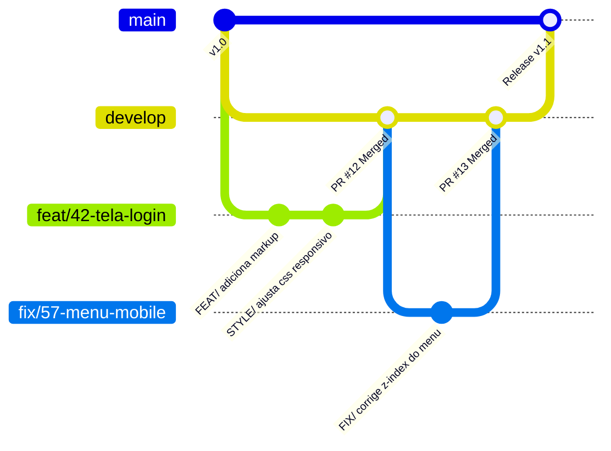

> 📍 **Manual do Calouro** » **Trilha 2: Engenharia, Setup & Gestão** » [🏠 Hub Central (README)](../README.md) &nbsp;|&nbsp; ⏱️ *Tempo de leitura: 5 min*

---

# 🐙 06. Git & GitHub Workflow

> *"Commit pequeno, commit frequente. Salve o seu trabalho antes que a energia acabe."*

---

## 🧭 O Ciclo de Vida de uma Tarefa no Git

Aqui na **Studio4You**, nunca comitamos diretamente na branch `main` ou `develop`.  
Toda e qualquer linha de código passa pelo fluxo de branches e Pull Request (PR) com revisão, e o PR sempre aponta para a `develop`, nunca para a `main`.

> [!IMPORTANT]
> Este módulo mostra o fluxo. As regras completas de nomenclatura, PR, revisão e uso de IA estão no [Módulo 16: Padrões de Commit, Branch & Pull Request](./16-padroes-de-commit-branch-e-pr.md).



---

## 🌿 1. Nomenclatura das Branches

Crie branches no formato `tipo/codigo-do-card-descricao-curta`, incluindo o número do card do Trello sempre que ele existir:

- **Novas funcionalidades:** `feat/42-tabela-relatorios`
- **Correção de bugs:** `fix/57-modal-fecha-sozinho`
- **Correção urgente em produção:** `hotfix/63-calculo-frete-checkout`
- **Melhorias de documentação:** `docs/atualiza-readme`
- **Refatorações:** `refactor/71-otimiza-query-sql`

```bash
# Sempre parta da develop atualizada:
git checkout develop
git pull origin develop

# Crie sua branch de trabalho:
git checkout -b feat/42-tabela-relatorios
```

---

## ✍️ 2. Boas Práticas de Mensagens de Commit

Evite mensagens preguiçosas como *"ajustes"*, *"update"*, *"funcionou"*, *"teste 1"* ou *"agora vai pelo amor de Deus"*.  
O commit é curto, objetivo e segue o formato `TIPO/ descrição`:

- `FEAT/ adiciona filtro por data na listagem de pedidos`
- `FIX/ corrige fechamento indevido do modal no clique externo`
- `HOTFIX/ corrige cálculo do frete no checkout`
- `STYLE/ ajusta espaçamento e cores do botão de envio`
- `DOCS/ atualiza instruções de instalação no README`
- `REFACTOR/ simplifica função de cálculo de desconto`

A lista completa de tipos e as regras da mensagem estão no [Módulo 16](./16-padroes-de-commit-branch-e-pr.md).

---

## 🚀 3. Abrindo um Pull Request (PR) Impecável

Quando sua funcionalidade estiver pronta e testada no seu Linux:

1. Suba a branch para o repositório remoto:
   ```bash
   git push -u origin feat/42-tabela-relatorios
   ```
2. Abra o GitHub e clique em **Compare & pull request**.
3. Confira o destino: a `base` do PR é a **`develop`**, nunca a `main`.
4. No título, use o padrão do commit com o número do card: `FEAT/ #42 implementa tabela de relatórios`.
5. Na descrição do PR, siga o modelo:
   ```markdown
   ## 📌 O que foi feito?
   - Criação da tabela responsiva de relatórios da quinzena.
   - Integração com a rota `/api/reports`.
   - Adicionada paginação e ordenação por data.

   ## 🔗 Card no Trello
   - [Card #42 - Tela de Relatórios](https://trello.com/c/...)

   ## 🧪 Como testar?
   1. Rodar `npm run dev`.
   2. Acessar `/relatorios` no navegador.
   3. Clicar nas colunas para validar ordenação.

   ## 📸 Prints / Evidências
   [Cole aqui o print da tela funcionando]
   ```
6. Resolva os conflitos com a `develop` e leia o seu próprio diff antes de pedir a revisão.
7. Marque pelo menos uma pessoa em **Reviewers**: o seu gestor.
8. Mova o card no Trello para a coluna **`Em Revisão`** e mencione o link no canal `#duvidas` ou avise na Daily!

---

## 🧭 Navegação Rápida

[⬅️ Anterior: 05. Setup do Ambiente Linux](./05-setup-ambiente-linux.md) &nbsp;|&nbsp; [🏠 Início (README)](../README.md) &nbsp;|&nbsp; [Próximo: 07. Gestão Interna ➡️](./07-guia-de-gestao-interna.md)
