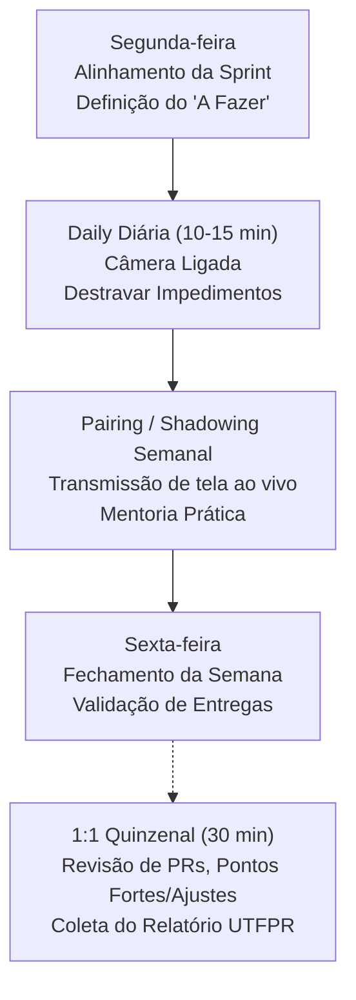

> 📍 **Manual do Calouro** » **Trilha 2: Engenharia, Setup & Gestão** » [🏠 Hub Central (README)](../README.md) &nbsp;|&nbsp; ⏱️ *Tempo de leitura: 5 min*

---

# 🛡️ 07. Manual de Gestão do Estágio (Uso Interno do Gestor)

> *Documento de referência para o supervisor de estágio da Studio4You gerenciar o ciclo de aprendizado, alinhamento técnico e entregas da equipe.*

---

## 📌 1. Diretrizes de Acesso e Ferramentas

### Contas e Logins: Conta Corporativa do Estágio + E-mail Pessoal
- **Mantenha uma conta de e-mail corporativa genérica por vaga de estágio** (duas vagas, duas contas). A conta pertence à vaga, não à pessoa, e é reaproveitada a cada ciclo.
- **Finalidade:** login no Claude e nas demais ferramentas fornecidas pela empresa, mantendo conversas, código e dados de clientes em contas que a Studio4You controla.
- **Na entrada do estagiário:**
  1. Entregue o endereço e uma senha inicial nova, por canal seguro;
  2. Configure a autenticação em dois fatores e mantenha os dados de recuperação com a empresa;
  3. Vincule a conta à licença do Claude.
- **Na saída do estagiário:**
  1. Troque a senha e encerre todas as sessões ativas;
  2. Revise ou remova o acesso ao Claude e a qualquer serviço cadastrado com a conta;
  3. Limpe a caixa e o histórico antes de entregar a conta ao próximo estagiário.
- **Deixe claro desde o Dia 1** que a conta é corporativa e auditável, conforme o [Módulo 02](./02-comunicacao-discord.md).
- **Discord, Trello e GitHub continuam no e-mail do aluno.** Convide o e-mail que ele já utiliza (pessoal ou acadêmico da UTFPR) diretamente para:
  1. O Workspace do Trello da empresa.
  2. O servidor do Discord da Studio4You.
  3. A organização e repositórios no GitHub.

### Discord: Hub de Comunicação Operacional
- Manter canais de texto separados e com propósitos estritos:
  - `#avisos`: Comunicações oficiais da gestão, alterações de horários e prazos.
  - `#duvidas`: Foco em suporte técnico colaborativo entre estagiários e liderança.
  - `#links-uteis`: Compartilhamento de artigos, bibliotecas e referências.
- Salas de voz dedicadas para reuniões com câmera e pareamento ao vivo.

### Trello: Gestão Visual por Sprints
Fluxo obrigatório em 5 colunas:
1. **`Backlog`**: Demandas mapeadas, ideias e funcionalidades futuras.
2. **`A Fazer`**: Prioridades selecionadas para o ciclo atual da Sprint.
3. **`Em Andamento`**: **Limite estrito de 1 card por estagiário**. Garante foco e reduz trabalho em progresso (WIP).
4. **`Em Revisão`**: Tarefas concluídas aguardando seu code review ou validação visual/funcional.
5. **`Concluído`**: Entregas aprovadas e integradas à branch principal.

### Ambiente de Desenvolvimento & Segurança da Máquina
- **Flexibilidade de SO:** A preferência da empresa é Linux nativo (Ubuntu sugerido), mas o estudante pode utilizar Windows com **WSL 2** ou macOS sem problema. O essencial é um ambiente compatível e reprodutível com containers Docker e terminal Bash.
- **Segurança Cibernética Primordial:** Cobrar postura rigorosa contra malwares, especialmente em Windows (antivírus ativo e atualizado), proibição de ativadores/cracks (vetores clássicos de roubo de chaves SSH e senhas) e atenção a phishing e pacotes maliciosos do GitHub.
- **Documentação de Dependências:** Os alunos continuam obrigados a **documentar no `README.md`** qualquer nova biblioteca, migração ou dependência necessária para rodar o projeto.

---

## 🎯 2. Rituais e Dinâmica de Gestão

### 1. Daily Diária (10 a 15 min)
- **Cobrança Expressa:** Câmera ligada obrigatória.
- **Roteiro dos 3 pontos:**
  1. O que fez ontem.
  2. O que vai fazer hoje.
  3. O que está travando o trabalho.
- **Regra de Ouro do Gestor:** Mantenha o foco exclusivamente em destravar impedimentos técnicos e alinhar prioridades. Se um problema exigir discussão técnica longa, isole o assunto para uma sessão pós-daily de pareamento.
- **Cobrança da Escadinha dos 3 Níveis:** Antes de responder diretamente a uma dúvida de código, sempre pergunte: *"O que a documentação diz e o que você e seu colega já tentaram juntos?"*. Isso reforça autonomia e evita dependência do gestor para dúvidas triviais.

### 2. Alinhamento da Sprint (Segunda-feira)
- Revisão rápida do backlog e priorização das tarefas que vão para `A Fazer`.
- Esclarecimento das regras de negócio para que o estudante comece a semana com direcionamento claro.

### 3. Fechamento e Review (Sexta-feira)
- Validação das tarefas entregues na semana na coluna `Concluído`.
- Verificação do que não foi concluído para reorganizar o backlog da segunda-feira seguinte.
- Reconhecimento das boas soluções implementadas.

### 4. Trabalho com o Gestor (Pairing / Shadowing Semanal)
- Sessão prática onde você:
  - Transmite a tela resolvendo um problema real de arquitetura, banco ou infraestrutura;
  - Ou orienta um dos estagiários codando ao vivo enquanto os outros acompanham.
- Esse é o momento de maior ganho de maturidade técnica do estudante.

### 5. Feedback Quinzenal (1:1 de 30 min)
- Revisão detalhada dos cards do Trello e Pull Requests dos últimos 15 dias.
- Apontamento de pontos fortes demonstrados (proatividade, clareza no código, pontualidade).
- Indicação de pontos técnicos a ajustar (qualidade dos testes, commits, atenção a detalhes).
- **Validação e assinatura do [Relatório Quinzenal da UTFPR](./templates/relatorio-quinzenal-utfpr.md)** preenchido pelo aluno.

---

## 🎓 3. Acompanhamento Acadêmico (UTFPR)

Ao final do semestre, o orientador da UTFPR solicitará um relatório consolidado.  
Com a rotina quinzenal estabelecida:
- O estagiário não acumula pendências burocráticas.
- A empresa possui histórico documentado de cada quinzena trabalhada.
- O aluno precisa apenas unificar os relatórios quinzenais no relatório final da universidade.

### 🛡️ Gestão de Dias de Prova (Folga Integral para Estudos):
- **Trabalho não permitido:** Em dias de provas, avaliações teóricas/práticas ou bancas da UTFPR, **o estagiário tem folga total**. Ele não deve mexer em código, não deve participar de cerimônias e não deve ter cards atribuídos no Trello nesses dias.
- **Conformidade Legal & Parceria:** Essa política atende à Lei Federal de Estágio (Lei nº 11.788/2008) e fortalece o compromisso formativo da Studio4You com a UTFPR.
- Exija apenas o aviso prévio das datas para organizar o backlog da semana sem surpresas.

### 🍔 Diretriz de Reembolso do Happy Hour Mensal:
- Caso você não esteja presente presencialmente no encontro do mês:
  - O colaborador deverá enviar a foto da **Nota Fiscal (NFC-e) emitida com CPF** contendo a **discriminação clara dos itens da comanda**;
  - Limite reembolsável: até **R$ 60,00 no lanche** + até **R$ 20,00 em bebidas não alcoólicas**;
  - Constando os itens permitidos e o CPF na nota, efetuar o reembolso do valor via PIX. Não aceitar recibos genéricos ou apenas comprovantes de cartão.

### 💰 Diretriz de Gestão: Programa "Indique e Ganhe" (5% via PIX):
- **Registro do Lead Indicado:** Ao receber uma indicação de lead comercial vinda de um estagiário ou colaborador, registre no histórico a data, nome do indicado e quem fez a ponte.
- **Negociação Comercial:** Conduza a apresentação da proposta, orçamento e fechamento do contrato com o cliente.
- **Apuração e Pagamento Imediato:** Assim que o cliente quitar o serviço (seja à vista ou em parcelas), calcule rigorosamente **5% sobre o montante líquido recebido** e efetue a transferência imediata via **PIX** para a chave do colaborador indicador.
- **Envio do Comprovante:** Envie o comprovante do PIX no canal privado do Discord ou WhatsApp parabenizando o colaborador pelo resultado.
- **Transparência do Pipeline:** Mantenha o colaborador atualizado sobre o andamento da negociação (ex: proposta enviada, contrato assinado, faturamento previsto).

---

## 🎯 4. Gestão de Onboarding, Avaliação & Retenção de Talentos

### 🚀 Acolhimento nos Primeiros 7 Dias:
- Certifique-se de que o estagiário siga a [Trilha de Decolagem do Módulo 11](./11-onboarding-primeiros-7-dias.md);
- Deixe preparado na coluna `A Fazer` do Trello um card pequeno com a tag `[Good First Issue]` para o 3º dia;
- No 5º dia, realize um Code Review detalhado e encorajador no primeiro Pull Request do aluno, explicando os porquês de eventuais ajustes.

### 🧯 Fomento à Autonomia (Troubleshooting):
- Quando o estagiário relatar portas presas no Docker ou commits na main por engano, oriente-o a consultar o [Módulo 12 (Primeiros Socorros)](./12-troubleshooting-primeiros-socorros.md) antes de entregar a resposta pronta. Isso constrói resiliência e independência técnica.

### 🤫 Proteção de Dados & Sigilo de Clientes:
- Monitore e reforce com o time as diretrizes do [Módulo 13 (Sigilo & Redes Sociais)](./13-sigilo-etica-e-confidencialidade.md). Clientes da Studio4You exigem sigilo absoluto.

### 💼 Transição para Demandas Remuneradas (Freelas) e Contratação:
- Ao longo das quinzenas, avalie os alunos com base nos 5 pilares do [Módulo 15](./15-criterios-de-sucesso-e-carreira.md);
- Alunos que apresentarem alta autonomia, consistência e maturidade devem ser convidados para **projetos freelancers remunerados por demanda** ou futuros contratos de trabalho conforme novas demandas comerciais da Studio4You.

---

## 🧭 Navegação Rápida

[⬅️ Anterior: 06. Git & GitHub Workflow](./06-git-github-workflow.md) &nbsp;|&nbsp; [🏠 Início (README)](../README.md) &nbsp;|&nbsp; [Próximo: 08. Benefícios & Ferramentas Top ➡️](./08-beneficios-e-ferramentas-premium.md)
