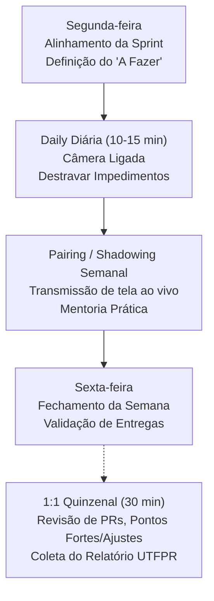

# 🛡️ 07. Manual de Gestão do Estágio (Uso Interno do Gestor)

> *Documento de referência para o supervisor de estágio da studio4you gerenciar o ciclo de aprendizado, alinhamento técnico e entregas da equipe.*

---

## 📌 1. Diretrizes de Acesso e Ferramentas

### Contas e Logins: Política Zero Hospedagem
- **Não crie caixas de e-mail corporativas na hospedagem da empresa.**
- Convide o e-mail que o aluno já utiliza (pessoal ou acadêmico da UTFPR) diretamente para:
  1. O Workspace do Trello da empresa.
  2. O servidor do Discord da studio4you.
  3. A organização e repositórios no GitHub.

### Discord: Hub de Comunicação Operacional
- Manter canais de texto separados e com propósitos estritos:
  - `#avisos`: Comunicações oficiais da gestão, alterações de horários e prazos.
  - `#duvidas`: Foco em suporte técnico colaborativo entre estagiários e liderança.
  - `#links-uteis`: Compartilhamento de artigos, bibliotecas e referências.
- Salas de voz dedicadas para reuniões com câmera e pareamento ao vivo.

### Trello: Gestão Visual por Sprints
Fluxo obrigatório em 5 colunas:
1. **`Backlog`**: Demandas mapeadas, ideias e funcionalidades futuras.
2. **`A Fazer`**: Prioridades selecionadas para o ciclo atual da Sprint.
3. **`Em Andamento`**: **Limite estrito de 1 card por estagiário**. Garante foco e reduz trabalho em progresso (WIP).
4. **`Em Revisão`**: Tarefas concluídas aguardando seu code review ou validação visual/funcional.
5. **`Concluído`**: Entregas aprovadas e integradas à branch principal.

### Ambiente de Desenvolvimento: Linux Autônomo
- Os estudantes devem preparar seus próprios ambientes em distribuições Linux (sugira e incentive **Ubuntu**).
- Os alunos são cobrados a **documentar a instalação de dependências e ferramentas no arquivo `README.md`** de cada repositório trabalhado, mantendo o projeto reprodutível.

---

## 🎯 2. Rituais e Dinâmica de Gestão

### 1. Daily Diária (10 a 15 min)
- **Cobrança Expressa:** Câmera ligada obrigatória.
- **Roteiro dos 3 pontos:**
  1. O que fez ontem.
  2. O que vai fazer hoje.
  3. O que está travando o trabalho.
- **Regra de Ouro do Gestor:** Mantenha o foco exclusivamente em destravar impedimentos técnicos e alinhar prioridades. Se um problema exigir discussão técnica longa, isole o assunto para uma sessão pós-daily de pareamento.

### 2. Alinhamento da Sprint (Segunda-feira)
- Revisão rápida do backlog e priorização das tarefas que vão para `A Fazer`.
- Esclarecimento das regras de negócio para que o estudante comece a semana com direcionamento claro.

### 3. Fechamento e Review (Sexta-feira)
- Validação das tarefas entregues na semana na coluna `Concluído`.
- Verificação do que não foi concluído para reorganizar o backlog da segunda-feira seguinte.
- Reconhecimento das boas soluções implementadas.

### 4. Trabalho com o Gestor (Pairing / Shadowing Semanal)
- Sessão prática onde você:
  - Transmite a tela resolvendo um problema real de arquitetura, banco ou infraestrutura;
  - Ou orienta um dos estagiários codando ao vivo enquanto os outros acompanham.
- Esse é o momento de maior ganho de maturidade técnica do estudante.

### 5. Feedback Quinzenal (1:1 de 30 min)
- Revisão detalhada dos cards do Trello e Pull Requests dos últimos 15 dias.
- Apontamento de pontos fortes demonstrados (proatividade, clareza no código, pontualidade).
- Indicação de pontos técnicos a ajustar (qualidade dos testes, commits, atenção a detalhes).
- **Validação e assinatura do [Relatório Quinzenal da UTFPR](./templates/relatorio-quinzenal-utfpr.md)** preenchido pelo aluno.

---

## 🎓 3. Acompanhamento Acadêmico (UTFPR)

Ao final do semestre, o orientador da UTFPR solicitará um relatório consolidado.  
Com a rotina quinzenal estabelecida:
- O estagiário não acumula pendências burocráticas.
- A empresa possui histórico documentado de cada quinzena trabalhada.
- O aluno precisa apenas unificar os relatórios quinzenais no relatório final da universidade.

---

## 🧭 Navegação Rápida

[⬅️ Anterior: 06. Git & GitHub Workflow](./06-git-github-workflow.md) &nbsp;|&nbsp; [🏠 Início (README)](../README.md) &nbsp;|&nbsp; [Próximo: 08. Benefícios & Ferramentas Top ➡️](./08-beneficios-e-ferramentas-premium.md)
