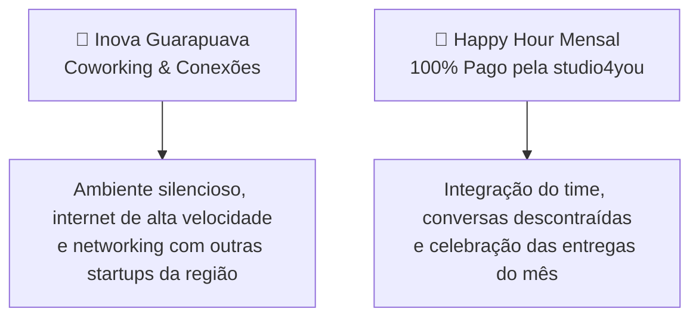

# 🎁 08. Benefícios, Ferramentas de Ponta & Networking

> *"Trabalho voluntário focado em mentoria não significa trabalhar sem recursos — muito pelo contrário. Na studio4you, você tem acesso às melhores ferramentas do mercado global de tecnologia."*

---

## 🚀 Ferramentas Profissionais à Sua Disposição

Na **studio4you**, acreditamos que para aprender o padrão da indústria, você deve usar as mesmas ferramentas que os desenvolvedores seniores usam ao redor do mundo.

### 🧠 1. Inteligência Artificial com Claude Code
- Você terá acesso guiado a ferramentas de IA de última geração (**Claude Code** e assistentes de ponta).
- **Como usamos:** Não para copiar código às cegas, mas para:
  - Explicar trechos complexos de código legado.
  - Ajudar no diagnóstico e troubleshooting de bugs difíceis.
  - Sugerir testes unitários e refatorações limpas.
  - Acelerar a curva de aprendizado prático.

### 💻 2. Suíte Oficial JetBrains
- Licença oficial para uso das melhores IDEs do mercado:
  - **WebStorm** (para ecossistemas JavaScript/TypeScript e React);
  - **PhpStorm** (para projetos web e backend em PHP);
  - **DataGrip** (para gerenciamento visual avançado de bancos de dados);
  - Plugins e extensões integradas com terminal e Git.
- *Fale com o gestor para obter o vínculo da sua licença.*

### 📚 3. Capacitação Contínua: Catálogo Udemy Liberado
- Travou em algum conceito de Docker, TypeScript avançado, Tailwind CSS ou arquitetura de software?
- Você tem acesso livre ao catálogo de cursos selecionados na **Udemy**.
- Alinhe na reunião de **1:1 Quinzenal** quais cursos fazem sentido para a sua trilha de evolução do momento.

---

## 🏢 Espaço Físico & Convivência em Guarapuava

Mesmo sendo uma oportunidade com rotina remota e flexível, o contato humano e o networking presencial aceleram carreiras:

### 📍 4. Coworking no Inova Guarapuava
- Se você cansar de trabalhar em casa ou se a internet oscilar, você tem direito ao uso do espaço de coworking no **Inova Guarapuava**.
- Um ecossistema de inovação moderno, com infraestrutura completa, salas de reunião e oportunidade de conhecer outros profissionais e empresas do setor.

### 🍔 5. O Lendário Happy Hour Mensal (100% Pago pela Empresa!)
- Para os integrantes residentes em **Guarapuava e região**, realizamos **1 Happy Hour presencial por mês**!
- **Tudo por conta da studio4you:** Lanches, petiscos e bebidas não alcoólicas para comemorar os merges, rir dos bugs superados e fortalecer os laços de amizade do time.
- Data e local combinados previamente no canal `#avisos` do Discord.

---

## ⏰ Horário Altamente Flexível & Faculdade (UTFPR)

- A prioridade máxima da sua vida acadêmica é concluir sua graduação com sucesso.
- Nossa carga horária é flexível e adaptada à sua grade de aulas, semanas de provas e bancas da UTFPR.
- Teve semana de prova pesada? Avise com antecedência na Daily e realinhamos os cards do Trello. Comunicação aberta é tudo!

---

## 🧭 Navegação Rápida

[⬅️ Anterior: 07. Gestão Interna](./07-guia-de-gestao-interna.md) &nbsp;|&nbsp; [🏠 Início (README)](../README.md) &nbsp;|&nbsp; [Próximo: Divulgação da Vaga ➡️](./divulgacao-da-vaga.md)
