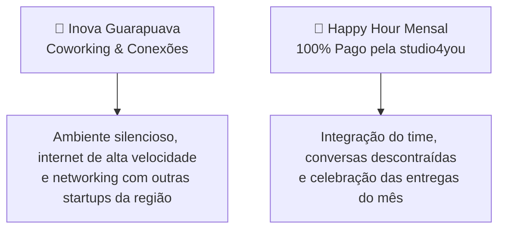

# 🎁 08. Benefícios, Ferramentas de Ponta & Networking

> *"Trabalho voluntário focado em mentoria não significa trabalhar sem recursos — muito pelo contrário. Na studio4you, você tem acesso às melhores ferramentas do mercado global de tecnologia."*

---

## 🚀 Ferramentas Profissionais à Sua Disposição

Na **studio4you**, acreditamos que para aprender o padrão da indústria, você deve usar as mesmas ferramentas que os desenvolvedores seniores usam ao redor do mundo.

### 🧠 1. Inteligência Artificial com Claude Code
- Você terá acesso guiado a ferramentas de IA de última geração (**Claude Code** e assistentes de ponta).
- **Como usamos:** Não para copiar código às cegas, mas para:
  - Explicar trechos complexos de código legado.
  - Ajudar no diagnóstico e troubleshooting de bugs difíceis.
  - Sugerir testes unitários e refatorações limpas.
  - Acelerar a curva de aprendizado prático.

### 💻 2. IDEs Profissionais (Dica: Suíte JetBrains Grátis para Alunos UTFPR!)
- Incentivamos o uso de ferramentas de alta produtividade (VS Code com extensões recomendadas ou a renomada suíte JetBrains).
- **💡 Dica para o Estagiário:** Como estudante ativo da **UTFPR**, você tem direito à **licença oficial 100% gratuita de toda a suíte JetBrains** (WebStorm, PhpStorm, DataGrip, GoLand, etc.) utilizando seu e-mail institucional acadêmico (`@alunos.utfpr.edu.br`) diretamente no programa *JetBrains Student* ou pelo *GitHub Student Developer Pack*. Aproveite esse benefício da sua faculdade!

### 📚 3. Capacitação Contínua: Catálogo Udemy Liberado
- Travou em algum conceito de Docker, TypeScript avançado, Tailwind CSS ou arquitetura de software?
- Você tem acesso livre ao catálogo de cursos selecionados na **Udemy**.
- Alinhe na reunião de **1:1 Quinzenal** quais cursos fazem sentido para a sua trilha de evolução do momento.

---

### 🔒 "Posso usar o Claude Code e as ferramentas da empresa para coisas pessoais?"

> [!CAUTION]
> **RESPOSTA DIRETA: NÃO.**  
> Todas as ferramentas, licenças de IA (**Claude Code**) e acessos de infraestrutura fornecidos pela studio4you são de **uso estritamente corporativo**, voltados para os projetos e aprendizado dentro da empresa.

#### ⚠️ Por que essa regra é inegociável? (Persistência de Dados & Privacidade)
1. **Os dados são persistidos e auditáveis:** As ferramentas corporativas mantêm histórico de prompts, logs de terminal, transcripts de sessão e código gerado armazenados na plataforma da organização.
2. **Proteja sua privacidade:** Ao colar trabalhos de outras disciplinas sem relação com a empresa, senhas, dados bancários, mensagens pessoais ou códigos de terceiros, essas informações ficam gravadas nos registros corporativos.
3. **Custos e Recursos de Infraestrutura:** Licenças de IA corporativas possuem cotas de consumo e custos mantidos pela studio4you para gerar valor aos nossos clientes e projetos.

#### 💡 A Exceção: Autorização Prévia do Gestor
Quer utilizar o Claude Code para auxiliar em um trabalho acadêmico específico da UTFPR ou um estudo técnico paralelo?  
**Converse antes com o Ricardo!**  
Se for solicitado com transparência e houver **autorização explícita prévia**, não há problema algum. O que é estritamente proibido é o uso velado ou indiscriminado sem o conhecimento da liderança.

---

## 🏢 Espaço Físico & Convivência em Guarapuava

Mesmo sendo uma oportunidade com rotina remota e flexível, o contato humano e o networking presencial aceleram carreiras:

### 📍 4. Coworking no Inova Guarapuava
- Se você cansar de trabalhar em casa ou se a internet oscilar, você tem direito ao uso do espaço de coworking no **Inova Guarapuava**.
- Um ecossistema de inovação moderno, com infraestrutura completa, salas de reunião e oportunidade de conhecer outros profissionais e empresas do setor.

### 🍔 5. O Lendário Happy Hour Mensal (100% Pago pela Empresa!)
- Para os integrantes residentes em **Guarapuava e região**, realizamos **1 Happy Hour presencial por mês**!
- **Tudo por conta da studio4you (Orçamento por pessoa):**
  - 🍔 **1 Lanche de até R$ 60,00** (hambúrguer artesanal, prato ou lanche à sua escolha);
  - 🥤 **Até R$ 20,00 em bebidas não alcoólicas** (sucos, refrigerantes, água, etc.).
- Momento exclusivo para comemorar os merges do mês, dar risada dos bugs superados, trocar ideias fora das telas e fortalecer os laços do time.
- Data e local combinados previamente no canal `#avisos` do Discord.

> [!IMPORTANT]
> **E se o gestor não puder comparecer no dia do Happy Hour?**  
> Caso o Ricardo não esteja presente fisicamente para acertar a conta no local:
> 1. Você realiza o pagamento da sua comanda normalmente no caixa;
> 2. **Obrigatório para Reembolso:** Você **DEVE solicitar a Nota Fiscal (NFC-e) emitida com CPF**, contendo a **discriminação clara dos itens comprados** na comanda (lanche e bebidas não alcoólicas);
> 3. Envie a foto nítida ou o PDF da nota fiscal para o gestor via Discord;
> 4. O reembolso do valor exato da comanda aprovada será efetuado via PIX;
> 5. *Atenção:* Canhoto de cartão ou comprovante sem discriminação de itens e sem CPF **não** são aceitos pela contabilidade para reembolso!

---

## 💰 6. Programa "Indique e Ganhe": 5% de Bonificação no PIX!

> [!TIP]
> **Monetize seu networking indicando novos clientes para a studio4you!**  
> Se você (seja estagiário ou colaborador) indicar uma empresa, comércio, startup ou profissional que fechar contrato com a studio4you, você ganha **5% de bonificação sobre o valor total pago pelo cliente**, transferido **diretamente via PIX** para a sua conta!

### 🎯 Como Funciona na Prática?
Conhece alguém que precisa de:
* **Sites Institucionais High-End ou Landing Pages** com Core Web Vitals 90+ e carregamento instantâneo;
* **Sistemas Web Sob Medida, Dashboards ou Plataformas SaaS** para automatizar processos operacionais;
* **Migração Profissional de E-mails Corporativos** com registros de reputação DNS (SPF, DKIM, DMARC);
* **Hospedagem & Infraestrutura Cloud Enterprise** em alta disponibilidade (AWS / Google Cloud).

Basta você fazer a ponte e apresentar o contato para o gestor (**Ricardo**). A equipe da studio4you assume toda a parte de diagnóstico comercial, alinhamento técnico de escopo e elaboração da proposta.

### 💵 Exemplos Reais de Bonificação no Seu Bolso:
| Tipo de Projeto Contratado | Valor Pago pelo Cliente | Sua Bonificação (5% via PIX) |
| :--- | :--- | :--- |
| **Landing Page / Site Institucional** | R$ 5.000,00 | **R$ 250,00 no PIX** |
| **Site Corporativo High-End + SEO/GEO** | R$ 10.000,00 | **R$ 500,00 no PIX** |
| **Sistema Web Sob Medida / MVP SaaS** | R$ 20.000,00 | **R$ 1.000,00 no PIX** |
| **Plataforma Enterprise / Software House** | R$ 40.000,00 | **R$ 2.000,00 no PIX** |

### 📌 Regras Claras e Transparentes:
1. **Quem pode participar:** Qualquer estagiário ou colaborador ativo da studio4you.
2. **Gatilho de Pagamento:** A bonificação de 5% é creditada via PIX proporcionalmente aos valores efetivamente quitados pelo cliente na conta da empresa (ex: se o projeto for pago em 2 parcelas de R$ 5.000, você recebe R$ 250 a cada parcela recebida).
3. **Sem Teto de Ganhos:** Não existe limite! Quanto mais clientes você indicar que fecharem com a empresa, mais bonificações você acumula no mês.
4. **Como Fazer a Indicação:** Basta chamar o Ricardo no Discord ou WhatsApp informando o nome da pessoa/empresa, contato e a demanda.
5. **Relação Ganha-Ganha:** O cliente recebe engenharia de ponta, a empresa cresce e você é reconhecido e recompensado financeiramente com dinheiro na mão!

---

## ⏰ Horário Altamente Flexível & Apoio aos Estudos (UTFPR)

* **Formação em 1º Lugar:** O principal objetivo da sua graduação na UTFPR é formar você com excelência. Nós nunca colocaremos uma demanda da empresa na frente do seu rendimento escolar.
* **Dia de Prova = FOLGA TOTAL para Estudar:** Em dias de avaliação e exames na UTFPR, **não é permitido trabalhar no estágio**. É folga garantida para você se dedicar aos livros e tirar uma excelente nota!
* **Zero Culpa, Máxima Transparência:** Você não precisa inventar desculpas nem justificar com vergonha. A única exigência é a **comunicação prévia**: informe o cronograma de provas com antecedência para que o gestor deixe sua agenda 100% livre.

---

## 🧭 Navegação Rápida

[⬅️ Anterior: 07. Gestão Interna](./07-guia-de-gestao-interna.md) &nbsp;|&nbsp; [🏠 Início (README)](../README.md) &nbsp;|&nbsp; [Próximo: 09. Rotina & Home Office de Elite ➡️](./09-rotina-e-boas-praticas-remotas.md)
