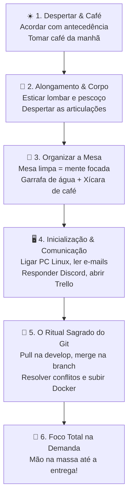

> 📍 **Manual do Calouro** » **Trilha 3: Benefícios, Rotina & DNA** » [🏠 Hub Central (README)](../README.md) &nbsp;|&nbsp; ⏱️ *Tempo de leitura: 4 min*

---

# 🏠 09. O Guia do Home Office de Elite: Da Cama ao Terminal

> *"Trabalhar de casa não é trabalhar da cama. Home office de verdade exige ritual, postura e respeito ao seu ambiente."*

---

## 🛋️ O Grande Mito do Home Office Desleixado

Quando as pessoas pensam em trabalho remoto, muitos imaginam aquela cena de filme:
- O cara deitado de pijama na cama com o notebook na barriga;
- Ou largado no sofá com a televisão ligada em um podcast ou novela;
- Um cachorro latindo no colo, crianças correndo, prato sujo de comida do lado do teclado e meia luz no quarto.

**SPOILER:** Esse é o caminho mais rápido para:
1. Destruir a sua coluna lombar e o seu pescoço aos 22 anos;
2. Fazer o seu cérebro achar que você está de folga (e a produtividade cair para zero);
3. Passar uma imagem completamente amadora nas reuniões com a câmera ligada.

Na **Studio4You**, nós valorizamos a flexibilidade remota, mas cobramos **postura profissional de engenharia**. Para ajudar você a construir esse hábito vencedor, documentamos abaixo a **rotina real do nosso Tech Lead (Ricardo)**, um passo a passo testado no campo de batalha para você adotar no seu dia a dia.

> [!NOTE]
> **Horário Oficial de Funcionamento:**  
> A Studio4You opera de **segunda a sexta-feira**, das **09:00 às 12:00** e das **14:00 às 18:00**. O intervalo das 12:00 às 14:00 é a pausa para almoço e descanso da equipe.

---

## ☕ O Ritual Matinal do Ricardo (O Checklist do Desenvolvedor)

Não existe mágica: consistência vem de rituais claros. Veja como começa o dia de quem entrega software de verdade:



---

### 1. Preparação Pessoal & Física
* **Acorde com antecedência:** Nada de colocar o despertador para tocar às 08h59 se a Daily é às 09h00! Dê tempo para seu cérebro e seu corpo acordarem.
* **Tome um bom café:** Alimente-se. Programar exige glicose e energia mental.
* **Alongamento obrigatório:** Antes de colar na cadeira, faça 3 a 5 minutos de alongamento simples: estique os braços, gire os ombros, alongue o pescoço e a lombar. Seu corpo agradece.

---

### 2. O Templo de Trabalho: Sua Mesa
* **Trabalhe em uma mesa de verdade:** Cama é lugar de dormir; sofá é lugar de descanso; mesa e cadeira são lugares de construir carreira.
* **Organização física:** Guarde papéis soltos, tire pratos sujos e embalagens velhas. Um ambiente organizado reduz drasticamente a ansiedade.
* **O Kit Hidratação & Foco:**
  * 🚰 **Uma garrafa de água cheia:** Não espere ter sede para levantar. Fique se hidratando enquanto pensa na lógica.
  * ☕ **Uma xícara de café:** O combustível clássico do dev ao lado do teclado (cuidado para não derramar em cima!).

---

### 3. Conexão, E-mails & Comunicação (Warm-up)
Ao sentar na máquina e ligar o seu sistema Linux:
1. **Verifique seus e-mails:** Olhe notificações do GitHub e mensagens acadêmicas da UTFPR.
2. **Abra o Discord:** Dê um bom dia sincero no canal do time, confira o `#avisos` e responda quem te marcou ou chamou.
3. **Abra o Trello:** Olhe a coluna `Em Andamento` ou `A Fazer`. Releia a descrição do seu card, os critérios de aceite e o que falta para fechar a entrega de hoje.

---

### 4. O Ritual Sagrado do Código (Antes de digitar uma linha!)

> [!IMPORTANT]
> **NUNCA comece a codar diretamente de onde você parou ontem sem sincronizar o repositório!**  
> Seus colegas ou gestor podem ter subido novas funcionalidades para a branch de integração (`develop`) enquanto você dormia.

Siga religiosamente este ritual no terminal:

```bash
# 1. Vá para a develop e baixe as novidades da equipe
git checkout develop
git pull origin develop

# 2. Volte para a sua branch de trabalho da demanda atual
git checkout feat/42-minha-tarefa-do-trello

# 3. Traga as novidades da develop para dentro da sua branch
git merge develop
```

> **🙏 Momento "Reza para não dar conflito":**  
> * O `merge` passou direto sem conflitos? Maravilha! Siga o jogo.  
> * Deu conflito de código (*Merge Conflict*)? **Não se desespere e resolva agora!** É infinitamente mais fácil resolver 3 linhas de conflito logo pela manhã do que acumular 5 dias de divergência e ter um ataque de pânico na sexta-feira.

```bash
# 4. Com o código atualizado, suba os containers do projeto
docker compose up -d

# 5. Abra a sua IDE (WebStorm, PhpStorm, VS Code) e foco na demanda!
```

---

## 🎧 Dicas de Ouro para o Isolamento e Foco

* **Isolamento de Ruídos:** Se na sua casa há barulho de vizinhos, obras ou família, utilize fones de ouvido (músicas instrumentais, synthwave ou lofi ajudam a entrar em estado de fluxo).
* **Posicionamento da Câmera:** Nas dailies e reuniões, posicione a câmera na altura dos olhos e de frente para a luz (evite ficar de costas para uma janela brilhante, o que deixa você em sombra total).
* **Defina limites claros:** Avise seus familiares ou colegas de república: *"Pessoal, agora estou no horário de expediente da empresa (dentro das 09h às 12h e/ou 14h às 18h), com câmera ligada e reuniões"*. Respeite o seu horário para que os outros também o respeitem.

---

## 🧭 Navegação Rápida

[⬅️ Anterior: 08. Benefícios & Ferramentas Top](./08-beneficios-e-ferramentas-premium.md) &nbsp;|&nbsp; [🏠 Início (README)](../README.md) &nbsp;|&nbsp; [Próximo: 10. Conhecendo a Studio4You ➡️](./10-sobre-a-studio4you.md)
