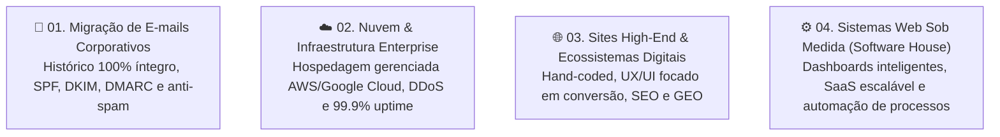

# 🏢 10. Conhecendo a studio4you: Nossa Visão, DNA & Serviços

> *"Não entregamos templates prontos; entregamos engenharia de software de alta performance, código limpo e ecossistemas digitais escaláveis."*

---

## 🧭 Quem é a studio4you?

A **studio4you** ([studio4you.com.br](https://studio4you.com.br)) é uma **Software House de elite e agência de tecnologia** sediada em **Guarapuava – Paraná** (CNPJ: 64.102.766/0001-60), atuando com destaque no ecossistema de inovação do hub **Inova Guarapuava**.

Fundada e liderada por engenheiros com quase uma década de experiência no mercado, a studio4you nasceu com uma missão clara: **elevar o padrão do desenvolvimento web e corporativo**, fugindo do amadorismo de temas genéricos e construtores visuais pesados ("arrasta-e-solta") que deixam os sistemas lentos e vulneráveis.

---

## 💡 A "Nossa Ideia": A Filosofia da studio4you

Acreditamos que todo negócio que deseja liderar seu setor precisa de uma presença digital construída com rigor de **Engenharia de Software**:

### 1. Código Nativo vs. "Criadores Prontos"
Enquanto o mercado tradicional empilha dezenas de plugins pesados e templates prontos (como Elementor) que quebram a cada atualização, a studio4you desenvolve em **código limpo e proprietário**. Nós criamos temas e painéis sob medida (incluindo WordPress headless ou desacoplado), permitindo que o cliente atualize o conteúdo com facilidade, mas sem risco de quebrar o layout ou degradar a performance.

### 2. A Obsessão pela Velocidade (Core Web Vitals)
Sites lentos afastam clientes, perdem vendas e são punidos nos rankings. Cada projeto da studio4you é construído para atingir notas máximas de métricas do Google (+90 em Performance, Acessibilidade, Melhores Práticas e SEO), garantindo carregamento em frações de segundo.

### 3. Pioneirismo em GEO (Generative Engine Optimization)
O tráfego da internet não depende mais apenas das pesquisas tradicionais do Google. Hoje, clientes perguntam diretamente para o **ChatGPT, Gemini, Perplexity e Claude**.  
A studio4you estrutura o código, dados semânticos (Schema.org) e arquitetura técnica para que as Inteligências Artificiais consigam ler, indexar e **recomendar ativamente** as empresas dos nossos clientes.

### 4. Parceria de Longo Prazo e Atendimento Humano
Rejeitamos robôs de atendimento frios e filas burocráticas de tickets que demoram dias. Nosso relacionamento com o cliente é próximo, transparente e com suporte técnico especializado e ágil.

---

## 🛠️ Nossos 4 Pilares de Serviços

Conforme apresentado no portal oficial, nossa atuação se divide em quatro grandes frentes técnicas:

---

### 📨 01. Migração Profissional de E-mails Corporativos
* **Integridade Absoluta:** Transferência completa de caixas de entrada, pastas e históricos de mensagens sem perda de dados.
* **Segurança e Reputação Anti-Spam:** Configuração rigorosa de registros DNS essenciais (**SPF, DKIM e DMARC**), garantindo que as mensagens dos clientes cheguem direto à caixa de entrada e nunca no spam.
* **Suporte Técnico Integrado:** Orientação e configuração das contas em computadores corporativos, notebooks e smartphones.

---

### ☁️ 02. Migração Especializada & Infraestrutura Cloud Enterprise
* **Hospedagem Gerenciada de Alta Disponibilidade:** Conectada aos melhores datacenters globais (AWS, Google Cloud, HostDime), garantindo **latência média de 15ms** e **99.9% de uptime**.
* **Segurança Ativa:** Proteção contra ataques de negação de serviço (Firewall & DDoS), certificados SSL modernos com criptografia de ponta e backups automáticos.
* **Zero Preocupação Técnica:** O cliente foca no seu modelo de negócio enquanto nossa engenharia cuida de servidores, monitoramento, consumo de recursos e atualizações críticas.

---

### 🌐 03. Desenvolvimento de Sites High-End & Ecossistemas Digitais
* **Sites Institucionais & Portais:** Estruturas digitais completas para empresas que buscam consolidar autoridade no mercado.
* **Landing Pages de Alta Conversão:** Páginas estratégicas projetadas com UX/UI persuasivo para captura massiva de leads e vendas.
* **Design Estratégico com Elementos 3D & Microinterações:** Interfaces modernas e elegantes que encantam os visitantes sem comprometer a leveza do carregamento.
* **Otimização Extrema (SEO & GEO):** Código semântico, carregamento em milissegundos e prontidão para mecanismos de busca tradicionais e motores de IA generativa.

---

### ⚙️ 04. Desenvolvimento de Sistemas Web e Aplicações de Alta Performance
* **Atuação como Software House:** Quando plataformas pré-moldadas não resolvem a complexidade do negócio, desenvolvemos soluções do zero.
* **Plataformas SaaS e Dashboards Inteligentes:** Painéis administrativos modernos, relatórios analíticos em tempo real e automação de fluxos operacionais.
* **APIs Robustas e Microsserviços:** Backend veloz e seguro em Go (Golang) e ecossistemas modernos, com banco de dados modelado para suportar alto volume de requisições e crescimento futuro sem necessidade de refatorações caras.

---

## 📊 Números que Comprovam a Qualidade

* **+9 Anos** de experiência consolidada em arquitetura de software e soluções web;
* **99.9%** de disponibilidade (Uptime) nos servidores monitorados;
* **+90 Pontos** constantes nas métricas oficiais do Google (Core Web Vitals);
* **100% de Projetos Sob Medida**, sem reutilização de templates de terceiros.

---

## 🎯 Por que o Estagiário precisa saber disso?

Como estagiário da **studio4you**:
1. Você não está aqui para aprender a instalar plugins genéricos; você está aqui para aprender **engenharia de software real**.
2. Cada linha de código que você escreve no seu Ubuntu, cada container Docker que você sobe e cada Pull Request que você abre reflete o compromisso com a **performance máxima** e a **qualidade artesanal de software** que entregamos aos nossos clientes.
3. **Você pode monetizar seu networking:** Conhecendo o alto padrão técnico dos nossos serviços (sites high-end, sistemas sob medida, e-mails corporativos e infraestrutura cloud), você pode indicar potenciais clientes através do [Programa Indique e Ganhe](./08-beneficios-e-ferramentas-premium.md#-6-programa-indique-e-ganhe-5-de-bonificacao-no-pix) e embolsar **5% do valor pago pelo cliente em bonificação no PIX**!

---

## 🧭 Navegação Rápida

[⬅️ Anterior: 09. Rotina & Home Office de Elite](./09-rotina-e-boas-praticas-remotas.md) &nbsp;|&nbsp; [🏠 Início (README)](../README.md) &nbsp;|&nbsp; [Próximo: Divulgação da Vaga ➡️](./divulgacao-da-vaga.md)
