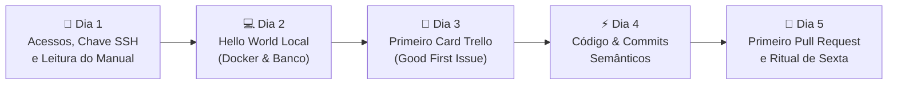

> 📍 **Manual do Calouro** » **Trilha 4: Decolagem, Primeiros Socorros & Carreira** » [🏠 Hub Central (README)](../README.md) &nbsp;|&nbsp; ⏱️ *Tempo de leitura: 5 min*

---

# 🚀 11. Trilha de Decolagem: Seus Primeiros 7 Dias na Studio4You

> *"Ninguém espera que você saiba tudo no primeiro dia. Mas esperamos que você saiba exatamente o que fazer no próximo passo."*

---

## 🧭 Bem-vindo a Bordo: Sem Adivinhação!

Entrar em uma nova empresa de tecnologia costuma dar um frio na barriga. É normal se perguntar: *"Por onde eu começo? O que esperam de mim hoje? E se eu quebrar alguma coisa?"*.

Na **Studio4You**, você **não precisa adivinhar**. Criamos esta **Trilha de Decolagem** para que a sua primeira semana seja estruturada, tranquila e focada em vitórias rápidas.



---

## 📅 Dia 1: Recepção, Acessos & Setup da Máquina

Seu foco no primeiro dia é **deixar suas ferramentas prontas** para nunca mais perder tempo configurando ambiente.

### Checklist do Dia 1:
- [ ] **Configuração do Discord:**
  - Entre no servidor da Studio4You pelo convite enviado pelo Ricardo;
  - Configure sua foto de perfil (rosto visível ou avatar profissional) e seu nome real;
  - Apresente-se no canal `#geral-bate-papo` com um olá para o time.
- [ ] **Configuração de Git & SSH:**
  - Configure seu `git config --global user.name` e `user.email` com o mesmo e-mail do seu GitHub;
  - Gere sua chave SSH (`ssh-keygen -t ed25519 -C "seu-email@..."`);
  - Cadastre a chave pública no seu perfil do GitHub (**Settings -> SSH and GPG keys**).
- [ ] **Leitura Atenta do Manual do Calouro:**
  - Leia do [Módulo 01](./01-boas-vindas-e-cultura.md) ao [Módulo 06](./06-git-github-workflow.md);
  - Anote termos que você não conhecia para consultar no [Dicionário do Calouro](./14-glossario-do-dev-moderno.md).
- [ ] **Aviso de Conclusão:**
  - Mande uma mensagem no canal `#avisos` ou no privado do Ricardo: *"Ambiente base e Git configurados, pronto para o próximo passo!"*.

---

## 💻 Dia 2: "Hello World" na Máquina Local (Docker & Projeto)

Hoje você vai clonar seu primeiro projeto da Studio4You e colocá-lo para rodar na sua máquina.

### Checklist do Dia 2:
- [ ] **Acesso ao Repositório:** O Ricardo irá adicionar seu usuário do GitHub ao repositório do projeto em que você vai atuar;
- [ ] **Clone via SSH:**
  ```bash
  git clone git@github.com:Roliveira96/nome-do-projeto.git
  cd nome-do-projeto
  ```
- [ ] **Subir os Containers Docker:**
  - Siga rigorosamente o arquivo `README.md` do repositório;
  - Copie o arquivo de exemplo de ambiente: `cp .env.example .env`;
  - Suba os serviços: `docker compose up -d` (ou `docker-compose up -d`);
  - Rode as migrations de banco de dados se houver.
- [ ] **Verificar a Aplicação no Navegador:**
  - Abra `http://localhost:8000` (ou a porta informada no projeto);
  - Se a tela inicial abriu sem erros: **Parabéns! Sua máquina está operacional!** 🚀
- [ ] **Regra de Ouro da Documentação:**
  - Se você precisou rodar um comando que **não** estava no `README.md` para a aplicação funcionar, anote em um bloco de notas. Esse será o seu primeiro Pull Request de melhoria!

---

## 🎯 Dia 3: O Primeiro Card no Trello ("Good First Issue")

Hora de interagir com o fluxo oficial de tarefas da empresa.

### Checklist do Dia 3:
- [ ] **Acessar o Trello da Studio4You:**
  - Abra o quadro da equipe e localize a coluna **`A Fazer`**;
  - O Ricardo terá deixado um card reservado para você com a etiqueta `[Good First Issue]` ou `[Onboarding]` (uma tarefa simples, pensada para você treinar o fluxo sem risco);
- [ ] **Assumir a Tarefa:**
  - Adicione seu membro ao card;
  - Mova o card para a coluna **`Em Andamento`** (lembre-se: nunca tenha mais de 1 card em andamento);
- [ ] **Criar sua Branch de Trabalho:**
  ```bash
  # Garanta que a develop está atualizada
  git checkout develop
  git pull origin develop
  
  # Crie sua branch no padrão tipo/codigo-do-card-descricao
  git checkout -b fix/12-ajuste-link-rodape
  ```

---

## ⚡ Dia 4: Mão na Massa & Commits Semânticos

Hoje é o dia de escrever código, testar localmente e salvar seu progresso.

### Checklist do Dia 4:
- [ ] **Desenvolver a Demanda:**
  - Faça a alteração solicitada no card (ex: correção de layout, texto, criação de teste ou novo componente);
  - Teste a alteração no seu navegador local em diferentes resoluções;
- [ ] **Verificar o Status do Git:**
  ```bash
  git status
  git diff
  ```
- [ ] **Criar Commits Atômicos e Semânticos:**
  ```bash
  git add caminho/do/arquivo.vue
  git commit -m "FIX/ corrige alinhamento do botão no rodapé"
  ```
- [ ] **Sincronizar com a Develop:**
  - Antes de enviar o código, puxe eventuais novidades da `develop` para garantir zero conflitos:
  ```bash
  git checkout develop
  git pull origin develop
  git checkout fix/12-ajuste-link-rodape
  git merge develop
  ```
  *(Se der conflito, respire fundo e consulte o [Guia de Primeiros Socorros](./12-troubleshooting-primeiros-socorros.md)).*

---

## 🎉 Dia 5: O Primeiro Pull Request & Cerimônia de Sexta

O grande dia do seu primeiro Pull Request oficial entrar na base de código da empresa!

### Checklist do Dia 5:
- [ ] **Subir sua Branch para o GitHub:**
  ```bash
  git push -u origin fix/12-ajuste-link-rodape
  ```
- [ ] **Abrir o Pull Request (PR):**
  - Acesse o GitHub do projeto;
  - Clique em **Compare & pull request**;
  - Confira que a `base` do PR é a **`develop`**, nunca a `main`;
  - Preencha o título e a descrição explicando o que foi feito, seguindo o [Módulo 16](./16-padroes-de-commit-branch-e-pr.md);
  - Marque o seu gestor em **Reviewers**;
  - Anexe um print da tela com o antes e o depois da sua alteração;
- [ ] **Atualizar o Trello:**
  - Mova o seu card da coluna `Em Andamento` para a coluna **`Em Revisão`**;
  - Cole o link do seu Pull Request como anexo ou comentário no card;
- [ ] **Participar da Reunião de Sexta (17h):**
  - Conecte no Discord com a **câmera ligada**;
  - Compartilhe brevemente como foi sua primeira semana e o card que você colocou em revisão;
  - Veja seu código ser revisado ao vivo com o Ricardo e comemore o merge na `develop`! 🥂

---

## 🏖️ Dias 6 e 7 (Sábado e Domingo): Desconexão Total!

- **Fim de semana é para descansar, viver a vida e estudar suas matérias da faculdade se necessário.**
- Na Studio4You respeitamos o descanso: não exigimos trabalho fora do horário, não mandamos mensagens no final de semana e não esperamos respostas antes de segunda-feira.
- Recarregue a bateria para começar a segunda Sprint com energia total!

---

## 🧭 Navegação Rápida

[⬅️ Anterior: 10. Conhecendo a Studio4You](./10-sobre-a-studio4you.md) &nbsp;|&nbsp; [🏠 Início (README)](../README.md) &nbsp;|&nbsp; [Próximo: 12. Primeiros Socorros & Troubleshooting ➡️](./12-troubleshooting-primeiros-socorros.md)
