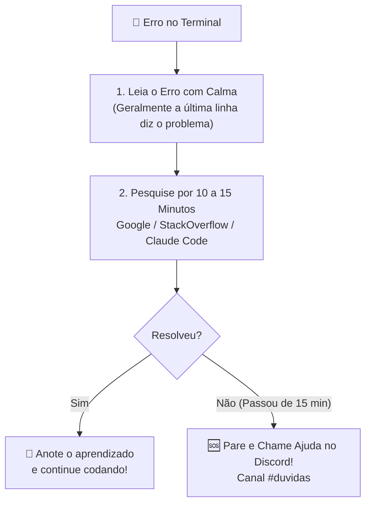

# 🧯 12. Primeiros Socorros & Troubleshooting: "Deu Ruim, e Agora?"

> *"Erros no terminal acontecem com todo mundo, do calouro ao engenheiro sênior. O que diferencia o amador do profissional é o método para diagnosticar e resolver sem desespero."*

---

## 🧭 O Manual de Sobrevivência do Desenvolvedor

Travou em um erro bizarro no terminal? As mensagens em vermelho parecem grego?  
**Mantenha a calma.** 95% dos problemas enfrentados por novos desenvolvedores caem exatamente em um dos 5 cenários descritos abaixo.

Consulte este guia antes de se descabelar!

---

## 🐳 1. Docker: "Porta já em uso" (`bind: address already in use`)

### 🔴 O Sintoma:
Ao rodar `docker compose up -d`, o terminal cospe um erro parecido com:
```text
Error response from daemon: driver failed programming external connectivity on endpoint ...
Error starting userland proxy: listen tcp4 0.0.0.0:80: bind: address already in use
```

### 🔍 A Causa:
Existe um serviço nativo no seu Linux/Windows (como o **Apache**, **Nginx** ou **MySQL** nativos) rodando em segundo plano e ocupando a porta 80, 443 ou 3306 que o container Docker precisa usar.

### 🛠️ Como Resolver:
1. **Descubra qual processo está sequestrando a porta:**
   ```bash
   sudo lsof -i :80
   # Ou para porta do MySQL:
   sudo lsof -i :3306
   ```
2. **Desative o serviço nativo concorrente:**
   ```bash
   # Se for o Apache:
   sudo systemctl stop apache2
   sudo systemctl disable apache2

   # Se for o Nginx:
   sudo systemctl stop nginx
   sudo systemctl disable nginx

   # Se for o MySQL nativo:
   sudo systemctl stop mysql
   sudo systemctl disable mysql
   ```
3. **Suba o Docker novamente:**
   ```bash
   docker compose up -d
   ```
   *Problema resolvido! Seus containers agora têm a porta livre.*

---

## 🔒 2. Docker: "Permissão Negada no Daemon" (`permission denied`)

### 🔴 O Sintoma:
```text
permission denied while trying to connect to the Docker daemon socket at unix:///var/run/docker.sock
```

### 🔍 A Causa:
No Linux ou WSL 2, o Docker roda como serviço de root e o seu usuário comum ainda não foi adicionado ao grupo de permissões do Docker.

### 🛠️ Como Resolver:
1. **Adicione seu usuário ao grupo do Docker:**
   ```bash
   sudo usermod -aG docker $USER
   ```
2. **Aplique a nova permissão imediatamente:**
   ```bash
   newgrp docker
   ```
3. Teste se funcionou sem precisar de `sudo`:
   ```bash
   docker ps
   ```

---

## 🌿 3. Git: "Socorro! Comitei na branch `main` por engano!"

### 🔴 O Cenário:
Você passou 2 horas codando, fez vários commits bonitinhos e, quando olhou o terminal, percebeu que estava na branch `main` em vez da sua branch de feature.

> [!TIP]
> **Não entre em pânico e NÃO delete nada!** Você não perdeu o seu código. O Git guarda tudo.

### 🛠️ Como Resolver sem Perder 1 Linha de Código:
```bash
# 1. Crie a sua nova branch com todo o trabalho que você acabou de comitar:
git branch feat/minha-nova-funcionalidade

# 2. Resete a branch main local para voltar a ser exatamente igual à main do GitHub:
git reset --hard origin/main

# 3. Troque para a sua branch de feature:
git checkout feat/minha-nova-funcionalidade
```
**Resultado:** A branch `main` local voltou a ficar 100% limpa e intocada, e todos os seus commits estão perfeitos e salvos dentro da sua branch `feat/minha-nova-funcionalidade`!

---

## ⚔️ 4. Git: Conflito de Merge Travado (`Merge Conflict`)

### 🔴 O Sintoma:
Ao rodar `git merge main`, o terminal avisa:
```text
CONFLICT (content): Merge conflict in src/App.vue
Automatic merge failed; fix conflicts and then commit the result.
```

### 🔍 O que significa?
Outro desenvolvedor alterou exatamente as mesmas linhas que você no mesmo arquivo. O Git não sabe qual versão priorizar e pede a decisão de um humano inteligente (você!).

### 🛠️ Como Resolver Passo a Passo:
1. **Abra o VS Code ou PhpStorm:**  
   O editor vai colorir o conflito com as seguintes marcações:
   ```text
   <<<<<<< HEAD (Sua versão atual na branch)
   <button class="bg-blue-600 text-white">Salvar Alterações</button>
   =======
   <button class="bg-indigo-600 text-white font-bold">Salvar Dados</button>
   >>>>>>> main (Versão que veio da main)
   ```
2. **Escolha o que deve ficar:**
   - O VS Code exibirá botões rápidos no topo:
     - `Accept Current Change` (mantém o seu código);
     - `Accept Incoming Change` (mantém o código que veio da main);
     - `Accept Both Changes` (mantém os dois);
   - Ou simplesmente apague as linhas de controle (`<<<<<<<`, `=======`, `>>>>>>>`) e edite o arquivo para ficar exatamente como você deseja.
3. **Teste se o código roda:**
   - Salve o arquivo e certifique-se de que a aplicação compila sem erros.
4. **Finalize o merge no Git:**
   ```bash
   git add .
   git commit -m "fix: resolve conflito de merge com a main"
   ```
5. **E se você fez besteira e quer cancelar tudo?**
   ```bash
   # Aborta o merge imediatamente e volta a sua branch ao estado anterior:
   git merge --abort
   ```

---

## 🔌 5. Banco de Dados: "Connection Refused" no Projeto

### 🔴 O Sintoma:
Sua aplicação web devolve um erro do tipo:
```text
SQLSTATE[HY000] [2002] Connection refused
# ou
Dial tcp 127.0.0.1:3306: connect: connection refused
```

### 🔍 As 3 Causas Mais Comuns:
1. **O container do banco de dados ainda está inicializando:**  
   Bancos como MySQL e PostgreSQL demoram cerca de 10 a 20 segundos na primeira inicialização para criar as tabelas internas. Aguarde alguns segundos e recarregue a página.
2. **Esqueceu de criar o arquivo `.env`:**  
   Se você não copiou o `.env.example`, o projeto não tem as senhas e portas corretas.
   ```bash
   cp .env.example .env
   ```
3. **Host do Banco Errado no `.env` (Regra de Ouro do Docker):**  
   Quando seu código roda dentro de um container Docker, o host do banco de dados **NÃO É** `localhost` ou `127.0.0.1`.  
   O host deve ser o **nome do serviço** definido no arquivo `docker-compose.yml` (por exemplo: `DB_HOST=db` ou `DB_HOST=mysql`).

---

## ⏱️ 6. A "Regra de Ouro dos 15 Minutos"



### 🆘 Como Pedir Ajuda no Canal `#duvidas` (Comunicação Profissional):
Evite mensagens genéricas como: *"Gente, deu erro aqui, me ajuda!"*. Isso faz todo mundo perder tempo perguntando o que houve.

**Poste com clareza profissional seguindo este modelo:**
> *"Fala pessoal! Estou no projeto X tentando rodar as migrations com o comando `docker compose exec app php artisan migrate` e estou recebendo o erro:  
> `SQLSTATE[HY000] [2002] Connection refused`  
> Já verifiquei que o container do MySQL está rodando no `docker ps` e meu `.env` está com `DB_HOST=db`. Alguém já passou por isso?"*

Essa postura demonstra maturidade, respeito ao tempo dos seus colegas e acelera a sua resposta em 10x!

---

## 🧭 Navegação Rápida

[⬅️ Anterior: 11. Trilha de Decolagem (7 Dias)](./11-onboarding-primeiros-7-dias.md) &nbsp;|&nbsp; [🏠 Início (README)](../README.md) &nbsp;|&nbsp; [Próximo: 13. Sigilo, NDA & Ética ➡️](./13-sigilo-etica-e-confidencialidade.md)
