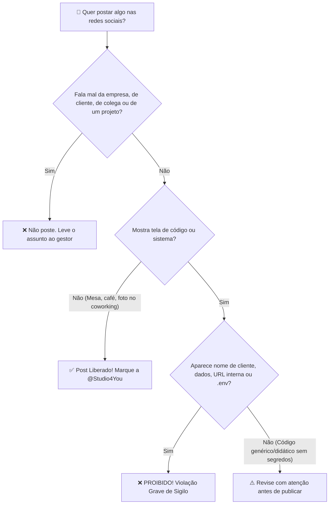

> 📍 **Manual do Calouro** » **Trilha 4: Decolagem, Primeiros Socorros & Carreira** » [🏠 Hub Central (README)](../README.md) &nbsp;|&nbsp; ⏱️ *Tempo de leitura: 6 min*

---

# 🤫 13. Sigilo, NDA & Ética com Dados de Clientes

> *"A reputação de uma Software House leva anos para ser construída e pode ser destruída por um único print impensado nas redes sociais."*

---

## 🔒 Confiança: O Ativo Mais Valioso da Studio4You

Na **Studio4You**, atendemos empresas consolidadas, comércios regionais, indústrias e startups em crescimento. Nossos clientes confiam a nós seus segredos de negócio, dados estratégicos, históricos de transações e a estabilidade da sua infraestrutura digital.

Como estagiário ou colaborador, você terá acesso a partes reais desse ecossistema. Com esse privilégio vem uma responsabilidade inegociável: **o dever absoluto de sigilo e discrição profissional**.

---

## 📑 O que é o Acordo de Confidencialidade (NDA)?

Ao ingressar na Studio4You, todo membro é vinculado a um termo de confidencialidade (**Non-Disclosure Agreement - NDA**):
1. **Propriedade Intelectual:** Todo código-fonte, arquitetura, design de banco de dados, documentações e regras de negócio pertencem exclusivamente aos clientes e à Studio4You.
2. **Dados Pessoais & LGPD:** Dados de usuários finais (nomes, e-mails, telefones, CPFs, cartões) são estritamente protegidos pela Lei Geral de Proteção de Dados (Lei nº 13.709/2018). O que a lei exige de você no dia a dia está no [Módulo 05](./05-setup-ambiente-linux.md).
3. **Vigência:** O compromisso de sigilo não termina quando o seu estágio acaba; ele permanece válido permanentemente.

---

## 📱 Regras para Redes Sociais: O que NUNCA Postar!

A geração atual de desenvolvedores adora compartilhar sua rotina no Instagram Stories, LinkedIn, X (Twitter) ou TikTok. **Postar é permitido e incentivado**: você pode dizer que estagia na Studio4You, marcar a empresa e mostrar a sua evolução. O que pedimos são limites claros e profissionais, que protegem os clientes, a empresa e a sua própria carreira:

### ❌ O que é ESTRITAMENTE PROIBIDO Compartilhar:
- **Prints ou vídeos de telas de sistemas contendo nomes de clientes reais:** Nunca exiba painéis administrativos ou sites de clientes que ainda não foram lançados oficialmente.
- **Tabelas de Banco de Dados ou Dados de Usuários:** Qualquer captura contendo dados reais (mesmo que pareçam inofensivos) é uma violação grave de privacidade.
- **Arquivos `.env`, Chaves de API e Tokens:** Jamais poste fotos do seu editor (VS Code/PhpStorm) mostrando variáveis de ambiente, senhas ou tokens de serviços (Stripe, Mercado Pago, AWS, OpenAI, Claude).
- **URLs de Staging ou Endereços Internos de Servidores:** Links de testes não devem ser expostos publicamente.
- **Tecnologias e arquitetura dos projetos:** Não revele qual stack, banco de dados, fornecedor, hospedagem ou integração um cliente ou projeto específico utiliza. Além de ser segredo de negócio, essa informação é um mapa para quem quer atacar o sistema.
- **Segredos de negócio e informações internas:** Regras de negócio, valores de contratos e propostas, lista de clientes, cronogramas, lançamentos ainda não anunciados, processos internos e conversas do Discord ou de reuniões.
- **Desabafos ou Comentários Depreciativos:** Detalhados na seção de conduta pública logo abaixo.

---

### 🗣️ Conduta Pública: Falar Mal Não É Opção

Quando você se apresenta como parte da Studio4You, o que você publica é lido como a voz de alguém de dentro. Por isso, **não é permitido depreciar publicamente**:

| Não fale mal de... | Exemplo do que não postar |
| :--- | :--- |
| **A empresa** | *"Estágio aqui é bagunça"*, indiretas sobre gestão, prazos ou decisões internas. |
| **Gestor e colegas** | Piadas, prints de conversas, críticas ao código ou ao trabalho de alguém. |
| **Clientes e seus negócios** | *"Olha que código horrível desse cliente X"*, comentários sobre pedidos ou prazos do cliente. |
| **As tecnologias que usamos nos projetos** | *"Essa stack é ultrapassada"*, *"me obrigam a usar tal framework"*, reclamações sobre sistema legado de cliente. |
| **Parceiros** | UTFPR, Inova Guarapuava, fornecedores e ferramentas contratadas. |

**Onde a regra vale:** em qualquer lugar fora dos canais internos. Isso inclui perfil pessoal, Stories para "melhores amigos", grupos de WhatsApp e Discord da faculdade, fóruns, comentários em vídeos, GitHub pessoal e também mensagens privadas, que viram print em segundos.

**O que mais faz parte da conduta:**
- **Não fale em nome da empresa.** Não anuncie cliente, projeto, vaga ou parceria por conta própria, nem responda a clientes ou à imprensa. Comunicação oficial é com o gestor.
- **Não use a marca para dar peso a opinião pessoal.** O logo e o nome da Studio4You não entram em post de opinião, polêmica ou política.
- **Pergunta técnica em fórum ou IA** se faz com exemplo genérico, sem nome de cliente, sem código real do projeto e sem reclamar do contexto.
- **A regra continua depois do estágio.** Sigilo e respeito não vencem junto com o contrato.

> [!TIP]
> **Tem uma crítica? Ótimo, traga para dentro.** Discordar de uma tecnologia, de um processo ou de uma decisão é saudável e bem-vindo: fale na Daily, no 1:1 ou direto com o gestor. Crítica interna melhora a empresa; a mesma crítica em público só gera desgaste e não resolve nada. Questões sobre o estágio em si também podem ser levadas ao professor orientador da UTFPR, que é o canal oficial para isso.

> [!WARNING]
> **Por que isso é levado a sério:** um post depreciativo ou um segredo exposto pode custar um cliente, quebrar um contrato e gerar responsabilidade legal para a empresa e para quem publicou. O descumprimento destas regras é tratado como falta grave, sujeita às medidas previstas no termo de compromisso de estágio e no acordo de confidencialidade, incluindo o desligamento.

---

### ✅ O que você PODE e DEVE Postar com Orgulho!
Incentivamos muito que você construa sua autoridade profissional nas redes. Você pode compartilhar:
- ☕ **Seu Setup de Trabalho:** Sua mesa organizada, café, monitor com terminal ou código genérico (desde que não revele dados de clientes);
- 🎓 **Cursos e Certificações Concluídas:** Concluiu um curso de Docker, TypeScript ou Golang na Udemy? Poste no LinkedIn celebrando sua evolução!
- 🍔 **Momentos de Descontração do Time:** Fotos do Happy Hour mensal da Studio4You no Inova Guarapuava ou encontros presenciais;
- 🏢 **Que você faz parte do time:** Colocar a Studio4You no LinkedIn, marcar a empresa e contar que está estagiando aqui;
- 💡 **Artigos e Aprendizados Conceituais:** Escrever posts do tipo: *"Esta semana aprendi como resolver conflitos de merge no Git de forma limpa"* ou *"3 lições que aprendi configurando containers Docker na prática"*. Isso agrega muito valor ao seu perfil profissional!

> [!NOTE]
> **Falar de tecnologia pode; ligar a tecnologia a um cliente, não.** *"Estou aprendendo Docker e Laravel no estágio"* é um ótimo post. *"O sistema do cliente X roda em Laravel com banco Y no servidor Z"* é vazamento.

---

## 🛡️ Boas Práticas com Dados de Banco Local

Para evitar qualquer vazamento acidental durante o desenvolvimento do dia a dia:
1. **Sempre use Seeds e Dados Fakes:** No ambiente de desenvolvimento local na sua máquina, utilize sempre os geradores automáticos de dados fictícios (**Seeders / Fakers**).
2. **Nunca baixe dumps de produção na sua máquina pessoal:** Bancos de dados de clientes em produção contêm dados sensíveis e nunca devem ser exportados para computadores de desenvolvimento sem autorização formal e procedimentos de anonimização.
3. **Bloqueio de Tela:** Ao se afastar do seu computador em locais públicos (como cafeterias, faculdade ou coworking), use sempre o atalho de bloqueio de tela (`Super + L` no Ubuntu ou `Win + L` no Windows).

---

> [!IMPORTANT]
> **Na dúvida, pergunte antes de postar!**  
> Se você quer publicar uma imagem ou texto sobre um projeto em que trabalhou e não tem 100% de certeza se pode, mande um print para o Ricardo no Discord. O alinhamento prévio evita qualquer dor de cabeça.

---

## 🧭 Navegação Rápida

[⬅️ Anterior: 12. Primeiros Socorros & Troubleshooting](./12-troubleshooting-primeiros-socorros.md) &nbsp;|&nbsp; [🏠 Início (README)](../README.md) &nbsp;|&nbsp; [Próximo: 14. Dicionário do Calouro ➡️](./14-glossario-do-dev-moderno.md)
