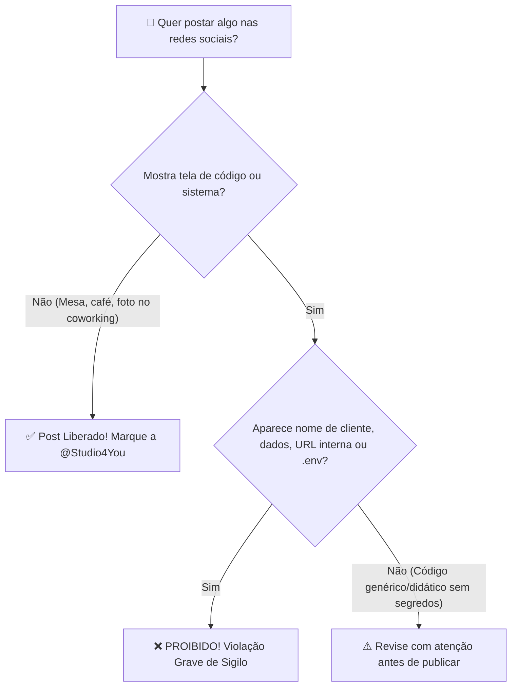

# 🤫 13. Sigilo, NDA & Ética com Dados de Clientes

> *"A reputação de uma Software House leva anos para ser construída e pode ser destruída por um único print impensado nas redes sociais."*

---

## 🔒 Confiança: O Ativo Mais Valioso da Studio4You

Na **Studio4You**, atendemos empresas consolidadas, comércios regionais, indústrias e startups em crescimento. Nossos clientes confiam a nós seus segredos de negócio, dados estratégicos, históricos de transações e a estabilidade da sua infraestrutura digital.

Como estagiário ou colaborador, você terá acesso a partes reais desse ecossistema. Com esse privilégio vem uma responsabilidade inegociável: **o dever absoluto de sigilo e discrição profissional**.

---

## 📑 O que é o Acordo de Confidencialidade (NDA)?

Ao ingressar na Studio4You, todo membro é vinculado a um termo de confidencialidade (**Non-Disclosure Agreement - NDA**):
1. **Propriedade Intelectual:** Todo código-fonte, arquitetura, design de banco de dados, documentações e regras de negócio pertencem exclusivamente aos clientes e à Studio4You.
2. **Dados Pessoais & LGPD:** Dados de usuários finais (nomes, e-mails, telefones, CPFs, cartões) são estritamente protegidos pela Lei Geral de Proteção de Dados (Lei nº 13.709/2018).
3. **Vigência:** O compromisso de sigilo não termina quando o seu estágio acaba; ele permanece válido permanentemente.

---

## 📱 Regras para Redes Sociais: O que NUNCA Postar!

A geração atual de desenvolvedores adora compartilhar sua rotina no Instagram Stories, LinkedIn, X (Twitter) ou TikTok. Incentivamos a sua presença digital, **mas com limites claros e profissionais**:

### ❌ O que é ESTRITAMENTE PROIBIDO Compartilhar:
- **Prints ou vídeos de telas de sistemas contendo nomes de clientes reais:** Nunca exiba painéis administrativos ou sites de clientes que ainda não foram lançados oficialmente.
- **Tabelas de Banco de Dados ou Dados de Usuários:** Qualquer captura contendo dados reais (mesmo que pareçam inofensivos) é uma violação grave de privacidade.
- **Arquivos `.env`, Chaves de API e Tokens:** Jamais poste fotos do seu editor (VS Code/PhpStorm) mostrando variáveis de ambiente, senhas ou tokens de serviços (Stripe, Mercado Pago, AWS, OpenAI, Claude).
- **URLs de Staging ou Endereços Internos de Servidores:** Links de testes não devem ser expostos publicamente.
- **Desabafos ou Comentários Depreciativos:** Nunca faça piadas públicas ou reclame de tecnologias antigas de clientes (*"Olha que código horrível desse cliente X"*). Respeito à história e ao negócio do cliente é a base da nossa conduta.

---

### ✅ O que você PODE e DEVE Postar com Orgulho!
Incentivamos muito que você construa sua autoridade profissional nas redes. Você pode compartilhar:
- ☕ **Seu Setup de Trabalho:** Sua mesa organizada, café, monitor com terminal ou código genérico (desde que não revele dados de clientes);
- 🎓 **Cursos e Certificações Concluídas:** Concluiu um curso de Docker, TypeScript ou Golang na Udemy? Poste no LinkedIn celebrando sua evolução!
- 🍔 **Momentos de Descontração do Time:** Fotos do Happy Hour mensal da Studio4You no Inova Guarapuava ou encontros presenciais;
- 💡 **Artigos e Aprendizados Conceituais:** Escrever posts do tipo: *"Esta semana aprendi como resolver conflitos de merge no Git de forma limpa"* ou *"3 lições que aprendi configurando containers Docker na prática"*. Isso agrega muito valor ao seu perfil profissional!

---

## 🛡️ Boas Práticas com Dados de Banco Local

Para evitar qualquer vazamento acidental durante o desenvolvimento do dia a dia:
1. **Sempre use Seeds e Dados Fakes:** No ambiente de desenvolvimento local na sua máquina, utilize sempre os geradores automáticos de dados fictícios (**Seeders / Fakers**).
2. **Nunca baixe dumps de produção na sua máquina pessoal:** Bancos de dados de clientes em produção contêm dados sensíveis e nunca devem ser exportados para computadores de desenvolvimento sem autorização formal e procedimentos de anonimização.
3. **Bloqueio de Tela:** Ao se afastar do seu computador em locais públicos (como cafeterias, faculdade ou coworking), use sempre o atalho de bloqueio de tela (`Super + L` no Ubuntu ou `Win + L` no Windows).

---

> [!IMPORTANT]
> **Na dúvida, pergunte antes de postar!**  
> Se você quer publicar uma imagem ou texto sobre um projeto em que trabalhou e não tem 100% de certeza se pode, mande um print para o Ricardo no Discord. O alinhamento prévio evita qualquer dor de cabeça.

---

## 🧭 Navegação Rápida

[⬅️ Anterior: 12. Primeiros Socorros & Troubleshooting](./12-troubleshooting-primeiros-socorros.md) &nbsp;|&nbsp; [🏠 Início (README)](../README.md) &nbsp;|&nbsp; [Próximo: 14. Dicionário do Calouro ➡️](./14-glossario-do-dev-moderno.md)
