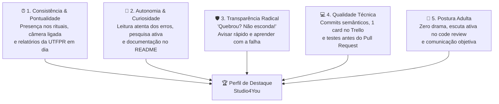

> 📍 **Manual do Calouro** » **Trilha 4: Decolagem, Primeiros Socorros & Carreira** » [🏠 Hub Central (README)](../README.md) &nbsp;|&nbsp; ⏱️ *Tempo de leitura: 4 min*

---

# 🎯 15. Critérios de Sucesso, Avaliação & "E Depois do Estágio?"

> *"O estágio na Studio4You não existe apenas para preencher horas na faculdade. Nosso propósito é identificar talentos reais e formar os futuros desenvolvedores e parceiros da nossa Software House."*

---

## 🧭 O que Torna um Estagiário um Destaque?

Não avaliamos estagiários por quantas linhas de código eles digitam por dia, nem esperamos que você chegue sabendo arquitetura avançada de servidores. O que realmente avaliamos é a sua **curva de aprendizado, consistência e maturidade profissional**.

Para garantir transparência total, a Studio4You baseia sua avaliação em **5 Pilares Fundamentais**:

---

## 📊 Os 5 Pilares de Avaliação na Prática

### 1. ⏰ Consistência & Pontualidade
* Presença pontual nas Dailies rápidas (10-15m) com **câmera ligada** e postura atenta;
* Participação no alinhamento de segunda-feira e fechamento de sexta-feira;
* Entrega rigorosa do [Relatório Quinzenal da UTFPR](./templates/relatorio-quinzenal-utfpr.md) sem atrasos.

### 2. 🧠 Autonomia & Curiosidade Técnica
* Aplicação da **Regra dos 15 Minutos**: investigar o erro no Google, logs e Claude Code antes de chamar ajuda;
* Quando tiver dúvidas, trazer contexto (o que tentou, o comando rodado e o print do terminal);
* Documentar soluções novas no `README.md` do repositório para ajudar os próximos colegas.

### 3. 🛡️ Transparência Radical ("Quebrou? Não esconda!")
* Assumir falhas sem inventar desculpas mirabolantes;
* Se cometeu um engano no Git ou travou o container, levantar a mão no Discord imediatamente;
* Errar faz parte do aprendizado; esconder o erro é inaceitável.

### 4. 💻 Qualidade Técnica & Boas Práticas
* Respeito à regra de ouro do Trello: **apenas 1 card em andamento por vez**;
* Commits semânticos, atômicos e bem descritos (`feat:`, `fix:`, `docs:`);
* Abrir Pull Requests organizados, com descrição clara e prints do antes e depois.

### 5. 🤝 Postura Adulta & Espírito de Equipe
* Ouvir os apontamentos do Code Review com maturidade, entendendo que correções técnicas visam a excelência do software, nunca o ataque pessoal;
* Zero fofocas, melindres ou vitimismo; foco na solução e na entrega de valor.

---

## 🔄 Como Funcionam os Feedbacks (1:1 Quinzenal)

A cada 15 dias, você terá uma conversa individual de 30 minutos com o gestor (**Ricardo**):
* **Reconhecimento dos Pontos Fortes:** O que você fez de incrível na quinzena e deve continuar fazendo;
* **Pontos de Ajuste:** Diretrizes claras e práticas sobre onde você deve focar para evoluir tecnicamente na quinzena seguinte;
* **Assinatura e Validação:** Assinatura formal do seu relatório acadêmico para entrega na UTFPR.

---

## 🚀 E Depois do Estágio? Oportunidades Reais de Carreira

O encerramento do seu período de estágio na Studio4You não precisa ser o fim da nossa história — na verdade, costuma ser o começo:

### 🎓 1. Relatório Final Impecável & Carta de Recomendação
* Você finaliza sua exigência curricular na UTFPR com a documentação 100% aprovada e validada;
* Estagiários com avaliação positiva recebem uma **Carta Oficial de Recomendação** assinada pela liderança da Studio4You, além de recomendações públicas no LinkedIn.

### 💵 2. Demandas Comerciais Remuneradas (Projetos Freela)
* Os estagiários que demonstram autonomia, qualidade de código e compromisso passam a ser convidados para atuar em **demandas comerciais remuneradas** da Software House!
* Você recebe pagamentos por escopo/entrega de novas landing pages, módulos de sistemas e integrações, gerando renda real enquanto ainda estuda na faculdade.

### 💼 3. Contratação Efetiva (PJ / CLT)
* A Studio4You é uma empresa em constante expansão no ecossistema de tecnologia e inovação do Paraná.
* Quando novas vagas fixas de desenvolvedor são abertas, **os primeiros da fila são sempre os estagiários que já conhecem a nossa cultura, nossos processos e nossos padrões de código**.

### 🌍 4. Portfólio de Peso Global
* Mesmo que seus planos futuros envolvam outras empresas ou intercâmbios, você sairá do estágio com:
  - Experiência prática comprovada em Docker, Git avançado e arquitetura moderna;
  - Código real em produção atingindo notas 90+ de Core Web Vitals no Google;
  - Um histórico de Pull Requests no GitHub que impressiona qualquer recrutador de tecnologia no Brasil ou no exterior!

---

## 🧭 Navegação Rápida

[⬅️ Anterior: 14. Dicionário do Calouro](./14-glossario-do-dev-moderno.md) &nbsp;|&nbsp; [🏠 Início (README)](../README.md) &nbsp;|&nbsp; [Próximo: Divulgação da Vaga ➡️](./divulgacao-da-vaga.md)
