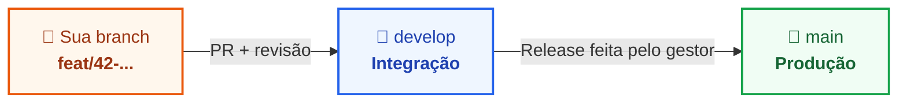

> 📍 **Manual do Calouro** » **Trilha 2: Engenharia, Setup & Gestão** » [🏠 Hub Central (README)](../README.md) &nbsp;|&nbsp; ⏱️ *Tempo de leitura: 7 min*

---

# 📐 16. Padrões de Commit, Branch & Pull Request

> *"O histórico do Git é a memória do projeto. Escreva para quem vai ler daqui a seis meses, e essa pessoa provavelmente é você."*

---

## 🧭 Para que serve este documento

O [Módulo 06](./06-git-github-workflow.md) mostra o fluxo do dia a dia. Este módulo é a **referência oficial das regras**: como nomear commits e branches, como abrir um Pull Request e o que revisar antes de pedir a revisão de alguém.

Se houver dúvida entre o que está aqui e o que está em outro módulo, vale o que está aqui.

Estes padrões são revisados com frequência. Releia este módulo de tempos em tempos e, se encontrar algo a melhorar, abra um PR no repositório do manual (veja o [README](../README.md)).

### As regras em uma tela

| # | Regra | Resumo |
| :-: | :--- | :--- |
| **1** | Commit curto e objetivo | `TIPO/ descrição`, em uma linha de até 72 caracteres. |
| **2** | Branch com tipo e card | `tipo/codigo-do-card-descricao-curta`. |
| **3** | Nunca PR direto para a `main` | O destino é a `develop`. |
| **4** | Todo PR tem descrição | Quem revisa precisa entender o quê, por quê e como testar. |
| **5** | Todo PR tem revisor | No mínimo uma pessoa: o seu gestor. |
| **6** | Conflito é de quem abriu o PR | Resolva antes de pedir a revisão. |
| **7** | Revise o seu próprio código primeiro | Leia o diff inteiro antes de marcar alguém. |
| **8** | Código de IA é código seu | Valide, teste e entenda cada linha antes de commitar. |
| **9** | Poucos comentários, nenhum código comentado | Código morto se apaga; o Git guarda o histórico. |

---

## ✍️ 1. Padrão de Commit

### Formato

```text
TIPO/ descrição curta do que o commit faz
```

Exemplos:

```text
FEAT/ adiciona filtro por data na listagem de pedidos
FIX/ corrige fechamento do modal no clique externo
HOTFIX/ corrige cálculo do frete no checkout
REFACTOR/ simplifica função de cálculo de desconto
DOCS/ atualiza instruções de instalação no README
```

### Tipos aceitos

| Tipo | Quando usar |
| :--- | :--- |
| **`FEAT`** | Funcionalidade nova para o usuário ou para o sistema. |
| **`FIX`** | Correção de bug encontrado em desenvolvimento ou em homologação. |
| **`HOTFIX`** | Correção urgente de um problema que já está em produção. |
| **`REFACTOR`** | Mudança interna no código que não altera o comportamento. |
| **`STYLE`** | Formatação, espaçamento, lint. Nada de lógica. |
| **`DOCS`** | Somente documentação. |
| **`TEST`** | Criação ou ajuste de testes. |
| **`PERF`** | Melhoria de desempenho. |
| **`CHORE`** | Manutenção: dependências, configuração, build, CI. |
| **`REVERT`** | Desfaz um commit anterior. |

### Regras da mensagem

- **Uma linha, até 72 caracteres.** Se precisar de mais contexto, ele vai na descrição do PR.
- **Tipo em maiúsculas, barra, espaço, descrição em minúsculas.** Sem ponto final.
- **Verbo no presente, dizendo o que o commit faz:** *adiciona*, *corrige*, *remove*, *atualiza*.
- **Um commit, um assunto.** Se a mensagem precisa de "e" para juntar duas coisas, são dois commits.
- **Seja específico.** A mensagem tem que fazer sentido sozinha, sem abrir o diff.

### Certo e errado

| ❌ Não faça | ✅ Faça |
| :--- | :--- |
| `ajustes` | `FIX/ corrige alinhamento do botão no rodapé` |
| `funcionou` / `agora vai` | `FIX/ corrige validação de CPF com máscara` |
| `update` / `wip` / `teste 1` | `FEAT/ adiciona paginação na tabela de relatórios` |
| `correções da revisão` | `REFACTOR/ extrai validação do formulário para um composable` |
| `FEAT/ tela de login, ajuste no menu e novo rodapé` | Três commits, um para cada assunto. |

> [!TIP]
> **Teste rápido:** complete a frase *"Este commit..."* com a sua descrição. *"Este commit adiciona filtro por data"* faz sentido. *"Este commit ajustes"* não.

---

## 🌿 2. Padrão de Branch

### Formato

```text
tipo/codigo-do-card-descricao-curta
```

- **`tipo`**: o mesmo tipo do commit, em minúsculas (`feat`, `fix`, `hotfix`, `refactor`, `docs`...).
- **`codigo-do-card`**: o número do card no Trello, quando ele existir.
- **`descricao-curta`**: de duas a cinco palavras, em minúsculas, separadas por hífen, sem acentos.

Exemplos:

```text
feat/42-tabela-relatorios
fix/57-modal-fecha-sozinho
hotfix/63-calculo-frete-checkout
docs/atualiza-readme
```

> [!NOTE]
> **Por que a branch fica em minúsculas se o commit usa maiúsculas?** Nomes de branch viram pastas no disco, e o Windows e o macOS não diferenciam maiúsculas de minúsculas. `FEAT/login` e `feat/login` seriam branches diferentes no servidor e a mesma na sua máquina. Em minúsculas esse problema não existe.

### Regras da branch

- **Uma branch por card.** Não acumule duas tarefas na mesma branch.
- **Sempre parta da `develop` atualizada.** A única exceção é o `hotfix`, que parte da `main`.
- **Branch de vida curta.** Quanto mais tempo ela fica aberta, maior o conflito na volta.
- **Apague a branch depois do merge.**

```bash
git checkout develop
git pull origin develop
git checkout -b feat/42-tabela-relatorios
```

---

## 🚀 3. Padrão de Pull Request

### Para onde o PR aponta



- **Nunca abra PR direto para a `main`.** A `main` é o que está em produção e só recebe código que já passou pela `develop`.
- **O destino do seu PR é a `develop`.** Confira o campo `base` antes de clicar em criar: o GitHub costuma sugerir a `main`.
- **`HOTFIX` é a única exceção**, e ela não é sua para decidir sozinho. Avise o gestor antes de começar; é ele quem autoriza o PR para a `main`.

### Título

O título segue o mesmo padrão do commit, com o número do card quando existir:

```text
FEAT/ #42 implementa tabela de relatórios
```

### Descrição

Todo PR tem um texto explicando a mudança. PR sem descrição volta sem revisão. Use este modelo, que também está em [`.github/pull_request_template.md`](../.github/pull_request_template.md) para ser copiado para os repositórios dos projetos:

```markdown
## 📌 O que foi feito?
- Criação da tabela responsiva de relatórios da quinzena.
- Integração com a rota `/api/reports`.

## 🤔 Por quê?
O cliente precisa consultar os relatórios sem pedir exportação manual.

## 🔗 Card no Trello
- [Card #42 - Tela de Relatórios](https://trello.com/c/...)

## 🧪 Como testar?
1. Rodar `npm run dev`.
2. Acessar `/relatorios` no navegador.
3. Clicar nas colunas para validar a ordenação.

## 📸 Evidências
[Print ou vídeo curto da tela funcionando, com antes e depois quando for ajuste visual]

## ⚠️ Pontos de atenção
[Migration, variável de ambiente nova, dependência instalada, algo que ficou de fora]
```

### Revisor

- **Marque sempre pelo menos uma pessoa em `Reviewers`: o seu gestor.** PR sem revisor não entra na fila de ninguém.
- **Ninguém aprova o próprio PR**, e nenhum PR recebe merge sem aprovação.
- Ainda não está pronto, mas quer opinião? Abra como **Draft** e avise no Discord.

### Antes de pedir a revisão

- **Resolva os conflitos.** Conflito é responsabilidade de quem abriu o PR, não de quem revisa:
  ```bash
  git fetch origin
  git merge origin/develop
  # resolva os arquivos em conflito, teste a aplicação e então:
  git add .
  git commit -m "CHORE/ resolve conflitos com a develop"
  git push
  ```
  Travou? O passo a passo está no [Módulo 12](./12-troubleshooting-primeiros-socorros.md).
- **PR pequeno.** Um PR resolve um card. Acima de umas 400 linhas alteradas, a revisão perde qualidade; converse com o gestor sobre dividir.
- **Nada fora do escopo.** Refatoração que você notou no caminho vira outro card e outro PR.
- **Build, lint e testes passando.** Não peça para alguém revisar algo que você sabe que está quebrado.

### Durante a revisão

- **Responda todos os comentários**, com a correção ou com o seu argumento. Não deixe comentário sem resposta.
- **Correção entra como commit novo na mesma branch.** Não use `git push --force` depois que a revisão começou: o revisor perde a referência do que já leu.
- **Code review é sobre o código, não sobre você.** É a [Lei 7](../README.md) do manual.

### Depois da aprovação

Faça o merge, apague a branch e mova o card no Trello.

---

## 🔍 4. Revise o seu próprio código primeiro

Antes de marcar o revisor, abra a aba **Files changed** do seu PR e leia o diff inteiro, linha por linha, como se o código fosse de outra pessoa. Boa parte dos problemas que o revisor encontraria, você encontra sozinho em cinco minutos.

O que procurar:

- `console.log`, `dd()`, `var_dump`, `debugger` e qualquer resto de depuração;
- código comentado e arquivos que entraram por engano;
- senha, token, chave de API ou `.env` (veja o [Módulo 13](./13-sigilo-etica-e-confidencialidade.md));
- nomes de variáveis e funções que não dizem o que fazem;
- trecho que você não saberia explicar se alguém perguntasse na Daily.

> [!TIP]
> Se algo no diff merece explicação, **comente no próprio PR**, na linha, antes de o revisor chegar: *"Usei X em vez de Y porque..."*. Isso economiza uma rodada inteira de perguntas.

---

## 🤖 5. Código gerado por IA

A IA é uma ferramenta oficial aqui (veja o [Módulo 08](./08-beneficios-e-ferramentas-premium.md)), e usá-la bem faz parte do trabalho. A regra é uma só: **o autor do commit é você, não a IA.** Se quebrar, a responsabilidade é de quem commitou.

Antes de commitar qualquer coisa gerada por IA:

- **Leia tudo.** Se você não consegue explicar uma linha, ela não está pronta para entrar.
- **Rode e teste.** Código que parece certo e nunca foi executado não foi validado.
- **Confira o que ela inventa.** Função, biblioteca, parâmetro e rota que não existem são erros comuns. Verifique na documentação oficial.
- **Olhe o diff inteiro.** A IA costuma alterar mais do que foi pedido: reformata arquivos, renomeia coisas, mexe em trechos vizinhos. O que não faz parte do card sai do commit.
- **Limpe o excesso.** Remova comentários óbvios, tratamentos de erro para situações impossíveis e abstrações que ninguém pediu.
- **Não cole dado sigiloso.** Credenciais e dados de cliente não vão para o prompt ([Módulo 13](./13-sigilo-etica-e-confidencialidade.md)).

---

## 💬 6. Comentários no código

Código bom se explica pelos nomes. Comentário em excesso polui a leitura, fica desatualizado e vira ruído no diff.

- **Comente o porquê, nunca o quê.** O que o código faz já está escrito no código.
- **Não commite código comentado.** Se não é mais usado, apague. O Git guarda a versão antiga.
- **Prefira renomear a comentar.** Se a função precisa de um comentário para dizer o que faz, o nome dela está ruim.
- **`TODO` só com card.** `// TODO(#58): ...` é rastreável; `// TODO: arrumar depois` nunca é arrumado.

```js
// ❌ Narrates what the code already says
// Loop through the users
users.forEach((user) => {
  // Check if the user is active
  if (user.active) notify(user);
});

// ❌ Dead code kept "just in case"
// const oldTotal = price * quantity;

// ✅ Explains a decision the code cannot show by itself
// The payment gateway rejects amounts with more than 2 decimal places
const total = Math.round(price * quantity * 100) / 100;
```

---

## ✅ Checklist antes de pedir a revisão

- [ ] A branch segue o padrão `tipo/codigo-do-card-descricao-curta`.
- [ ] Os commits seguem o padrão `TIPO/ descrição` e cada um trata de um assunto.
- [ ] O PR aponta para a `develop`, não para a `main`.
- [ ] O título e a descrição estão preenchidos, com o link do card e como testar.
- [ ] Não há conflitos com a branch de destino.
- [ ] Li o diff inteiro e removi logs, código comentado e arquivos fora do escopo.
- [ ] Rodei e testei localmente; build, lint e testes passam.
- [ ] Tudo que veio de IA foi lido, entendido e testado.
- [ ] O gestor está marcado como revisor.
- [ ] O card está em **`Em Revisão`** no Trello.

---

## 🧭 Navegação Rápida

[⬅️ Anterior: 15. Critérios de Sucesso & Carreira](./15-criterios-de-sucesso-e-carreira.md) &nbsp;|&nbsp; [🏠 Início (README)](../README.md) &nbsp;|&nbsp; [Próximo: Divulgação da Vaga ➡️](./divulgacao-da-vaga.md)
